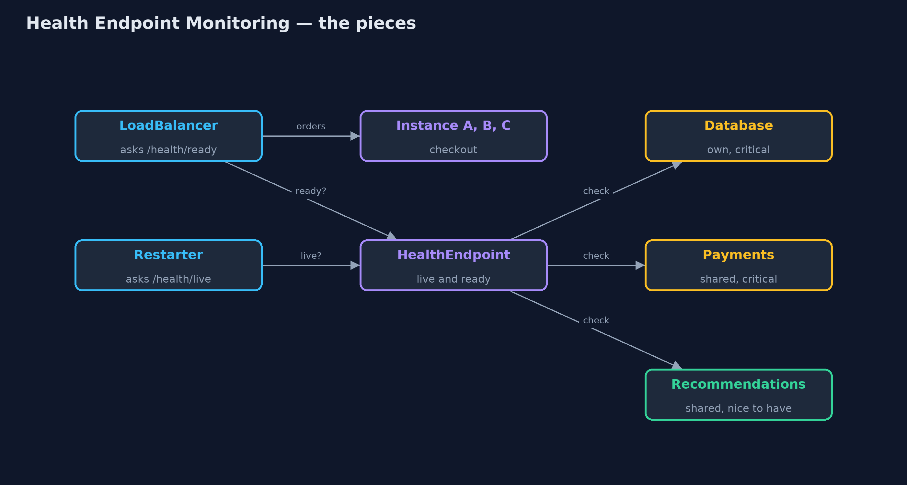
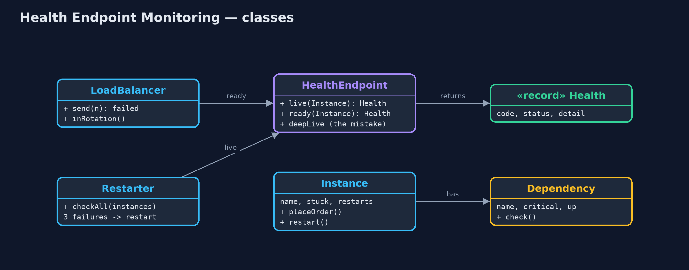
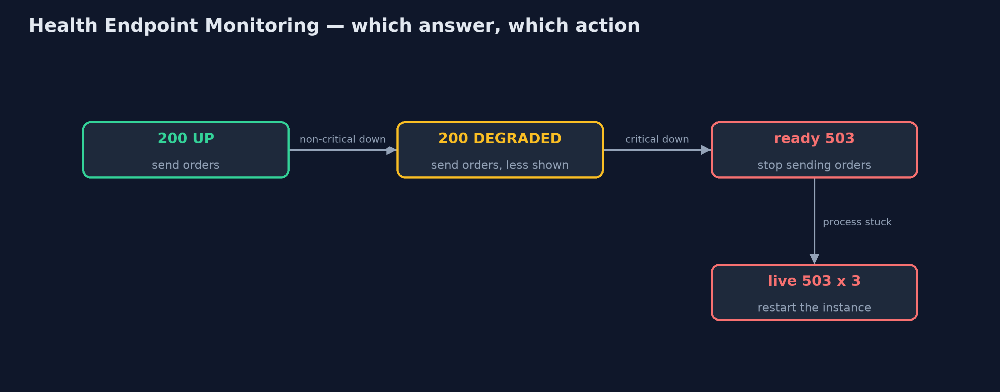

# Health Endpoint Monitoring Pattern

```
src/main/java/com/jk/explore/healthcheck/
├── Dependency.java          Something checkout relies on, such as its database or the payment provider, which can be up or down
├── Health.java              A health answer: the HTTP code a checker sees, a one-word status, and what was found
├── HealthEndpoint.java      The pattern: two addresses an instance answers so others can tell whether to restart it or send it work
├── HealthEndpointDemo.java  The five acts: an open port, liveness, readiness, a liveness check that is too deep, and the bill
├── Instance.java            One running copy of the checkout service
├── LoadBalancer.java        Shares orders between instances in turn, skipping any that its check says are not fit for work
└── Restarter.java           The platform's watchdog: restarts an instance after three failed liveness checks in a row
```

**Let each instance answer two questions for the platform: am I working at all (restart me if not), and can I take work right now (stop sending it if not).**

Health Endpoint Monitoring is a microservices pattern. Each running copy of a
service, called an instance, answers a small web address that says how it is.
The load balancer uses the answer to decide where to send work, and the
platform uses it to decide when to restart an instance.

The important idea is that there are two different questions. Liveness asks
"is this process working at all?", and restarting it may help if not.
Readiness asks "can it take work right now?", and if not, the answer is to stop
sending it work, not to restart it.

## The idea in everyday terms

Think of the host at a busy restaurant, who decides which waiter gets the next
table. A waiter who has fainted needs to be sent home and replaced: that is
liveness. A waiter who is fine, but whose section of the kitchen has run out of
gas, should not be given tables for now, and sending them home would not fix
the gas: that is readiness. And a waiter whose dessert trolley is empty can
still serve, just without dessert: that is degraded.

## The scenario

The online store runs three instances of its checkout service, A, B and C,
behind a load balancer. Each has its own database connection, and all three
use the same payment provider and the same product recommendations service.
The load balancer only checked that each instance's network port was open.

## Run

```bash
./gradlew run
```

The demo tells the story in 5 acts, each printing exact numbers that the tests check:

| Act | What it shows |
| --- | --- |
| 1. An open port | Instance B is stuck but its port is open; the load balancer keeps sending it work: 3 of 9 orders fail. |
| 2. Liveness | B answers 503 DOWN on /health/live; the load balancer drops it (0 of 9 fail); after 3 failed checks it is restarted and returns. |
| 3. Readiness | C's database is down: ready says 503, live says 200, so C is taken out but not restarted; recommendations down makes A and B DEGRADED but still serving. |
| 4. A liveness check that is too deep | The shared payment provider is down: a liveness check that includes it restarts all 3 instances; a shallow one restarts 0. |
| 5. The bill | Readiness every 10 s on 3 instances is 54 dependency calls a minute; details like "database down" must not be public. |

## Test

```bash
./gradlew test
```

11 tests in `DemoRunsTest`, `HealthEndpointTest`. Every number the demo prints is asserted, and nothing depends on the clock, so every run gives the same result.

## Technologies and versions

| Technology | Version | Used for |
| --- | --- | --- |
| Java | 21 | the code (toolchain set in `build.gradle`) |
| Gradle | 9.2.1 (wrapper) | build and run, nothing to install |
| JUnit | 5.10.2 | the tests |
| videokit | repository tool | the narrated video and animation: Piper `en_US-amy-medium`, speed 0.8, longer pauses (the approved `amy-slow` voice) |

## Learning Material

| Document | What it is for |
| --- | --- |
| [Problem statement](docs/problem-statement.md) | the situation and what the project must show |
| [Prerequisites](docs/prerequisites.md) | what you need to know first |
| [Health Endpoint Monitoring, explained](docs/health-endpoint-monitoring-pattern-explained.md) | the acts in prose |
| [Session guide](docs/session.md) | a one-hour lesson with exercises |
| [Animated walkthrough](docs/animation.html) | the acts step by step, narrated |
| [Spec](docs/spec.md) | what this project must be true of |

### The pattern in one picture

Two checkers, two questions: the load balancer asks ready, the platform asks live.



### Where each piece sits

Two static checks, and two users of them.



### How the data moves

Each answer leads to a different action; only a failed liveness check leads to a restart.



### Who calls whom, in order

Taken out of rotation, but not restarted.


### Video

`video/health-endpoint-monitoring-pattern-explained.mp4` (with `.m4a` audio and `.srt` subtitles) is built by `video/build_video.sh`. Rendered media is not committed.

## What it costs

- **Checks cost calls.** Readiness every ten seconds on three instances makes 54 dependency calls a minute, before any customer orders anything.
- **Two endpoints to get right.** Putting a shared dependency into liveness turns one outage into a restart of every instance.
- **They say too much.** "database down" is useful to the platform and to an attacker, so the detail must not be public.
- **A green check is not proof.** An endpoint only tests what it was written to test.

## When this is too much

A single program on one server, watched by a person, does not need separate
liveness and readiness. And a readiness check does not need to test every
dependency: only those without which the instance truly cannot do its job.

## Where you have already met this

- Kubernetes liveness, readiness and startup probes.
- Spring Boot Actuator's `/actuator/health`, with its `liveness` and `readiness` groups.
- Load balancer target health checks in AWS, Azure and Google Cloud.
- Status pages that show a service as operational, degraded or down.

## Where this sits

This project is in [micro-services-design-patterns](..), next to
[Circuit Breaker](../circuit-breaker-pattern), which is the caller's side of the
same problem: noticing that something it depends on is down, and not waiting
for it.
