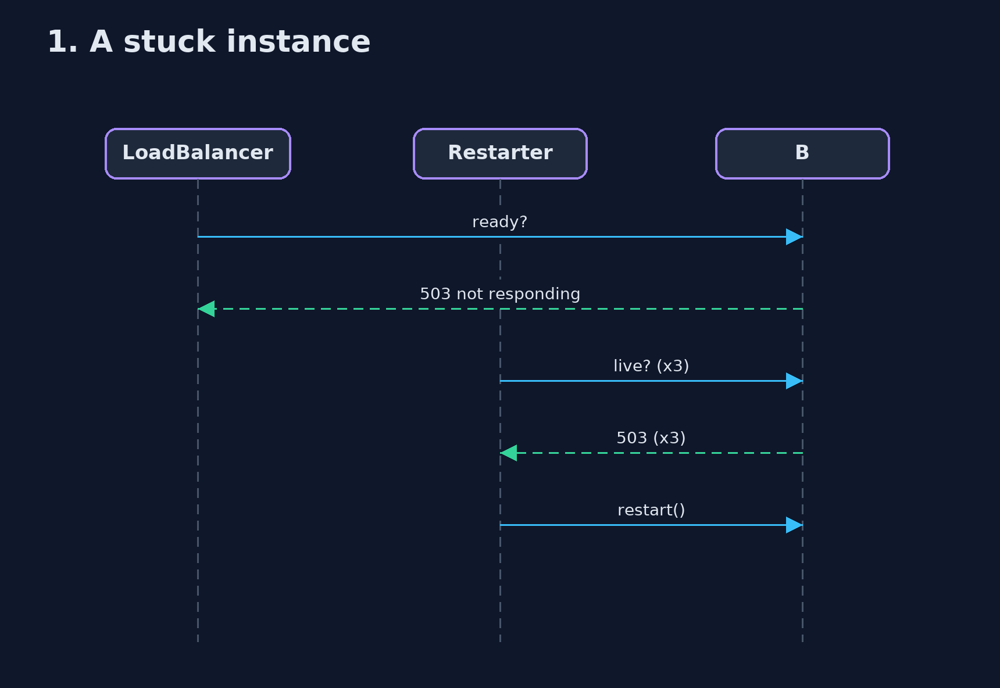
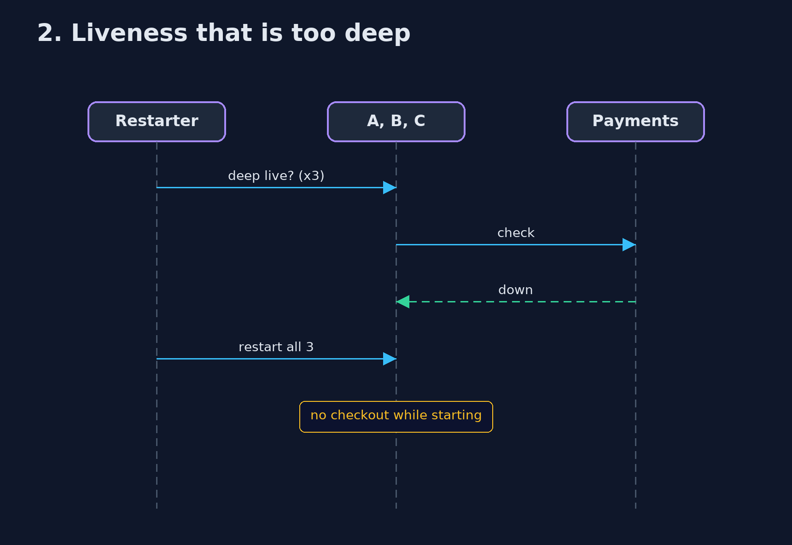

# Health Endpoint Monitoring Pattern — UML Sequence Diagrams

## 1. 1. A stuck instance

Removed at once; restarted after three failures.

## 2. 2. Liveness that is too deep

A shared outage restarts every instance.

