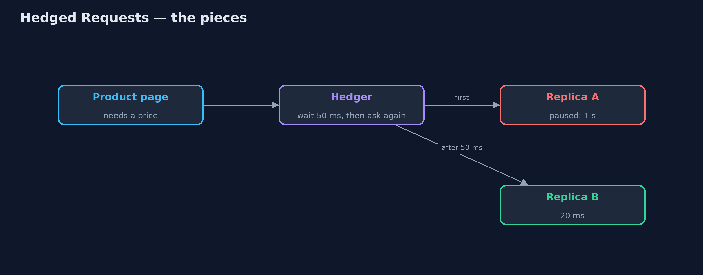
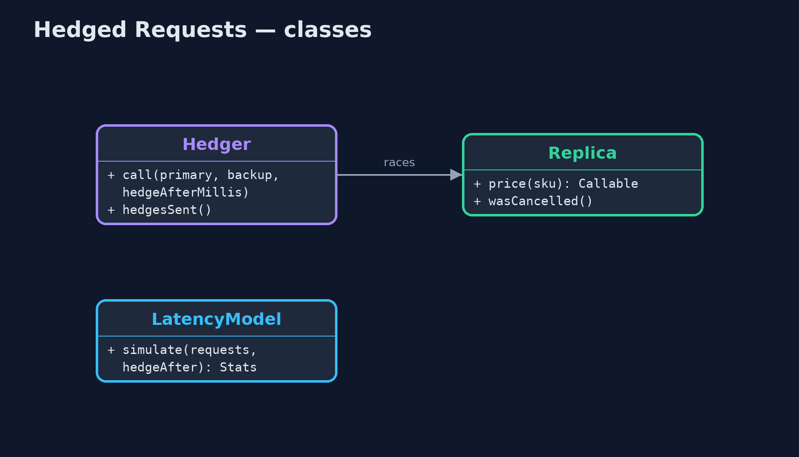
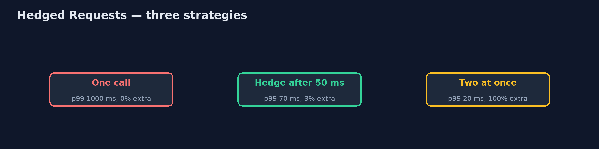

# Hedged Requests Pattern

```
src/main/java/com/jk/explore/hedgedrequests/
├── HedgedRequestsDemo.java  The five acts: the slow tail, hedging after a delay, hedging at once, a real race with cancellation, and the bill
├── Hedger.java              The pattern with real threads: call the primary; if it has not answered within the hedge delay, call a backup too; take whichever answers first and cancel the other
├── LatencyModel.java        Simulated price-service replicas: 20 ms normally, 1,000 ms when a replica is paused (about 1 call in 33)
└── Replica.java             One copy of the price service, answering after a fixed delay
```

**If a call has not answered within a short delay, send the same call to a second replica, use whichever answers first, and cancel the other.**

Hedged Requests is a pattern for cutting tail latency: the rare, very slow
calls that make a page feel sluggish even when the average is fast. The client
calls one replica. If no answer arrives within a short delay, usually around
the 95th percentile of normal response times, it sends the same request to a
second replica, takes whichever answer comes first, and cancels the other.

Because the backup is only sent for the few slow calls, the extra load is
small, while the worst waits shrink dramatically. It was made famous by
Google's paper "The Tail at Scale".

## The idea in everyday terms

Think of calling a shop to ask if something is in stock. Nobody answers after
a few rings, so you call their other branch too. Whichever answers first gets
your question, and you hang up on the other. You only make the second call
when the first is slow, so most of the time you make just one.

## The scenario

The online store's product page asks the price service for each price. There
are several copies of the price service, called replicas. Most answers take
twenty milliseconds, but now and then a replica pauses, for example for
garbage collection, and that call takes a whole second. About one call in
thirty-three is slow, so the 99th percentile is a full second.

## Run

```bash
./gradlew run
```

The demo tells the story in 5 acts, each printing exact numbers that the tests check:

| Act | What it shows |
| --- | --- |
| 1. One call, and a slow tail | 1,000 price lookups: the median is 20 ms but the 99th percentile is 1,000 ms, because 1 call in 33 hits a paused replica. |
| 2. Hedge after 50 ms | If no answer in 50 ms, ask a second replica: the 99th percentile drops to 70 ms, for only 3% extra calls. |
| 3. Hedge at once | Always asking two replicas brings the 99th percentile to 20 ms, but doubles the load: 1,000 extra calls. |
| 4. A real race | With real threads: replica A takes 1 s, replica B 20 ms; the hedged call answers from B in under 0.5 s, and A's call is cancelled. |
| 5. The bill | Only hedge calls that are safe to repeat, never "place order"; and cap hedges, because under overload they add load. |

## Test

```bash
./gradlew test
```

4 tests in `DemoRunsTest`, `HedgerTest`. Every number the demo prints is asserted, and nothing depends on the clock, so every run gives the same result.

## Technologies and versions

| Technology | Version | Used for |
| --- | --- | --- |
| Java | 21 | the code (toolchain set in `build.gradle`) |
| Gradle | 9.2.1 (wrapper) | build and run, nothing to install |
| JUnit | 5.10.2 | the tests |
| videokit | repository tool | the narrated video and animation: Piper `en_US-amy-medium`, speed 0.8, longer pauses (the approved `amy-slow` voice) |

## Learning Material

| Document | What it is for |
| --- | --- |
| [Problem statement](docs/problem-statement.md) | the situation and what the project must show |
| [Prerequisites](docs/prerequisites.md) | what you need to know first |
| [Hedged Requests, explained](docs/hedged-requests-pattern-explained.md) | the acts in prose |
| [Session guide](docs/session.md) | a one-hour lesson with exercises |
| [Animated walkthrough](docs/animation.html) | the acts step by step, narrated |
| [Spec](docs/spec.md) | what this project must be true of |

### The pattern in one picture

A backup call after 50 ms; first answer wins.



### Where each piece sits

A race between two callables.



### How the data moves

The 99th percentile against the extra load.



### Who calls whom, in order

B answers; A is cancelled.


### Video

`video/hedged-requests-pattern-explained.mp4` (with `.m4a` audio and `.srt` subtitles) is built by `video/build_video.sh`. Rendered media is not committed.

## What it costs

- **Only for calls that are safe to repeat.** Hedging a price lookup is fine; hedging "place order" could charge the customer twice.
- **Extra load.** Each hedge is a second call. With a 50 ms delay it was 3%; sending two at once doubled the load.
- **Harmful under overload.** If every replica is slow because they are all busy, hedging makes it worse, so cap hedges at a few percent.

## When this is too much

When calls are uniformly fast, or there is only one replica to ask, there is
nothing to hedge. It pays off for read-heavy services with several replicas
and an occasional slow outlier.

## Where you have already met this

- Google's "The Tail at Scale" and Bigtable's hedged reads.
- gRPC's hedging policy, configured per method.
- Cassandra's speculative retry and HDFS hedged reads.
- `CompletableFuture.anyOf` for racing calls in Java.

## Where this sits

This project is in [micro-services-design-patterns](..), and near
[Backpressure](../backpressure-pattern), which warns of the opposite risk:
sending more work than the other side can handle.
