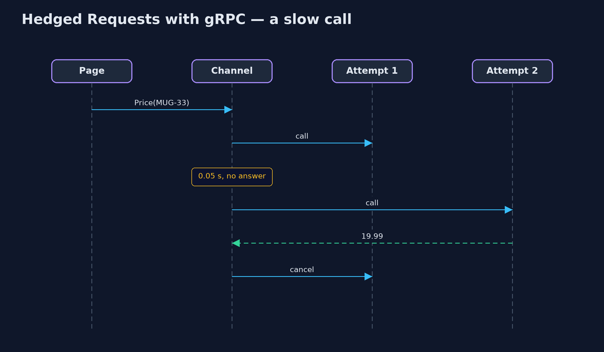

# Hedged Requests with gRPC Pattern

```
src/main/java/com/jk/explore/hedgedgrpc/
├── Channels.java                gRPC client channels
├── GrpcHedgedRequestsDemo.java  The five acts, with a real gRPC server and gRPC's own hedging policy
├── PriceServer.java             The price service, as a real gRPC server on a local port
└── Shop.java                    The shop's two gRPC methods, described by hand
```

**Cut the slow tail of price lookups with gRPC's built-in hedging policy: a second attempt after 50 ms, set in the channel's service config, with the losing attempt cancelled by gRPC itself.**

This is the framework version of the Hedged Requests pattern. The plain Java
version, a separate project in this category, writes a hedger with threads
and futures. Here gRPC, the remote-call framework, does it: hedging is a
policy in the client channel's service config, not code in the shop. The
demo runs a real gRPC server on a local port and calls it for real.

The policy says: for calls to this service, if no answer has arrived after
50 milliseconds, send a second attempt, take whichever answers first, and
cancel the other. Because it is configuration, the same policy could be
delivered by a name resolver to every client of the service.

## The idea in everyday terms

Think of phoning a shop's two branches about the same item. You ring the
first; if nobody picks up within a few rings, you ring the second, take
whichever answers, and hang up on the other. Here the phone itself does this
for you, because someone set it to.

## The scenario

The online store's product page asks the price service for each price. Most
answers take twenty milliseconds, but about one call in thirty-three lands on
a paused worker and takes a whole second, so the slowest pages wait that long.

## Run

Nothing to install beyond a Java 21 JDK: the gRPC server and client run inside
the program, over a local port.

```bash
./gradlew run
```

The demo tells the story in 5 acts, each printing exact numbers that the tests check:

| Act | What it shows |
| --- | --- |
| 1. A slow tail | 100 price lookups over gRPC: 3 take about a second, the rest about 20 ms, so the 99th percentile is a whole second. |
| 2. A hedging policy | With hedgingPolicy (2 attempts, 0.05 s delay) in the service config: 0 lookups over 0.2 s, and gRPC sent 3 extra calls. |
| 3. The loser is cancelled | The 3 slow attempts that lost see their call cancelled by gRPC and never reply. |
| 4. Hedge at once | With hedgingDelay 0, 100 lookups send 200 calls: twice the load on the price service. |
| 5. The bill | Hedging PlaceOrder by mistake: the customer sees one confirmation, the server places 2 orders. |

## Test

```bash
./gradlew test
```

1 tests in `DemoRunsTest`. Every result the demo prints is asserted, against a real gRPC server on a local port. Timings are printed as thresholds, and waits are bounded polls.

## What the simulation got right, and what it left out

The plain Java version got the idea right: hedge after a delay near the
normal worst case, take the first answer, cancel the other, never hedge what
is unsafe to repeat, and cap the extra load. What it left out is what a real
remote-call framework provides. In gRPC, hedging is a policy in the service
config, with no hedging code in the caller. gRPC cancels the losing attempt
and the server can see the cancellation. And the same policy wrongly applied
to PlaceOrder really does place an order twice, which is why gRPC applies it
per service or per method.

## Technologies and versions

| Technology | Version | Used for |
| --- | --- | --- |
| Java | 21 | the code (toolchain set in `build.gradle`) |
| Gradle | 9.2.1 (wrapper) | build and run, nothing to install |
| JUnit | 5.10.2 | the tests |
| gRPC Java | 1.84.0 | client channel with a hedging policy, server, Netty transport |
| videokit | repository tool | the narrated video and animation: Piper `en_US-amy-medium`, speed 0.8, longer pauses (the approved `amy-slow` voice) |

## Learning Material

| Document | What it is for |
| --- | --- |
| [Dependencies](docs/dependencies.md) | what the framework and infrastructure are, and why they are here |
| [Problem statement](docs/problem-statement.md) | the situation and what the project must show |
| [Prerequisites](docs/prerequisites.md) | what you need to know first |
| [Hedged Requests with gRPC, explained](docs/hedged-requests-with-grpc-pattern-explained.md) | the acts in prose |
| [Session guide](docs/session.md) | a one-hour lesson with exercises |
| [Animated walkthrough](docs/animation.html) | the acts step by step, narrated |
| [Spec](docs/spec.md) | what this project must be true of |

### The pattern in one picture

The policy lives in the channel.


### Where each piece sits

No hedging code: a map of policy.


### How the data moves

Slow lookups against extra calls.


### Who calls whom, in order

gRPC sends the hedge and cancels the loser.



### Video

`video/hedged-requests-with-grpc-pattern-explained.mp4` (with `.m4a` audio and `.srt` subtitles) is built by `video/build_video.sh`. Rendered media is not committed.

## What it costs

- **Only for calls safe to repeat.** Hedging PlaceOrder placed two orders for one click.
- **Extra load.** A delay of 0 sent 200 calls for 100 lookups; a 50 ms delay sent only 3 extra.
- **Cap it.** Under overload hedges add load; gRPC's `retryThrottling` stops hedging when too many calls fail.

## When this is too much

If calls are uniformly fast, or every call is expensive for the server, do
not hedge. Hedging pays off for cheap, repeatable reads with a rare slow
outlier.

## Where you have already met this

- gRPC's `hedgingPolicy` and `retryPolicy` in a service config.
- Cassandra's speculative retry and HDFS hedged reads.
- Service meshes such as Envoy, which can hedge too.

## Where this sits

This project is in [micro-services-design-patterns](..). It is the framework
version of the plain Java Hedged Requests project in the same category, which
is left unchanged.
