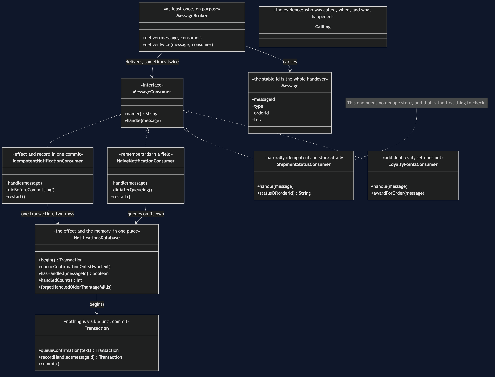

# Idempotent Consumer

**In plain words:** since the same message can arrive twice, write down the id of every message
you have handled, and if one arrives whose id you already have, throw it away. Handling it
twice then has the same effect as handling it once — which is all the word *idempotent* means.

**Everyday analogy:** a club doorman with a list of everyone he has already stamped. Somebody
comes back to the door claiming they have not been let in yet; the doorman checks the list,
finds their name, and does not stamp them a second time. The subtle part is the part that goes
wrong in real code: **the name has to go on the list at the same moment as the stamp goes on the
hand.** Stamp first and write the name afterwards, and a doorman who is interrupted in between
will stamp the same person twice.

In the shop, Notifications receives `OrderPlaced` twice, because the outbox relay of the
previous pattern guarantees at-least-once delivery. Two emails is embarrassing. Had the
consumer been Payments, it would have been two charges.

## Why the duplicate is not anybody's fault

A sender publishes a message and waits for an acknowledgement. If the acknowledgement is lost,
the sender cannot tell whether the message arrived, and it has exactly two choices: send again,
or not. Sending again risks a duplicate; not sending again risks losing the message forever.
Every production system chooses the duplicate. So `MessageBroker.deliverTwice` is not this
project being unfair — it is a Tuesday.

## The HashSet that nearly works

```
      0ms ->    10ms  Notifications    OK        delivered msg-1
      5ms ->     5ms  NotifDb          COMMIT    a confirmation on its own
     10ms ->    10ms  Broker           REDELIVERY msg-1 -- the acknowledgement was lost
     10ms ->    20ms  Notifications    OK        delivered msg-1
     15ms ->    15ms  Notifications    SKIPPED   msg-1 -- already seen
  confirmations queued: 1
```

`NaiveNotificationConsumer` keeps a `HashSet` of ids it has seen and updates it after the work.
It catches the duplicate, `theObviousTestPasses` is green, and this is where most
implementations stop. Two things are wrong with it, and both only show up in production.

**The memory is in the process.**

```
     10ms ->    10ms  Notifications    RESTARTED and its memory of what it has handled is empty
  confirmations queued: 2
```

The set lives in the heap, so a deploy empties it. And a restart is often *why* the
acknowledgement was lost in the first place, so a duplicate arriving just after one is common
rather than unlucky.

**The id is written down after the work.**

```
      5ms ->     5ms  NotifDb          COMMIT    a confirmation on its own
      5ms ->     5ms  Notifications    DIED      after queueing the email, before remembering the id
  confirmations queued: 2
```

A crash in that gap loses the id and keeps the effect. This is the doorman stamping the hand and
being interrupted before writing the name.

Both faults have one root: **the id and the effect are stored in two different places, so
nothing can make them land together.** Every test in `NaiveNotificationConsumerTest` passes,
including the two that describe a customer getting two emails for one order.

## The pattern

```java
if (database.hasHandled(message.messageId())) {
    return;                              // the doorman's list
}
Transaction transaction = database.begin();
transaction.queueConfirmation(text);     // the stamp
transaction.recordHandled(message.messageId());
transaction.commit();                    // both, or neither
```

```
      5ms ->     5ms  NotifDb          COMMIT    1 confirmation(s) and 1 handled id(s) together
     15ms ->    15ms  Notifications    IGNORED   msg-1 -- handled already
  confirmations queued: 1, handled ids stored: 1
```

The transaction is the entire pattern. Take it away and the naive consumer is back in one of its
two shapes:

- Write the id *first* and a crash before the work leaves the message remembered as handled and
  the customer with no email — worse than a duplicate, because nothing will ever retry.
- Write the id *afterwards* and a crash in between loses it.

Committing them together removes the gap, and both of the failures that beat the `HashSet` now
cost nothing. A restart changes nothing, because nothing was in memory. A crash before the
commit writes neither row, so the redelivery handles the message properly —
`exactlyOnceOutOfAtLeastOnce` is the test, and the demo prints it: **exactly once, out of a
broker that only promises at least once.**

## The constraint hiding in that transaction

The effect above is a row in a table, which is the only reason it can share a transaction with
the id. If the effect were the actual email — a call to an outside provider — it could not, and
you would be back to two systems with a gap between them.

The honest answer is the previous pattern's: write a row, and let an outbox relay do the
sending. Which is why Transactional Outbox and Idempotent Consumer are taught together and are
usually deployed together — one creates the duplicate, the other absorbs it, and each needs the
other to be worth having.

## Ask first whether you need any of this

```
  status of ord-7006: SHIPPED, orders known: 1
```

`ShipmentStatusConsumer` handles `OrderShipped` by setting a status, and it has **no dedupe
store, no transaction and no expiry policy**. Setting a status twice sets the same status. That
property is called being **naturally idempotent**, and it is a different thing from the
consumer above, which is not naturally idempotent and has to be *made* safe by remembering ids.

The test is one question: *if I run this twice, is the result the same?*

- "set the status to SHIPPED" — yes. Nothing needed.
- "set the stock level to 20" — yes.
- "add 70 loyalty points" — no.
- "send an email" — no, and no rewriting will change that.

And when the answer is no, the next question is whether the handler can be **rewritten** into
one where it is yes:

```
  and one that is not: "add 70 loyalty points" twice
    running total: 140 points for a 70 pound order
  rewritten as "set the points for this order to 70":
    points awarded: 70 after handling it twice
```

`LoyaltyPointsConsumer` shows both. Storing points *per order* and setting them, instead of
adding to a running total, makes the handler idempotent with no store, no window and nothing to
operate. **Reaching for the dedupe table before asking that question is the most common mistake
in this whole area.**

## What the store costs

```
    handled, confirmations queued: 1
    a minute later, with a thirty second memory, the same message arrives again: 2
```

The ids cannot be kept forever, so they expire, and the length of the window is **chosen rather
than derived**. Too short and a duplicate arriving after a long broker outage looks new — which
`theWindowIsAGuess` demonstrates as a passing test. Too long and it is a large table somebody
has to operate, back up and migrate.

One more requirement worth stating: **the message must carry a stable id**, the same on every
delivery. If it does not, there is nothing to deduplicate on, and the first job is to get one
added at the sending end.

## One JVM, no infrastructure

No broker, no database, no sockets, and nothing sleeps. `MessageBroker.deliverTwice` is
at-least-once delivery in two lines. `SimulatedClock` makes a sixty-second wait free, so the
expiry window can be tested rather than described. `ProcessDiedException` stands in for the JVM
disappearing — in real life there is no catch block, and the tests say so in a comment where
they catch it.

## Learning Material

| File | What it is for |
| --- | --- |
| [`docs/problem-statement.md`](docs/problem-statement.md) | The same confirmation email, twice, and the green test that allowed it |
| [`docs/idempotent-consumer-pattern-explained.md`](docs/idempotent-consumer-pattern-explained.md) | The full explanation, readable on its own |
| [`docs/class-diagram.md`](docs/class-diagram.md) | Four consumers, and where each one keeps its memory |
| [`docs/uml-diagram.md`](docs/uml-diagram.md) | The five acts as sequences, including the crash in the gap |
| [`docs/prerequisites.md`](docs/prerequisites.md) | What you need first, and what you explicitly do not |
| [`docs/session.md`](docs/session.md) | A one-hour taught session, with the arguments to expect |
| [`docs/animation.html`](docs/animation.html) | Twelve steps in a browser, narrated, that you can pause |
| [`docs/youtube.md`](docs/youtube.md) | Title, description and chapters for publishing |
| [`video/README.md`](video/README.md) | The sixteen scenes, and why two of them cannot be cut |
| [`video/scenes.py`](video/scenes.py) | The script itself, narration and all |

### The pattern in one picture



`IdempotentNotificationConsumer` writes the confirmation and the handled message
id in one transaction, so a redelivery is a lookup and nothing else.
`ShipmentStatusConsumer` sits alongside it needing no store at all, as a
reminder to ask that question first.

### Video

A narrated walkthrough across sixteen scenes: why the broker sends it twice, the
two ways a set of ids in memory loses, the one commit that fixes both — and the
expiry window that is a guess.

Build it with `cd video && python3 make_slides.py && ./build_video.sh`. The
rendered file is not committed; the sources are.
