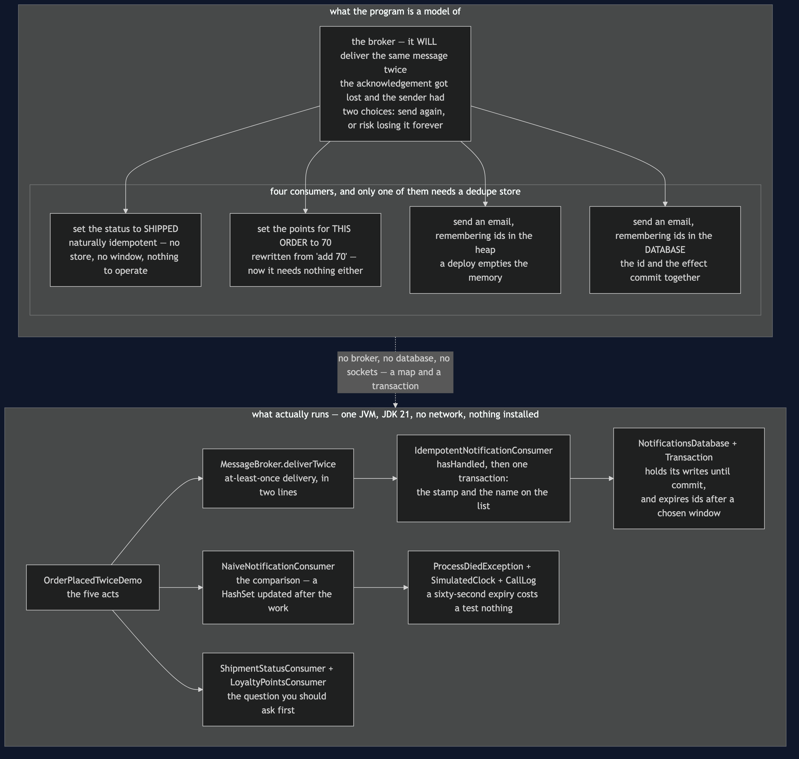
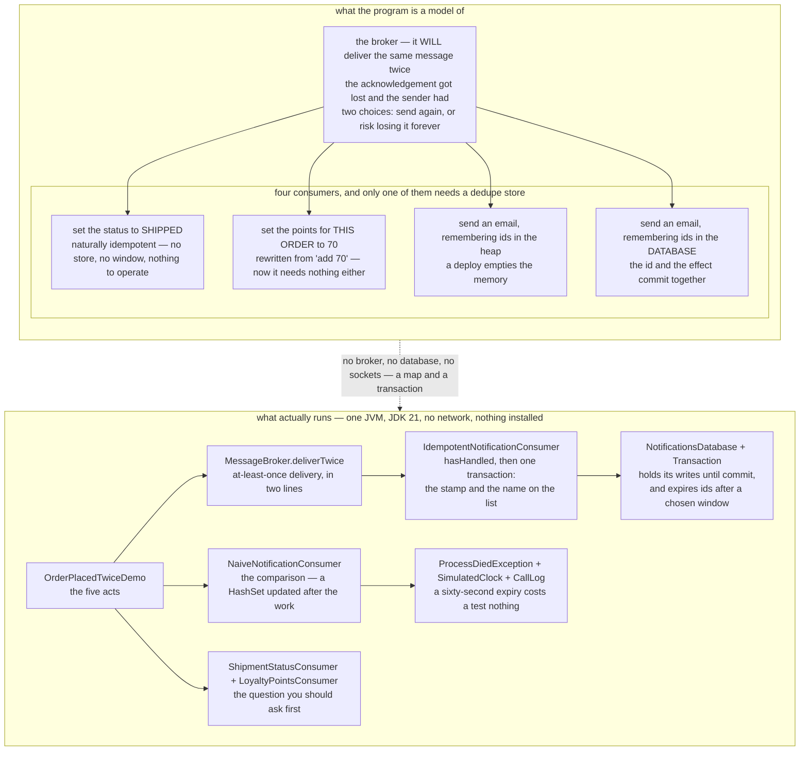

# Idempotent Consumer — Architecture Diagram

Where each piece of this project sits, and — because this project starts nothing — what
each piece *stands for*. The class diagram shows the types and the sequences show the order
of the calls; this one answers the question those two cannot, which is **where each consumer
keeps its memory of what it has already done, and whether it needs a memory at all**.

Read the picture as two halves stacked. The upper half is what the program is a model of: a
broker that will deliver the same message twice, and four consumers on the other side of it
that respond to that fact in four different ways. The lower half is the literal truth: one
Java program, a map behind a transaction, and a clock that makes a sixty-second wait free.

Look along the row of consumers in the upper half before reading anything else, because the
row is an argument and it runs from right to left.

`ShipmentStatusConsumer` needs **nothing** — setting a status to SHIPPED twice sets the same
status. `LoyaltyPointsConsumer` needs nothing either, once it is **rewritten** from "add 70
points" into "set the points for this order to 70". `NaiveNotificationConsumer` keeps a set
of ids **in the heap**, which works in a test and loses twice in production.
`IdempotentNotificationConsumer` keeps the ids **in the same database as the effect**, which
is the pattern. Reaching for the last one before trying the first two is the most common
mistake in this whole area.

Mermaid source

## What the diagram is telling you to count

**The duplicate is nobody's fault.** A sender publishes and waits for an acknowledgement. If
the acknowledgement is lost, the sender cannot tell whether the message arrived, and it has
exactly two choices: send again, or not. Sending again risks a duplicate; not sending again
risks losing the message forever. Every production system chooses the duplicate. So
`deliverTwice` is not this project being unfair — it is a Tuesday.

**The naive consumer's two faults have one root.** The set lives in the heap, so a deploy
empties it — and a restart is often *why* the acknowledgement was lost, so a duplicate just
after one is common rather than unlucky. And the id is written after the work, so a crash in
that gap loses the id and keeps the effect. Both come from the same thing: **the id and the
effect are stored in two different places, so nothing can make them land together.** Every
test in its class passes, including the two that describe a customer getting two emails for
one order.

**The transaction is the entire pattern.** Check the list, then in one commit queue the
confirmation and record the id. Take the transaction away and you are back in one of the two
broken shapes: record the id first, and a crash before the work leaves the message marked
handled and the customer with no email — worse than a duplicate, because nothing will ever
retry it — or record it afterwards and a crash in between loses it.

**What comes out is exactly once, from a broker that only promises at least once.** A
restart changes nothing, because nothing was in memory. A crash before the commit writes
neither row, so the redelivery handles the message properly. A test carries that name, and
the demo prints the result.

**A redelivery costs one read.** The second arrival is `hasHandled` returning true and
nothing else — no transaction, no write, no work. That is worth knowing when the duplicate
rate is high.

## What it deliberately leaves out

**The effect here is a row in a table, and that is load-bearing.** It is the only reason the
effect can share a transaction with the id. If the effect were the actual email — a call to
an outside provider — it could not, and you would be back to two systems with a gap between
them. The honest answer is the previous pattern's: write a row, and let an outbox relay do
the sending. That is why [Transactional Outbox](../transactional-outbox-pattern) and this
project are taught together and usually deployed together — one creates the duplicate, the
other absorbs it, and each needs the other to be worth having.

**The expiry window is chosen rather than derived.** The ids cannot be kept forever, so they
expire, and the length is a guess. Too short and a duplicate arriving after a long broker
outage looks new, which the demo shows as a passing test with a thirty-second memory and a
message a minute late. Too long and it is a large table somebody has to operate, back up and
migrate.

**And the message must carry a stable id**, the same on every delivery. If it does not,
there is nothing to deduplicate on, and the first job is to get one added at the sending
end — which is not a change you can make on the receiving side at all.
