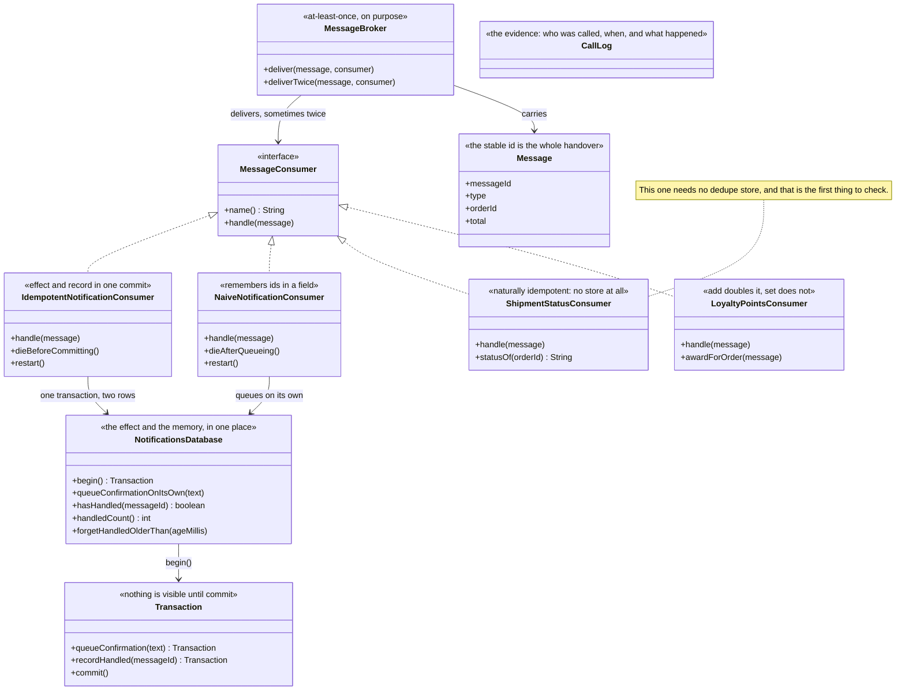

# Idempotent Consumer — Class Diagram

## The Shape Of It

Four consumers implement the same interface, and the comparison between them is the lesson.

`NaiveNotificationConsumer` and `IdempotentNotificationConsumer` do the same job and differ
only in where the memory of "I have handled this" is kept. One keeps it in a field, which a
deploy empties. The other keeps it in the database, in the same commit as the effect.

`ShipmentStatusConsumer` and `LoyaltyPointsConsumer` are the other half of the argument:
sometimes you do not need any of this, and sometimes you can rewrite the handler until you
do not.

## `Transaction`

An inner class on `NotificationsDatabase`, and small on purpose. It collects a confirmation
and a handled id, and neither is visible to anybody until `commit()` runs.

That is the only guarantee the whole pattern relies on, and it is one an ordinary relational
database has offered for decades. `writesAreHeldUntilTheCommit`, `bothOrNeither` and
`oneCommitCoversBoth` are the three tests that hold it in place.

## `NotificationsDatabase`

It holds both the effect — the queued confirmations — and the memory of which message ids
have been handled. They are in the same database precisely so that one transaction can cover
both. If the confirmation went somewhere else, the pattern would not work.

`forgetHandledOlderThan(ageMillis)` is the uncomfortable method. Ids cannot be kept forever,
so they expire; `theWindowIsAGuess` and `expiryOnlyForgetsOldIds` are the tests that show
what the window buys and what it costs.

## `MessageBroker`

`deliverTwice` is not a fault injection. It is the contract. A broker that promises
at-least-once delivery *will* send the same message again when an acknowledgement goes
missing, and the consumer is the only place that can do anything about it.

## `Message`

A record whose `messageId` is the most important field in the project. It is stable across
redeliveries — the same message sent twice carries the same id both times — and that one
field is everything the sending side owes the receiving side.

## `ShipmentStatusConsumer` And `LoyaltyPointsConsumer`

Kept as a pair. The first sets a status and needs no store, no transaction and no expiry
policy, because setting a value twice sets the same value. The second adds points, which
doubles on a duplicate, until it is rewritten as "set the points for this order", at which
point it also needs nothing.

`settingAStatusTwiceSetsTheSameStatus`, `addingTwiceDoublesIt` and `theRewriteBeatsTheStore`
are the tests, and reading them in that order is the argument.

## `CallLog` And `SimulatedClock`

Every consumer here ends with the same customer receiving something, so the only way to
compare them is to watch who was called, in what order, and what happened. `CallLog` records
that. `SimulatedClock` advances by fixed amounts — ten milliseconds for a delivery, five for
a database commit — so nothing sleeps and every timeline in the demo is exact and repeatable
on any machine.
