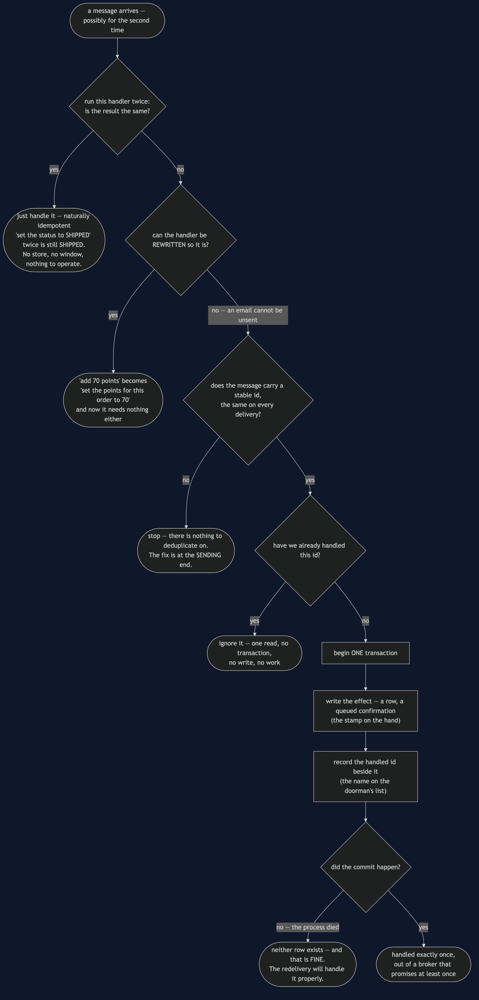
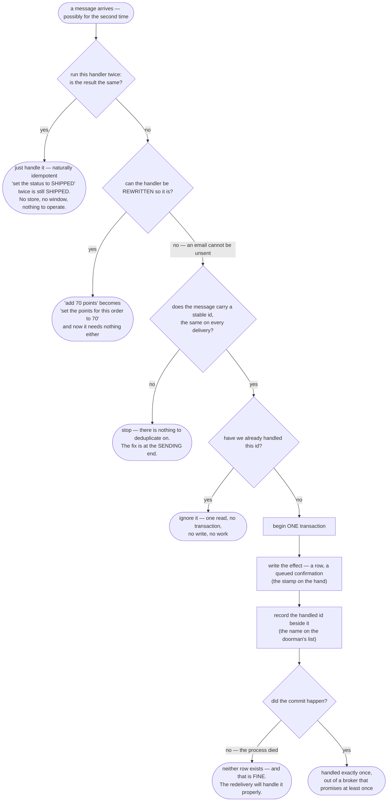

# Idempotent Consumer — Data Flow Diagram

One message arriving twice, followed from the broker to the customer's inbox. The
architecture diagram says where each consumer keeps its memory; this one says **what happens
on the second arrival, and where the process is allowed to die without anybody noticing**.

The thing to follow is the decision at the top, because it is the one most teams skip. Before
any of the machinery below it, there is a question: *if I run this handler twice, is the
result the same?* Two of the four consumers in this project answer yes and stop there,
needing no store, no window and nothing to operate. Only when the answer is no, and cannot
be made yes by rewriting the handler, does the rest of the diagram apply.

Then follow the commit. The stamp and the name on the doorman's list go on in one motion.
Every failure below the commit is harmless, and every arrangement that separates them is one
of the two bugs this pattern exists to remove.

Mermaid source

## What the picture is telling you

**The top third is the part that saves the most work.** `ShipmentStatusConsumer` sets a
status and has no dedupe store, no transaction and no expiry policy, because setting a status
twice sets the same status. `LoyaltyPointsConsumer` shows both sides of the rewrite: adding
seventy points twice gives a hundred and forty for a seventy-pound order, and storing points
*per order* and setting them gives seventy however many times it runs. Reaching for the
dedupe table before asking that question is the most common mistake in this whole area.

**The stable-id check is a dead end on purpose.** If the message id changes between
deliveries there is nothing to deduplicate on, and no amount of code on the receiving side
will fix it. The first job is to get a stable id added by the sender.

**The skip branch is one read.** No transaction, no write, nothing. That matters when
redeliveries are common rather than rare.

**The effect and the id are inside the same transaction, and the diagram has no path that
separates them.** That is the pattern, and it is worth seeing the two alternatives to
understand why. Record the id *first* and a crash before the work leaves the message
remembered as handled and the customer with no email — worse than a duplicate, because
nothing will ever retry. Record it *afterwards*, which is what the naive consumer does, and a
crash in between loses the id and keeps the effect. That is the doorman stamping the hand and
being interrupted before writing the name.

**The "neither row exists" ending is a success.** Nothing was done and nothing was recorded,
so the redelivery — which is coming anyway, because the broker only promises at least once —
handles the message properly. What comes out the other end is exactly once.

## The route that is not on the diagram

`NaiveNotificationConsumer` keeps its set of seen ids in the heap and updates it after the
work. It catches the ordinary duplicate, its obvious test is green, and this is where most
implementations stop.

It loses twice. A deploy empties the set — and a restart is often *why* the acknowledgement
was lost in the first place, so a duplicate arriving just after one is common rather than
unlucky. And a crash between queueing the email and updating the set loses the id while
keeping the effect. Every test in its class passes, including the two that describe a
customer getting two emails for one order.

## What the store costs

The ids cannot be kept forever, so they expire, and the length of the window is **chosen
rather than derived**. Set it to thirty seconds and a duplicate arriving a minute later looks
new, which the demo prints and a test asserts. Set it long and it is a large table somebody
has to operate, back up and migrate.

There is also a constraint hiding in the transaction: the effect is a row, which is the only
reason it can share a commit with the id. If the effect were the actual email, it could not,
and you would be back to two systems with a gap between them — which is exactly what
[Transactional Outbox](../transactional-outbox-pattern) is for. One pattern creates the
duplicate; the other absorbs it.
