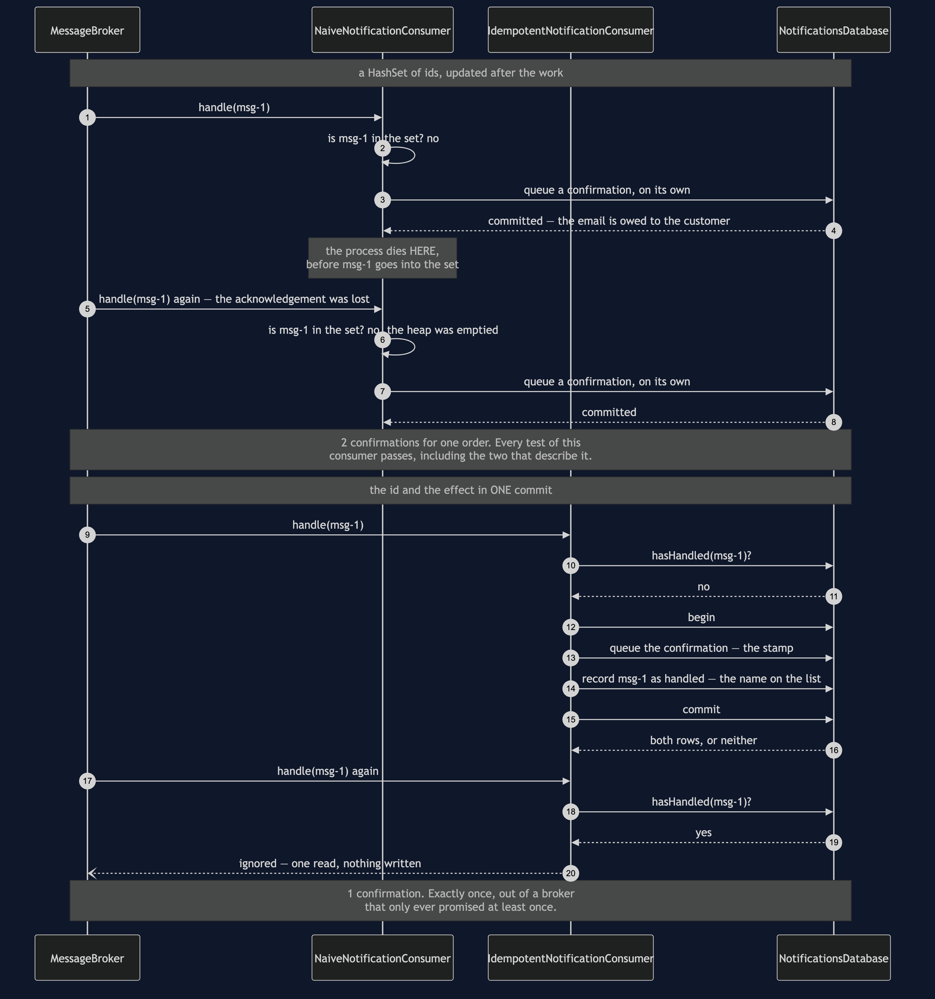
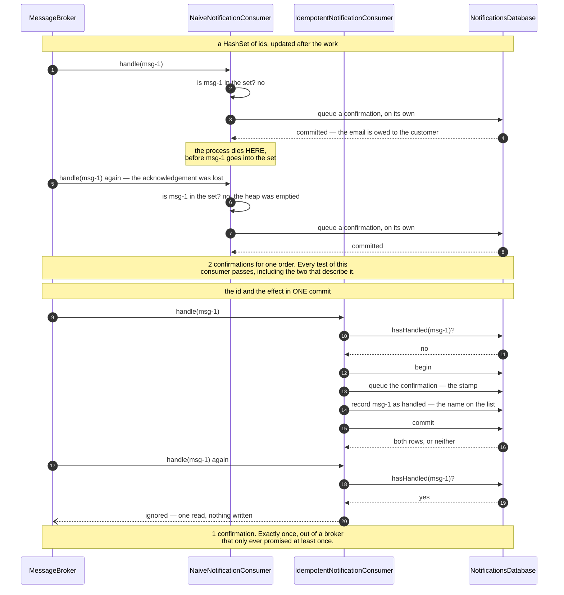

# Idempotent Consumer — Sequence Diagram

The one sequence worth having in your head before the others make sense: the same message
delivered twice to two consumers, one remembering ids in memory and one remembering them in
the same transaction as the work, with the process dying at the same instant in both.

[`uml-diagram.md`](uml-diagram.md) holds the full set of five acts, including the deploy and
the consumer that needed none of this. This document puts the two versions side by side,
because the pattern is a trade and a trade is only visible as a comparison.

Watch the position of one arrow: when the id is written down. In the upper half it happens
after the work, so there is a gap. In the lower half it is inside the same commit as the
work, so there is no gap to die in.

Mermaid source

## Reading the two halves

**Both consumers see exactly the same traffic.** One message, delivered twice, because the
acknowledgement was lost and the sender had two choices — send again, or risk losing it
forever. Every production system chooses the duplicate, so the redelivery is a Tuesday rather
than an unfair test.

**The upper half fails in two separate ways and this picture shows both at once.** The crash
loses the id while keeping the effect, and the restart empties the heap. Those are usually
the same incident: a restart is often *why* the acknowledgement was lost, so a duplicate
arriving just after one is common rather than unlucky.

**The lower half has no instant at which the effect exists without the id.** That is the
whole mechanism, and there is nothing else to it. `hasHandled` is a read, and then one
transaction carries both writes.

**The second delivery costs one read.** No transaction, no write, no work — a test is named
for it. That is worth knowing when the duplicate rate is high.

**Nothing here sleeps.** `SimulatedClock` makes a sixty-second wait free, so the expiry
window can be tested rather than described, and `ProcessDiedException` stands in for the JVM
disappearing. In real life there is no catch block, and the tests say so in a comment where
they catch it.

## What the other acts add

**The deploy.** The naive consumer restarts with an empty memory and handles a message it has
already handled. Nothing is wrong with the code; the memory was simply in the wrong place.

**The gap.** The naive consumer dies between queueing the confirmation and remembering the
id. This is the doorman stamping the hand and being interrupted before writing the name.

**The handler that needed none of it.** `ShipmentStatusConsumer` sets a status to SHIPPED and
has no dedupe store, no transaction and no expiry policy, because setting the same status
twice sets the same status. It is in the set as a reminder to ask the question first: *if I
run this twice, is the result the same?* "Set the stock level to 20" — yes. "Add 70 loyalty
points" — no, until it is rewritten as "set the points for this order to 70". "Send an email"
— no, and no rewriting will change that, which is why the lower half of this diagram exists.

## The constraint in that commit

The effect here is a row in a table, which is the only reason it can share a transaction with
the id. If the effect were the actual email — a call to an outside provider — it could not,
and you would be back to two systems with a gap between them. The answer is to write a row
and let a relay do the sending, which is
[Transactional Outbox](../transactional-outbox-pattern): one pattern creates the duplicate,
the other absorbs it, and each needs the other to be worth having.
