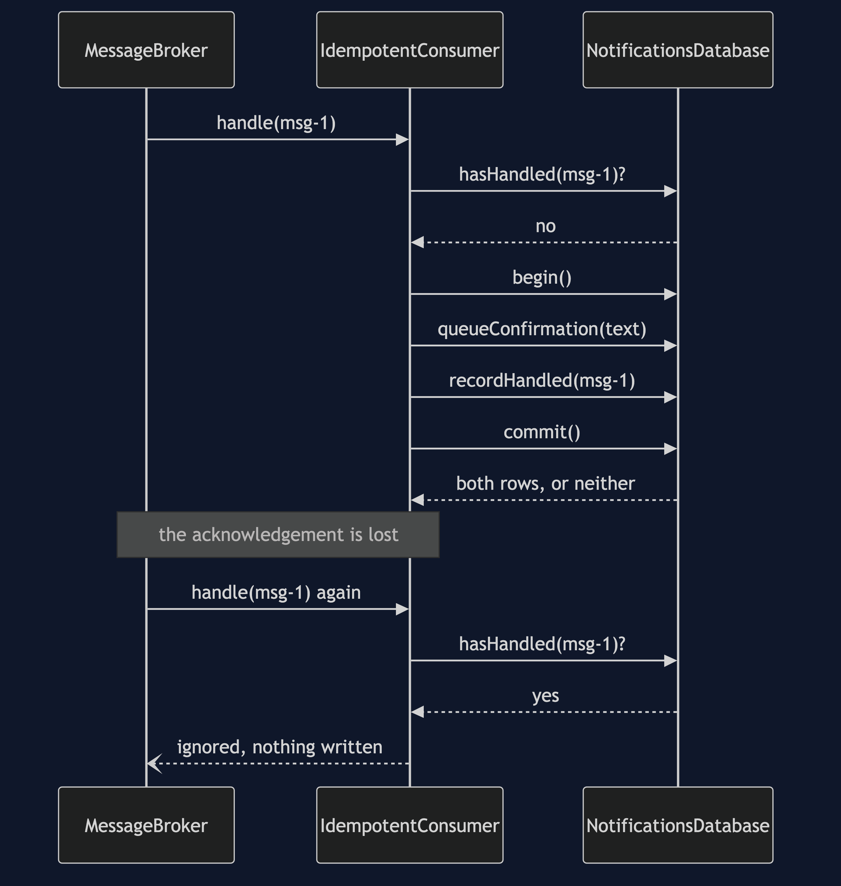
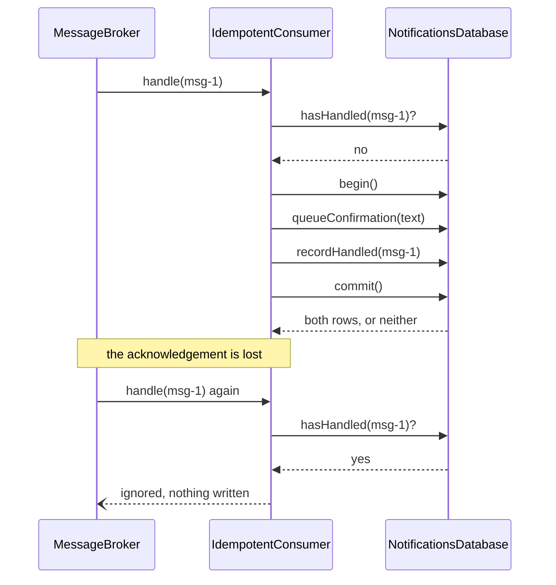
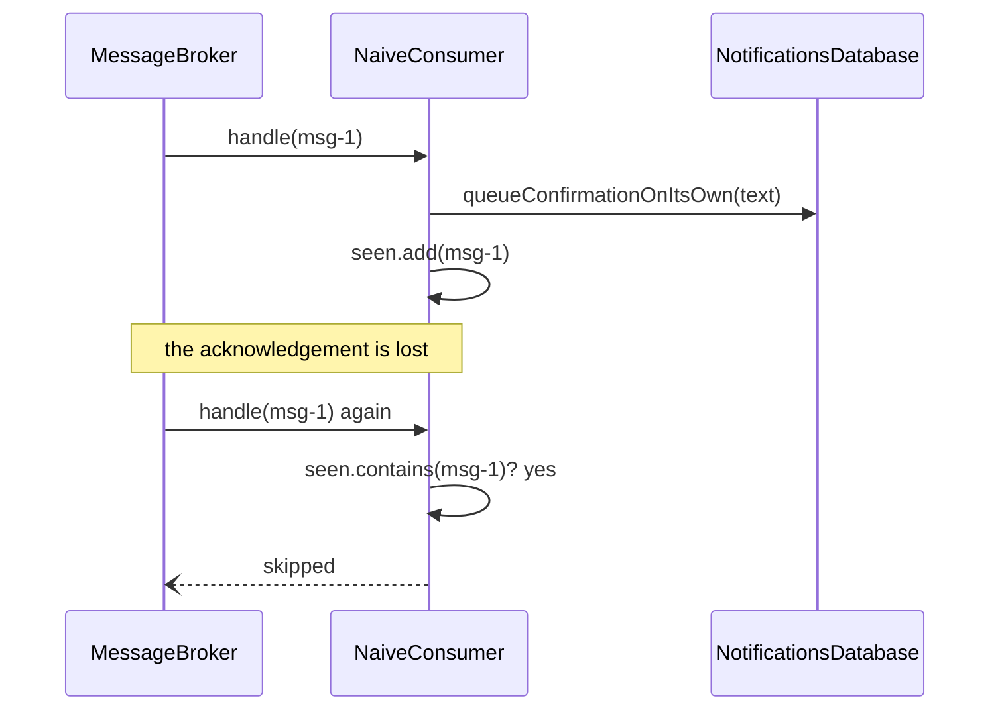
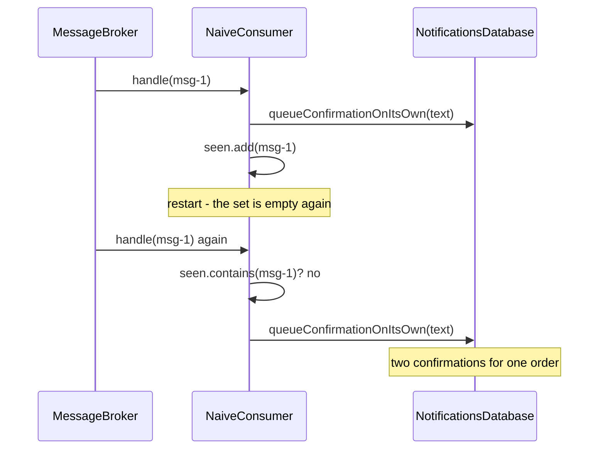
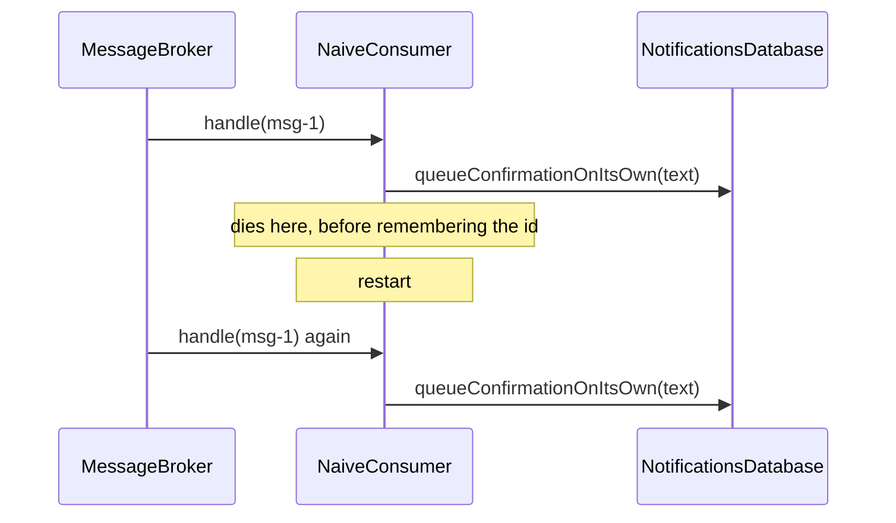
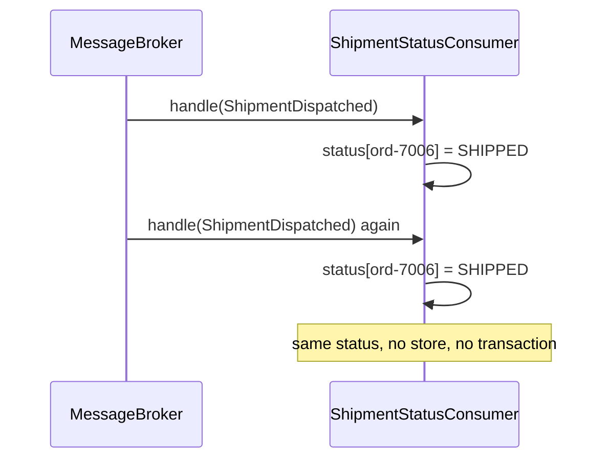

# Idempotent Consumer — Sequence Diagrams

Five acts, five sequences. The fourth one is rendered; the rest are here to read.

## Act Four — One Commit Covers Both

The second delivery is a read and nothing else. `ignoringIsCheap` is the test that says so.

## Act One — A Set Of Ids, And It Works

Correct about what to do, wrong about where to keep the evidence.

## Act Two — The Deploy

The database survived the deploy and the set did not.

## Act Three — The Gap

No restart is needed to cause this, only a crash in the wrong instant. Two writes, two
moments, one gap.

## Act Five — The Handler That Needed None Of It

There is no database in this diagram at all, and that is the point of it.

## Notes On Reading These

**Dashed arrows are things that did not happen.** An ignored redelivery writes nothing.

**The duplicate is never prevented, only absorbed.** In every diagram the broker delivers
twice. Nothing on the receiving side can stop that; the only question is what the second
delivery does.

**The exactly-once lives in one box.** Not in the broker, not in the network — in the
`commit()` inside `NotificationsDatabase`.

**The timings are exact.** `SimulatedClock` advances by fixed amounts — ten milliseconds for
a delivery, five for a commit — so the timelines in the demo output match these sequences
step for step on any machine.
