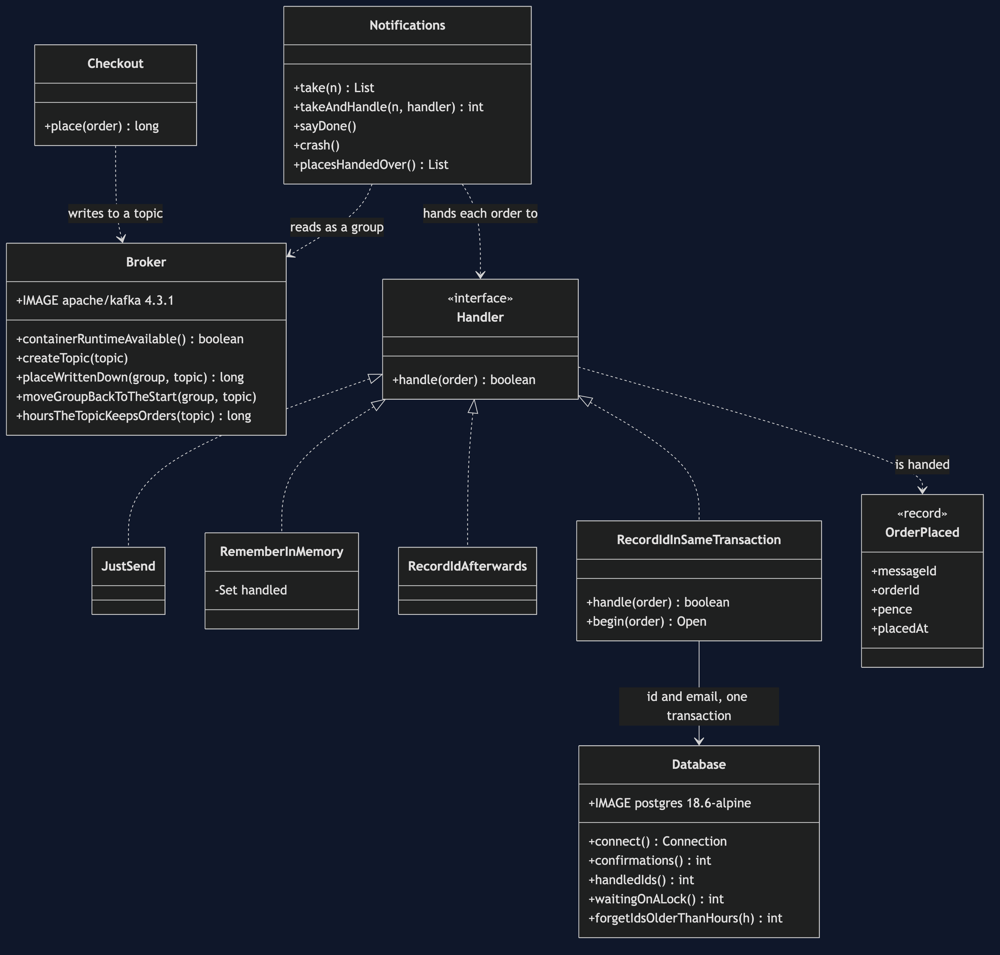
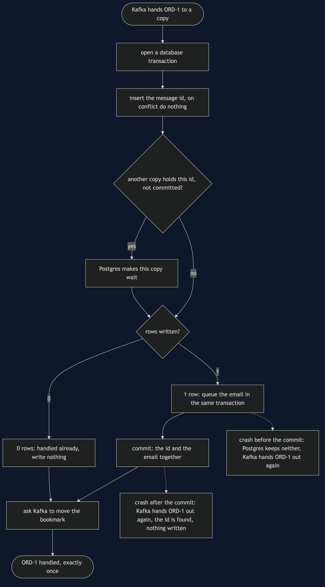
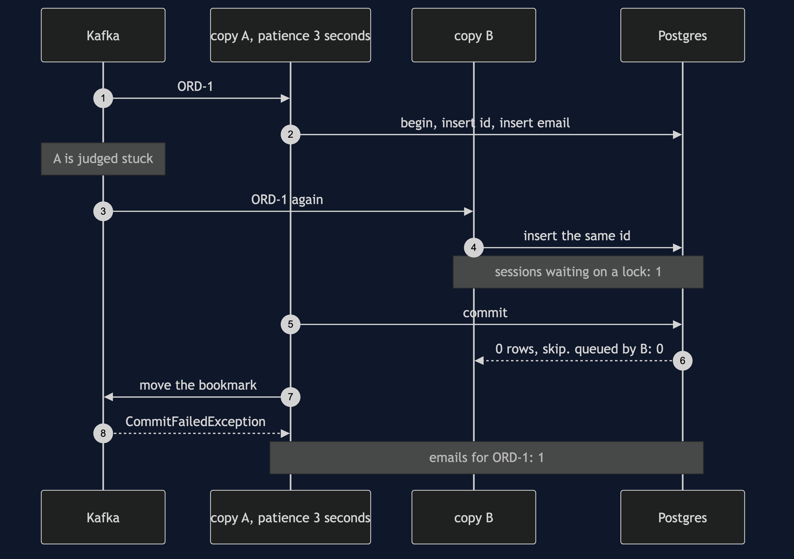
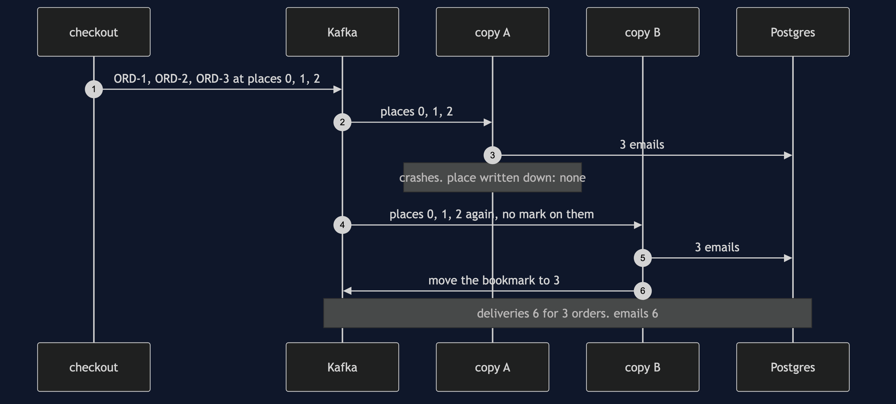
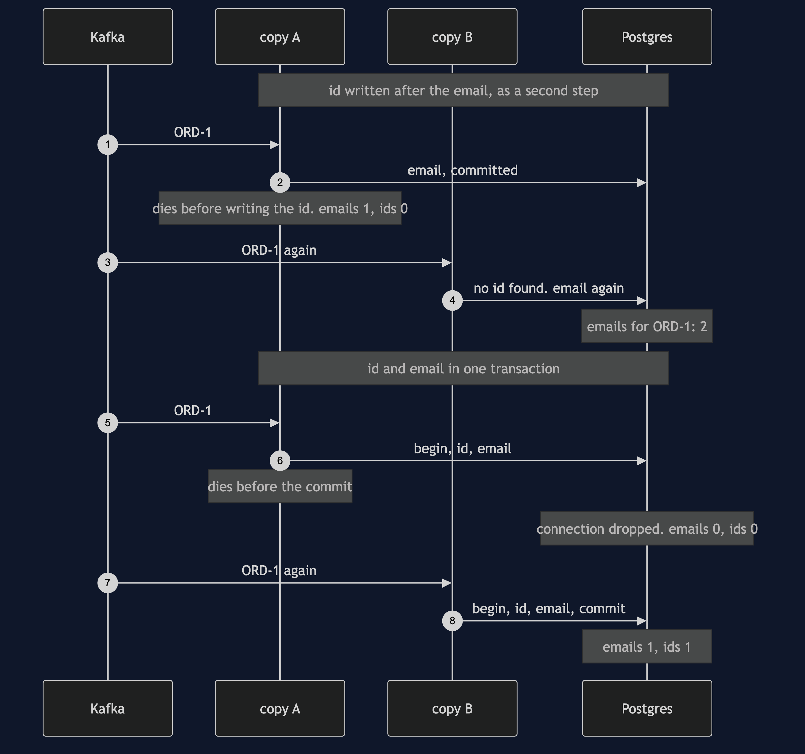
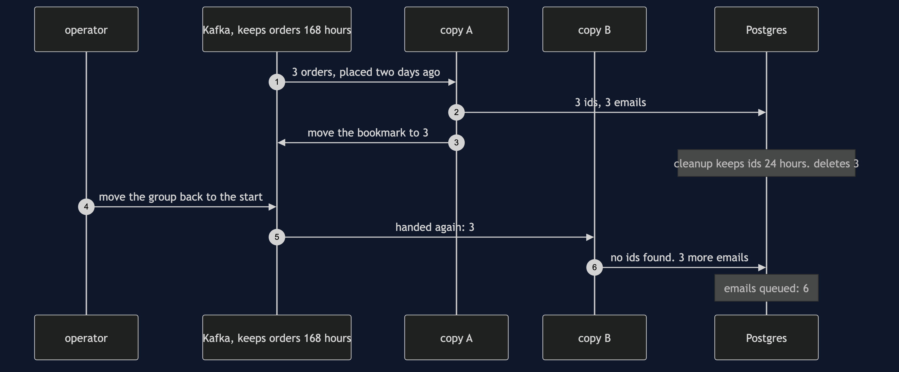

# Idempotent Consumer with Kafka Pattern

```
src/main/java/com/jk/explore/idempotentconsumerkafka/
├── KafkaIdempotentConsumerDemo.java   the six acts
├── Broker.java                        starts and stops a real Kafka broker; reads and moves a group's place
├── Database.java                      starts and stops a real Postgres; the confirmations and handled_messages tables
├── Checkout.java                      writes one OrderPlaced message to the topic per order
├── Notifications.java                 one running copy of the notifications service, in a consumer group
├── Handler.java                       what a copy does with an order it is handed
├── JustSend.java                      remembers nothing
├── RememberInMemory.java              a set of ids inside the copy
├── RecordIdAfterwards.java            a table of ids, written in a second step
├── RecordIdInSameTransaction.java     the pattern: the id and the email in one transaction
├── OrderPlaced.java                   the message, with the id that makes the pattern possible
├── ProcessDied.java                   the process disappearing at an exact line
└── Poll.java                          every wait is a question asked until the answer is yes
```

**On Kafka, a redelivery never goes back to the copy of the service that saw the order first. It happens *because* that copy stopped, so it lands on a new copy whose memory is empty, and Kafka puts no mark on it to say it is a repeat. Worse, a copy that is merely slow can have its order handed to a second copy while it is still working on it. Only a table in a database, written in the same transaction as the work, keeps that to one email — and in this project it is Postgres that makes the second copy wait, and Kafka that refuses the first copy's bookkeeping afterwards.**

**This project needs a container runtime.** Docker Desktop, or anything Docker-compatible, must be running before you start, with about 1 GB of memory to spare. The demo brings up a Kafka broker and a Postgres database in two containers and takes both down again at the end; nothing is installed and nothing is left behind. With no runtime, the demo prints two sentences saying what to do, and stops, rather than a stack trace.

This project is the real-infrastructure version of the plain-Java Idempotent Consumer project in this course. That project delivered a message twice by calling the consumer twice, kept its dedupe store in a map behind a hand-made transaction, and stood in for a restart by emptying a set. This one sends the orders through Kafka, a message log running as its own process, keeps the handled ids in Postgres, a real database in another, and lets both tools produce the duplicates on their own.

## The idea, before any of the tools' words

Think of a cloakroom attendant with a ticket book. Every coat handed over gets a ticket number, and the attendant writes the number in the book as the coat goes on the rail. If someone comes back with the same ticket and says they never handed their coat in, the attendant checks the book, finds the number, and does not hang up a second coat. Two things matter. The book must stay behind the counter when the attendant goes home, or the next attendant starts with an empty one. And the number must go in the book at the same moment the coat goes on the rail, or an attendant who is called away between the two will hang the same coat twice.

In the shop, checkout sends a message for every order placed, and the notifications service queues one confirmation email for each. Kafka promises every message will arrive at least once — sometimes twice. The ticket book is a table of message ids in the notifications service's own database.

## Run

```bash
./gradlew run
```

Six acts, against a real broker and a real database. Every number quoted below, and in every document and slide in this project, comes from this program's own output. Two runs back to back print exactly the same thing.

```
ONE. Kafka sends it again.
  a Kafka broker and a Postgres database are running in containers. checkout places 3 orders, at places 0, 1, 2.
  notifications copy A is handed 3, queues 3 confirmation emails, and crashes before writing down its place. place written down: none.
  copy B joins the same group and is handed the same orders again, at places 0, 1, 2. nothing on them says they are repeats.
  deliveries: 6 for 3 orders. confirmation emails queued: 6.
TWO. A list of ids in memory.
  copy A keeps a list of handled ids in memory. it handles 3 orders, remembers 3 ids, and crashes before writing down its place.
  copy B is handed the same 3. its list starts with 0 ids. confirmation emails queued: 6.
  the list died with copy A. a redelivery happens because a copy stopped, so it always lands on a list that is new.
THREE. A table of ids, in the same transaction.
  copy A writes each order's id and its email in one database transaction. it handles 3 and crashes before writing down its place.
  copy B is handed the same 3. the table already holds their ids, so B skips 3 and queues 0.
  deliveries: 6. confirmation emails queued: 3. ids stored: 3. the table outlived the copy that wrote it.
FOUR. Where the crash lands.
  id written after the email, as a second step. copy A queues ORD-1's email and dies before writing the id. emails: 1, ids: 0.
  copy B is handed ORD-1, finds no id, and queues it again. emails for ORD-1: 2.
  id and email in one transaction. copy A dies before the commit, and Postgres throws both away. emails: 0, ids: 0.
  copy B is handed ORD-1 and handles it properly. emails: 1, ids: 1. exactly once, from a broker that promises at least once.
FIVE. Two copies at once.
  copy A is handed ORD-1 and is slow. after 3 seconds without asking for more, Kafka decides A is stuck and hands the order to copy B.
  both copies are working on ORD-1. A has written the id and not committed. B writes the same id, and Postgres makes it wait. sessions waiting on a lock: 1.
  A commits. B is told the id is taken, and skips it: queued by B: 0. emails for ORD-1: 1.
  A finishes and asks for its place to be written down. Kafka refuses with CommitFailedException: A no longer owns those orders.
SIX. The bill.
  3 orders placed two days ago are handled. ids stored: 3. a cleanup job keeps ids for 24 hours, and deletes 3.
  this topic keeps orders for 168 hours. an operator replays the group from the start. handed again: 3. emails queued: 6.
  keep the ids at least as long as Kafka keeps the orders.
  and every message needs an id that stays the same when it is sent again, and every copy needs a transaction to put it in.
  and there are two more systems to run: this demo needed 2 containers, a broker and a database, for 1 email per order.
```

The first run pulls two images, Kafka at about 446 MB and Postgres at about 298 MB once unpacked, and takes longer. After that a run takes about twenty seconds, most of it the two containers starting and the three-second wait in act five.

**Every count in the output is exact, and none depends on timing.** The demo holds each copy still until the count has been read, and every wait is a poll on something Kafka or Postgres can be asked — which place the broker has written down, whether a copy has been handed an order, how many database sessions are waiting on a lock. The one figure that is a setting rather than a count is act five's 3 seconds: it is the patience the demo gives its copies, and Kafka acts on it.

Both containers listen on their usual ports inside — 9092 for Kafka, 5432 for Postgres — and Testcontainers maps each to a free port on this machine picked at random, so the demo never collides with a Kafka or a Postgres you already run.

## Test

```bash
./gradlew test
```

3 test classes, 14 test methods. `PlainPartsTest` needs nothing installed. `RealInfrastructureTest` starts one broker and one database for the whole class and asks them directly: a copy that stops before writing down its place is followed by the same orders at the same places, a copy that writes it down is not, a set in memory starts empty in the next copy, the table turns six deliveries into three emails, a crash between the email and the id sends the email twice, a crash before the commit writes neither, two copies holding the same order queue one email and the slow one's bookkeeping is refused, and a replay after a cleanup sends every email again. `DemoRunsTest` runs the demo and asserts every figure the documents quote.

There is no `Thread.sleep` anywhere under `src/test`. Every wait is a bounded poll with a sixty-second limit that fails the test rather than hanging it. The tests that need the containers are skipped when no container runtime is there; the rest still run.

## What the simulation got right, and what it left out

This is the reason this project exists, so it comes before anything else.

**What the plain-Java Idempotent Consumer project got right.** All of the pattern. A message can arrive twice, because a sender that hears nothing back must send again. A set of ids in memory catches an ordinary duplicate and loses everything at a restart. Writing the id after the work leaves a gap where a crash keeps the work and loses the id. Writing the id and the work in one transaction closes the gap, and turns at-least-once delivery into exactly one effect. The store cannot keep ids for ever, so its window is a choice. Every one of those lessons holds on Kafka and Postgres, and acts two, three and four reproduce them against the real tools.

**What it left out, first, and the headline find: the redelivery goes to somebody else.** In the simulation the broker called the same consumer object twice, so a set in that object had a fair chance. On Kafka a message is handed out again only when the group's written-down place is behind it, and that happens because the copy that was handed it stopped before writing its place down. So the second delivery goes to a different copy, or to the same program after a restart — either way, to a memory that is empty. In act two, copy A remembered 3 ids and copy B started with 0. A set of ids in memory does not merely fail at a restart; on Kafka, a restart is the only time a duplicate arrives.

**Second: Kafka puts no mark on a repeat.** Kafka hands out orders by their numbered place in the log. In act one copy B was handed the same orders at places 0, 1 and 2, exactly as copy A had been, and nothing on them said they had been handed out before. A consumer cannot ask Kafka whether it has seen a message. It has to keep its own record, and the record has to be keyed on the message's own id, not on the place: the same order sent twice by checkout lands at two different places.

**Third: two copies can hold the same order at the same time.** The simulation was one thread, so a duplicate always came after the first delivery had finished. Kafka gives each copy a patience limit: if a copy goes too long without asking for more orders, Kafka decides it is stuck and hands its orders to another copy. Kafka calls this limit `max.poll.interval.ms`, and its default is five minutes. In act five the limit is 3 seconds, copy A is slow, and copy B is handed ORD-1 while A is still in the middle of it. Both run the pattern. A has written the id and not yet committed; B writes the same id, and Postgres makes B wait on A's lock. When A commits, B is told the id is taken and skips it: 1 email. Then A asks Kafka to write down its place, and Kafka refuses with a `CommitFailedException`, because A no longer owns those orders. A check in Java — "is the id there? then skip" — would have let both through; the database's primary key is what decided.

**Fourth: the window has a floor, and Kafka sets it.** The simulation's window was "chosen rather than derived". On Kafka it has a lower bound. A topic keeps its messages for a set time, and anyone can move a group's place back and replay them. This topic keeps orders for 168 hours, Kafka's default of seven days. In act six a cleanup job keeps ids for 24 hours; an operator replays the group; 3 orders are handed out again, and 3 more emails are queued. Keep the ids at least as long as Kafka keeps the orders.

**Fifth: the restart the simulation faked is real here.** The simulation stood in for a restart by emptying a set and for a crash by throwing an exception. Here copy A's Kafka connection is actually closed without writing its place, and in act four its database connection is actually dropped with a transaction open, and Postgres itself throws the half-done work away: 0 emails, 0 ids. The one thing still faked is the exact moment of death, marked by `ProcessDied`, because a Java program cannot kill itself at a chosen line and carry on to show what happens next.

**One honest simplification.** A copy that crashes here leaves the group politely, so Kafka hands its orders on at once. A copy that is killed outright cannot say goodbye, and Kafka first waits for its heartbeat to stop — 45 seconds by default. The orders the next copy is handed are the same either way; only the wait differs.

**What Kafka's own "exactly once" does not cover.** Kafka has transactions of its own, and a setting that makes a producer's retries safe. Both are about messages going into Kafka and between Kafka topics. Neither reaches into Postgres, so neither can stop a confirmation email being queued twice. The database transaction in this project is the only thing that can.

## Technologies and versions

| What | Version | Why it is here |
| --- | --- | --- |
| Java | 21 | The repository standard, via the Gradle toolchain block |
| Gradle | 9.2.1 | The wrapper in this directory; no separate install needed |
| Kafka | 4.3.1 | The broker, as the Apache project's own `apache/kafka:4.3.1` image, in KRaft mode on a single node with a 256 MB heap; the newest release |
| Kafka Java client | 4.3.1 | `org.apache.kafka:kafka-clients`, the newest release, matching the broker |
| Postgres | 18.6 | The notifications database, as the official `postgres:18.6-alpine` image; the newest release, in its smaller Alpine build |
| Postgres JDBC driver | 42.7.13 | `org.postgresql:postgresql`, the newest release |
| Testcontainers | 2.0.5 | `testcontainers-kafka` and `testcontainers-postgresql`; start and stop both containers from inside the demo, on random free ports |
| slf4j-simple | 2.0.17 | Logging for the libraries above, turned off so the demo's own output is the only output |
| JUnit 5 | 5.10.2 | Test runner |
| A container runtime | Docker 24 or later, or compatible | Runs the broker and the database. Must be running before you start |

Nothing is held back: every version is the newest generally available release. The Kafka image has no Alpine build; the Apache project publishes one image. See [`docs/dependencies.md`](docs/dependencies.md) and [`docs/prerequisites.md`](docs/prerequisites.md).

## Learning Material

| Document | What it covers |
| --- | --- |
| [`docs/problem-statement.md`](docs/problem-statement.md) | The plain-Java version, and what is new |
| [`docs/idempotent-consumer-with-kafka-pattern-explained.md`](docs/idempotent-consumer-with-kafka-pattern-explained.md) | The tools' words in plain language, and six acts |
| [`docs/class-diagram.md`](docs/class-diagram.md) | The types |
| [`docs/architecture-diagram.md`](docs/architecture-diagram.md) | Two containers, two copies, and where each piece of memory lives |
| [`docs/data-flow-diagram.md`](docs/data-flow-diagram.md) | What one copy does with one order, and where a crash can land |
| [`docs/sequence-diagram.md`](docs/sequence-diagram.md) | Written for a listener with the screen off |
| [`docs/uml-diagram.md`](docs/uml-diagram.md) | Four sequences |
| [`docs/animation.html`](docs/animation.html) | The six acts in a browser |
| [`docs/prerequisites.md`](docs/prerequisites.md) | What you need installed, and what you need to know |
| [`docs/session.md`](docs/session.md) | A one-hour taught session |
| [`docs/dependencies.md`](docs/dependencies.md) | What Kafka, Postgres and Testcontainers are, what they cost, and that skipping this project loses none of the pattern |
| [`docs/spec.md`](docs/spec.md) | The generated specification |
| [`docs/youtube.md`](docs/youtube.md) | Title, description and chapters |

### The pattern in one picture



### Where each piece sits


### How one order moves



### Who calls whom, in order


### All four sequences









### Video

Built from [`video/scenes.py`](video/scenes.py) by
[`video/build_video.sh`](video/build_video.sh). The rendered file is not
committed; see [`video/README.md`](video/README.md) for how it is made.

## Where you have already met this

Any service that reads a Kafka topic and changes something outside Kafka: sending emails, charging cards, reserving stock, writing to a search index. Every one of them is handed some messages twice — after a deploy, after a crash, after a slow batch trips the patience limit — and every one that cannot afford the duplicate keeps a table like `handled_messages`. Spring Kafka, Kafka Streams and most outbox relays sit on the same at-least-once promise. The same table, with the same primary key and the same transaction, works behind RabbitMQ, Amazon SQS or any other broker that redelivers.

## When this is too much

If the work is naturally safe to repeat — setting an order's status to shipped, setting a stock level to twenty — there is nothing to deduplicate, and no table is needed. Ask first whether the handler can be rewritten that way. If the work already lives in the same database as the table, the pattern is one extra insert and nearly free; if it does not, the table cannot share a transaction with it, and you need an outbox as well. And the table grows by one row per message, so somebody has to own its cleanup, and has to set the window no shorter than the topic's retention.

## Where this sits

This project pairs with the plain-Java Idempotent Consumer project in this course, and is the real-infrastructure version in [`micro-services-design-patterns`](..).
