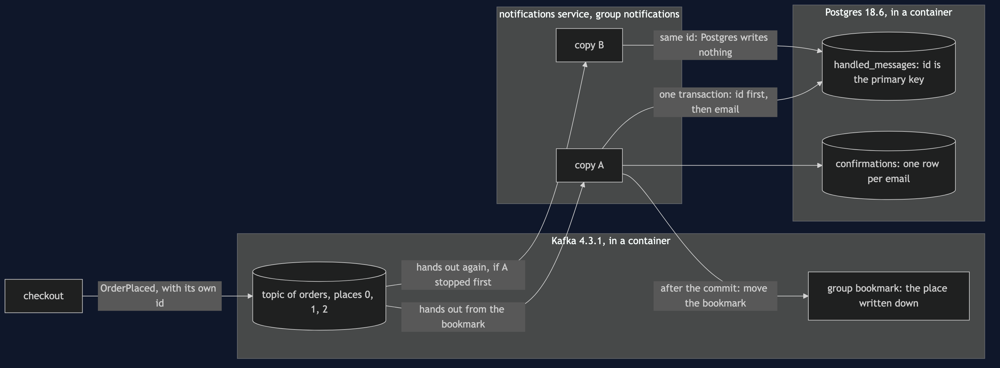

# Idempotent Consumer with Kafka Pattern — Architecture Diagram

Two containers and two copies of one service. Kafka holds the orders and each group's bookmark; Postgres holds the emails and the ids. The only memory that survives a copy stopping is the memory in a container — which is why the ids live in Postgres, beside the emails, and not in either copy.

