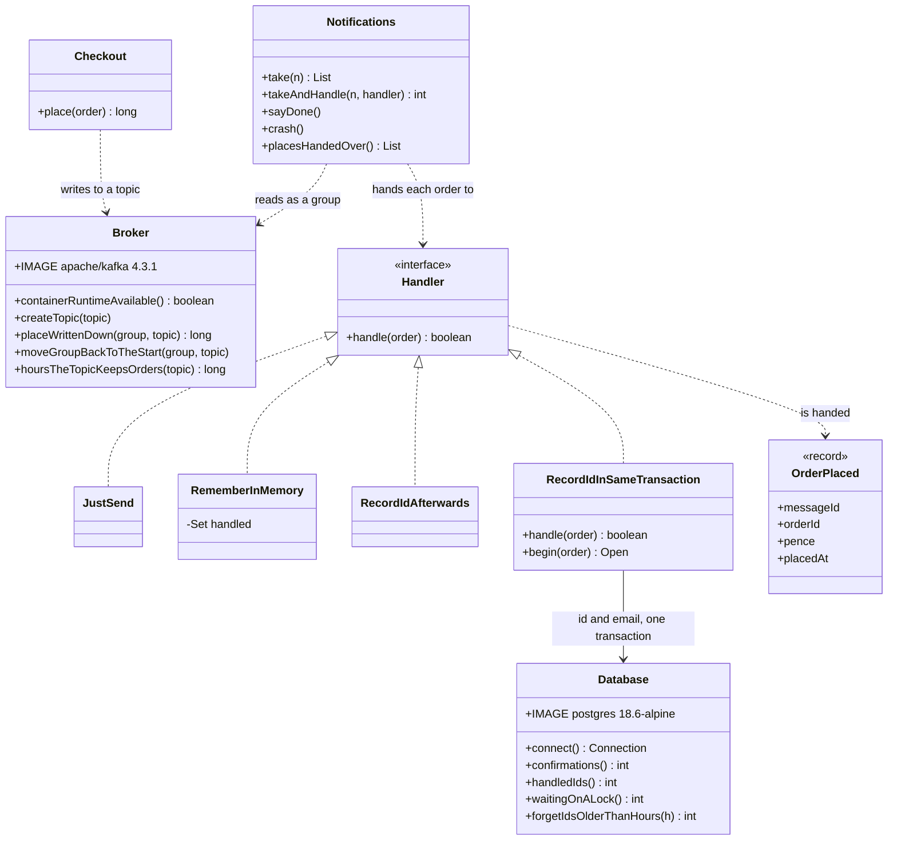

# Idempotent Consumer with Kafka Pattern — Class Diagram

The pattern is one class, `RecordIdInSameTransaction`: it writes the message's id first, inside a transaction, and queues the email only if Postgres says the id was new. `Notifications` is one running copy of the service in its consumer group, `Broker` and `Database` own the two containers, and the other three handlers are the ways of getting it wrong.

Mermaid source

