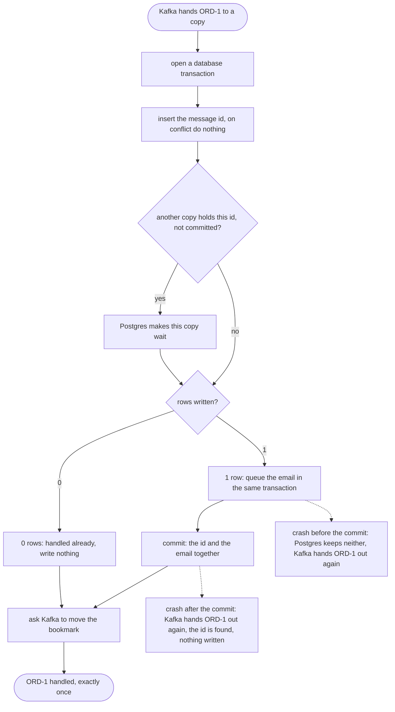

# Idempotent Consumer with Kafka Pattern — Data Flow Diagram

What one copy does with one order, and the three places a crash can land. Only one order of steps makes every crash safe: the id and the email committed together, and the Kafka bookmark moved after that.

Mermaid source

