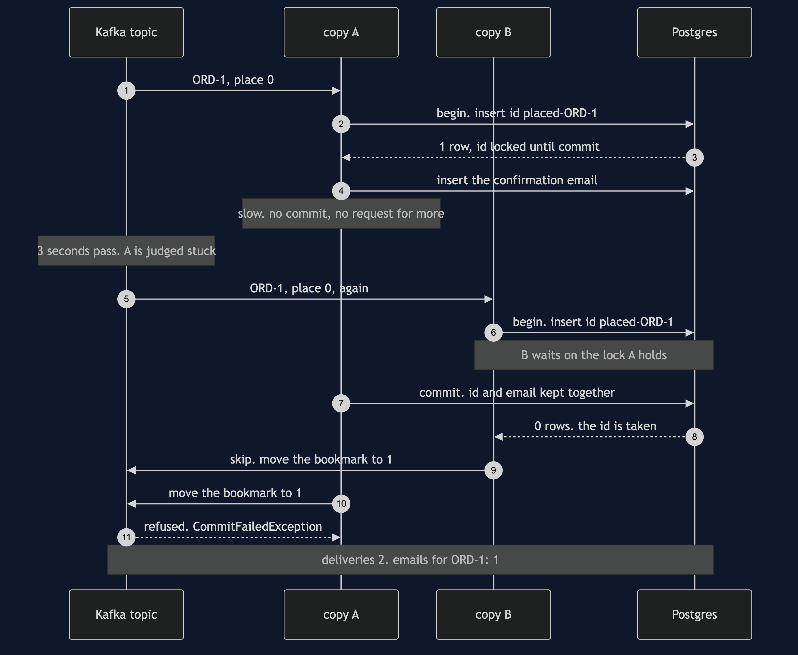

# Idempotent Consumer with Kafka Pattern — Sequence Diagram

Written for a listener with the screen off.

Say it in words. Checkout writes one order, ORD-1, to the Kafka topic, at place 0. Copy A of the notifications service is handed ORD-1. It opens a database transaction and writes ORD-1's message id into the handled-messages table; Postgres writes the row and holds a lock on that id. Copy A writes the confirmation email in the same transaction, and then it is slow: it neither commits nor asks Kafka for more. After three seconds, Kafka decides copy A is stuck and hands ORD-1 to copy B. Copy B opens its own transaction and tries to write the same id. Postgres makes copy B wait, because copy A still holds the lock. Copy A commits: the id and the email are kept together. Postgres now tells copy B the id is taken, and has written nothing, so copy B skips the order and moves the group's bookmark past it. Copy A asks Kafka to move the bookmark too, and Kafka refuses, because copy A no longer owns the order. One order, delivered twice, one email.

The load-bearing sentence: **Kafka will hand the same order to two copies, one after a crash or both at once; the database's primary key, written in the same transaction as the email, is the only thing that sees both of them.**

For the plain redelivery after a crash, the crash that lands between two steps, and the replay after a cleanup, see [`uml-diagram.md`](uml-diagram.md).
