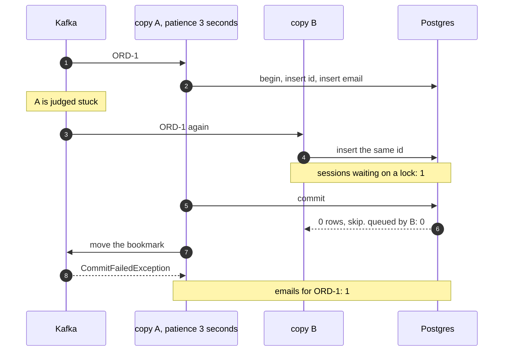
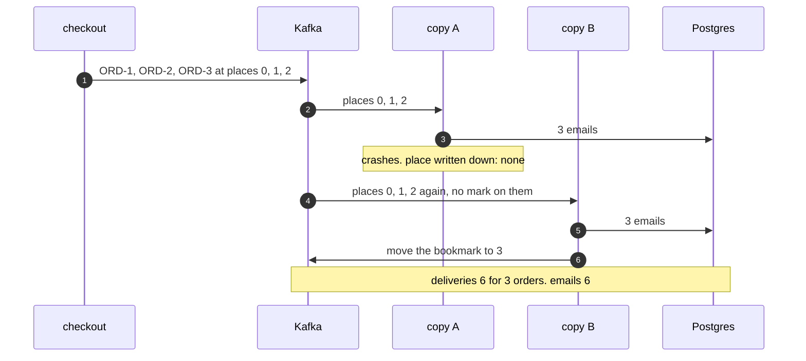
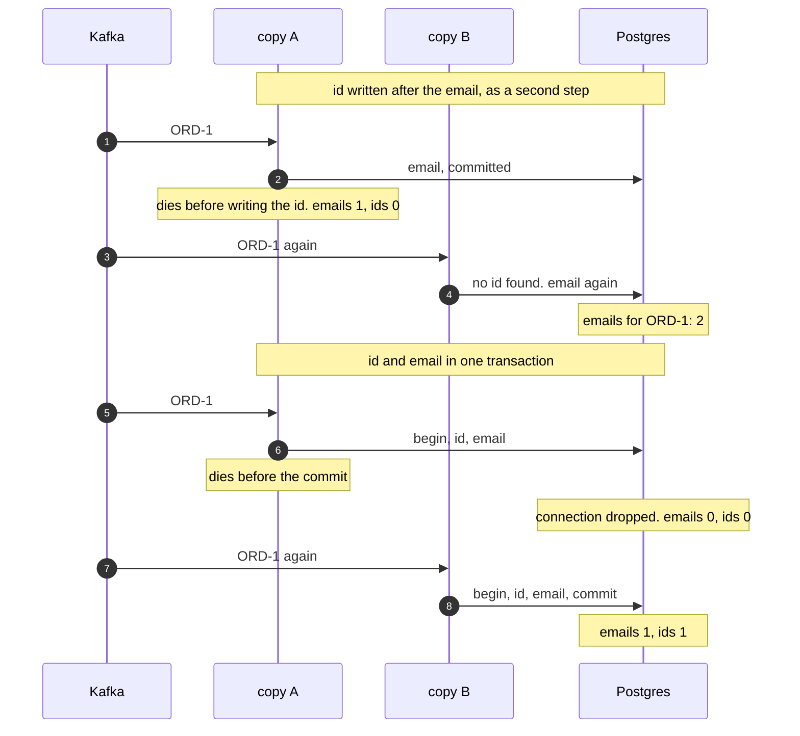
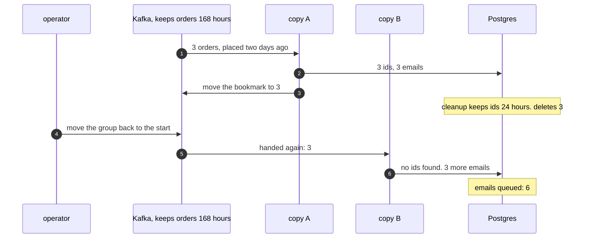

# Idempotent Consumer with Kafka Pattern — UML Sequence Diagrams

Four sequences. Two copies at once comes first, because it is the one thing the plain-Java version, which ran on one thread, could never show.

## 1. Two Copies At Once

Copy A is handed ORD-1 and holds its transaction open for longer than Kafka's patience of 3 seconds. Kafka hands ORD-1 to copy B. Postgres makes B wait on A's lock, then tells B the id is taken. Kafka refuses A's request to move the bookmark.

Mermaid source

## 2. Kafka Sends It Again

Copy A handles three orders with no memory of any kind and stops before moving the bookmark. Copy B is handed the same three at the same places, with no mark on them.

Mermaid source

## 3. Where The Crash Lands

The same crash, first between two steps and then inside one transaction.

Mermaid source

## 4. The Replay

Three orders placed two days ago are handled and their ids stored. The cleanup keeps ids for 24 hours; the topic keeps orders for 168. An operator replays the group.

Mermaid source

