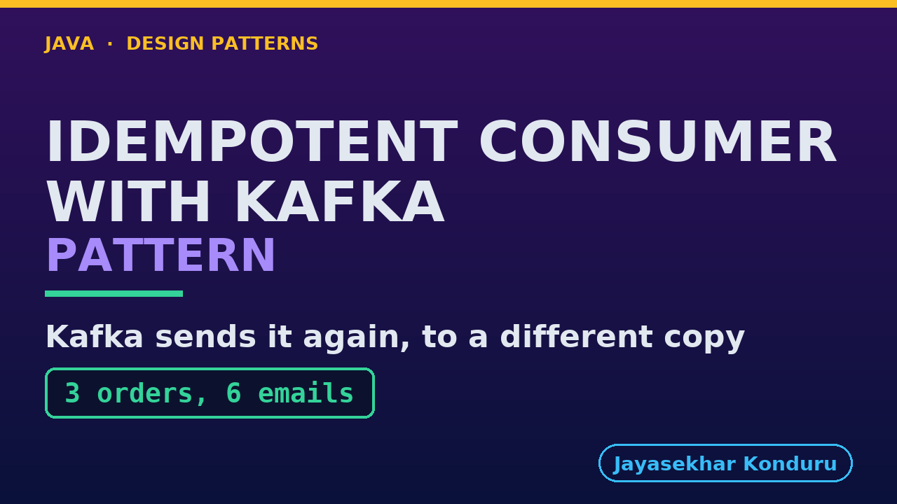

# YouTube — Idempotent Consumer With Kafka Pattern

Everything needed to publish `video/idempotent-consumer-with-kafka-pattern-explained.mp4`. Copy the fields straight out of this file.

Chapter timings are generated from the video's `.srt`. Re-run `python3 docs/make_youtube_docs.py idempotent-consumer-with-kafka` after any change to the narration, or they will be wrong.

## Title

```
Idempotent Consumer with Kafka
```

30 characters — under the 60 YouTube shows before truncating in search results.

## Description

The first two lines are what a viewer sees above the fold, so they carry the hook rather than the boilerplate.

```
Idempotent Consumer pattern in Java: a message can arrive more than once, so the receiver records the ID of every message it handles in the same step as the work, and does nothing when an ID it has already seen turns up. Explained with a real Kafka broker and a real PostgreSQL database. In our online store, each order message queues one confirmation email, and the customer must get exactly one. We watch Kafka hand the same three orders to a second copy of the service, a list of IDs in memory fail to notice, and two copies work on the same order at once while the database decides which one wins.

CHAPTERS
00:00 Introduction
01:02 The Scenario
01:30 Kafka's Words
02:12 Kafka Sends It Again
02:53 A List Of Ids In Memory
03:30 Postgres's Words
03:58 A Table, One Transaction
04:30 Where The Memory Lives
05:03 Where The Crash Lands
05:43 The Pattern In Two Statements
06:12 Two Copies At Once
07:10 The Bill
07:58 What The Simulation Left Out
08:28 The Verdict
08:56 What Is Real Here
09:36 Thanks for Watching

SOURCE CODE, WRITTEN NOTES AND AN INTERACTIVE ANIMATION
https://github.com/jk-boot-up/java-design-patterns/tree/main/gradle-java/micro-services-design-patterns/idempotent-consumer-with-kafka-pattern

WHAT YOU NEED FIRST
Java 21 and a working knowledge of classes and interfaces. No prior design-pattern knowledge is assumed. The full prerequisites are in docs/prerequisites.md in the repository.
```

## Chapters

YouTube renders these as chapters only if there are at least three and the first is at `00:00`.

```
00:00 Introduction
01:02 The Scenario
01:30 Kafka's Words
02:12 Kafka Sends It Again
02:53 A List Of Ids In Memory
03:30 Postgres's Words
03:58 A Table, One Transaction
04:30 Where The Memory Lives
05:03 Where The Crash Lands
05:43 The Pattern In Two Statements
06:12 Two Copies At Once
07:10 The Bill
07:58 What The Simulation Left Out
08:28 The Verdict
08:56 What Is Real Here
09:36 Thanks for Watching
```

## Tags

```
idempotent consumer, kafka, postgres, exactly once, design patterns, java design patterns, gang of four, java 21, software design, clean code, object oriented design, java tutorial, ecommerce, programming tutorial
```

213 characters, under YouTube's 500 limit.

## Thumbnail



**Upload `docs/thumbnail.png`** — 1280×720, the size YouTube recommends, generated by `docs/make_thumbnails.py`. It is deliberately not the same image as the video's opening frame: a thumbnail is judged at about 360 pixels wide in a search result, so this one carries only the pattern name, one line of promise and one short piece of code, each set large enough to survive the shrink.

`video/poster.png` is the 1920×1080 opening frame, produced by the video build. It stays in the repository as the title card; it is not what gets uploaded.

YouTube will not pick the thumbnail up on its own — upload it under **Details → Thumbnail → Upload file**. A custom thumbnail requires a verified channel.

## Upload checklist

- [ ] Upload `video/idempotent-consumer-with-kafka-pattern-explained.mp4` (1080p, H.264, 30 fps, AAC 48 kHz — already YouTube's recommended settings, no re-encode needed)
- [ ] Set the video language to **English** first, or the subtitle option may not appear
- [ ] Add subtitles: *Video elements → Add subtitles → Upload file → With timing* → `video/idempotent-consumer-with-kafka-pattern-explained.srt`
- [ ] Upload `docs/thumbnail.png` as the thumbnail — do not let YouTube auto-pick a frame
- [ ] Paste the title, description and tags from above
- [ ] Add to the **Java Design Patterns** playlist, in learning order
- [ ] Wait for 1080p processing before sharing the link — code slides are unreadable at 360p

## Cards and end screen

End screen links to whichever pattern video goes up next — set it at upload time rather than assuming an order.

Add a card partway through pointing at the playlist, so a viewer who arrives at this pattern from search can find the rest of the series.

## Runtime

Approximately 10:17, narrated at 145 words per minute.
