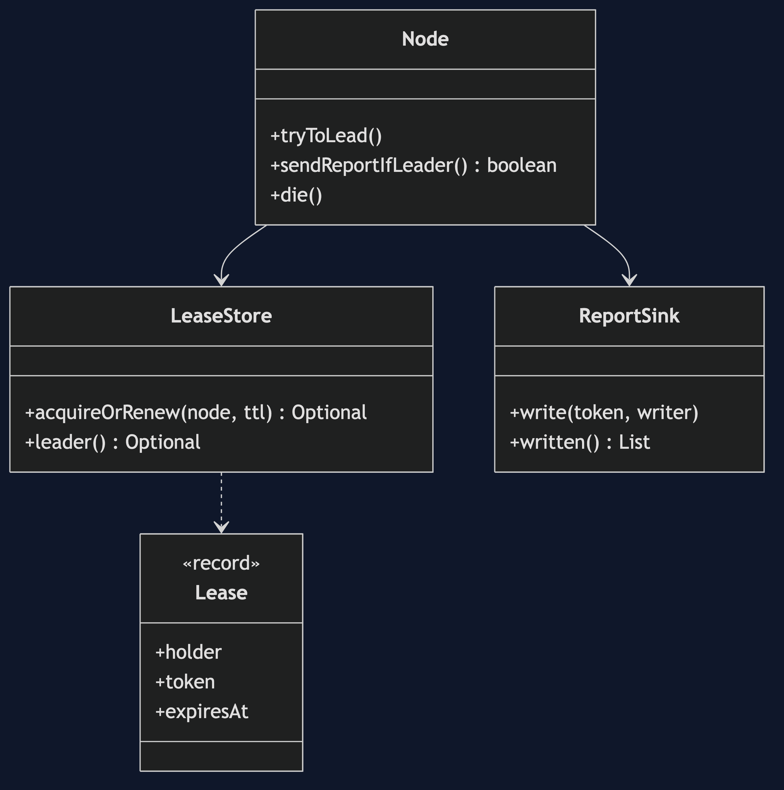
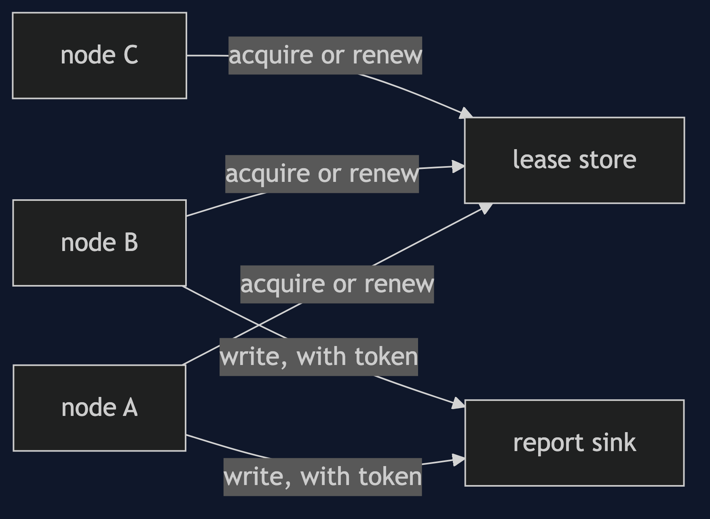
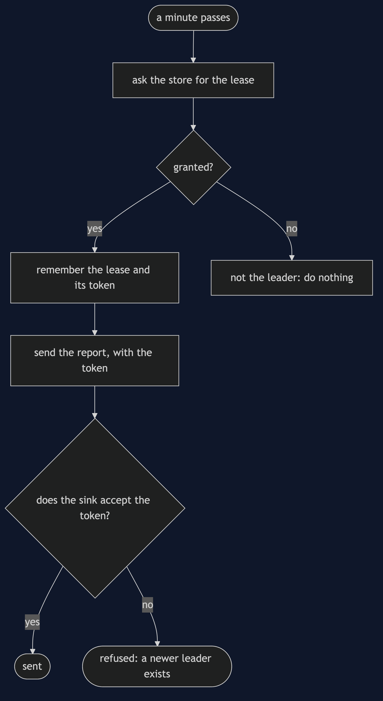
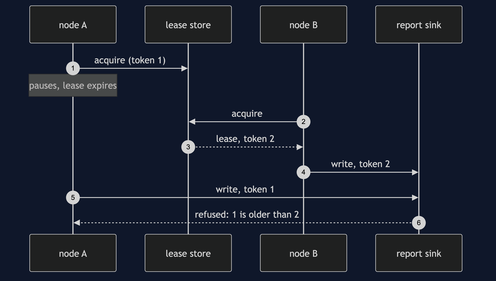
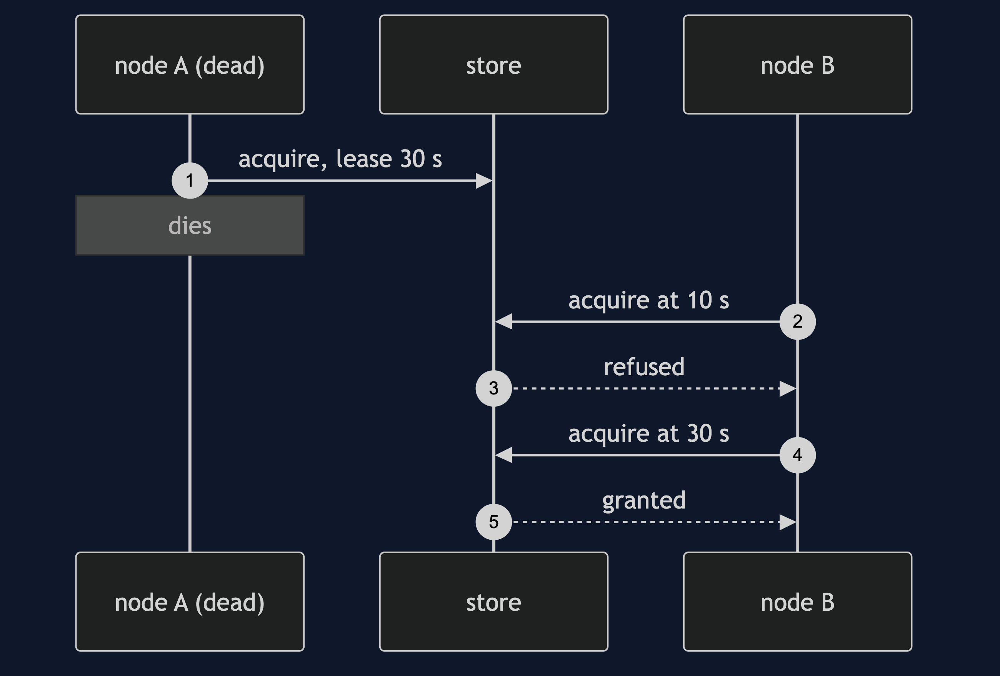

# Leader Election Pattern

```
src/main/java/com/jk/explore/leaderelection/
├── LeaderElectionDemo.java          the six acts
├── LeaseStore.java                  one shared record: who leads, until when, with what token
├── Lease.java  Node.java            a copy of the service that asks for the lease
├── ReportSink.java                  where the report goes; can check the fencing token
└── Clock.java                       moves only when told to
```

**Leader election gives one copy the job, by lease, and takes it away if the leader goes quiet.**

This project is in [micro-services-design-patterns](..). It is the coordination pattern behind singletons in a cluster, and the reason for locks in [Pessimistic Offline Lock](../../enterprise-design-patterns/pessimistic-offline-lock-pattern): the same lease, on a whole service.

## Run

```bash
./gradlew run
```

Six acts. Every number quoted below comes from this program's own output.

```
ONE. Three copies, nobody in charge.
  the nightly sales report is sent by every copy: [A, B, C].
  the manager receives it three times.
TWO. One holds the lease.
  all three ask for the lease. the leader is A. the report was sent by: [A].
THREE. The leader dies.
  A, the leader, dies. leader now: A, and its lease has 30 seconds to run.
  after 10 seconds B asks: leader is still A.
  after 30 seconds the lease has expired. B asks first and becomes leader: B.
  for those 30 seconds nobody was leading. that is the cost of not being sure A was dead.
FOUR. Two who think they lead.
  A paused for 35 seconds, say for a long garbage collection. its lease expired and B took it. the store says the leader is B.
  A wakes up, still believing it leads, and sends. so does B. the report was sent by: [A, B].
FIVE. Fencing.
  A wakes up and tries to send: refused, token 1 is older than 2.
  the report was sent by: [B]. each lease carries a token that only goes up, and the thing being written to checks it.
SIX. The bill.
  a leader that is perfectly healthy, renewing every 7 seconds against a lease of 5: it loses leadership at second 5.
  the same leader against a lease of 30: never loses it.
  the lease must be longer than the renewal interval, with room for a slow moment. too long, and a dead leader goes unnoticed for that long.
  and everything now depends on one shared record. if it is down, nobody can lead.
```

## Test

```bash
./gradlew test
```

2 test classes, 9 test methods, offline, with nothing installed and no framework.

## Technologies and versions

| What | Version | Why it is here |
| --- | --- | --- |
| Java | 21 | The repository standard, via the Gradle toolchain block |
| Gradle | 9.2.1 | The wrapper in this directory; no separate install needed |
| JUnit 5 | 5.10.2 | Test runner |

No framework. A hand-built project stays plain Java so the mechanism is the whole lesson.

## Learning Material

| Document | What it covers |
| --- | --- |
| [`docs/problem-statement.md`](docs/problem-statement.md) | One job, three copies |
| [`docs/leader-election-pattern-explained.md`](docs/leader-election-pattern-explained.md) | The pattern, and six acts |
| [`docs/class-diagram.md`](docs/class-diagram.md) | The types |
| [`docs/architecture-diagram.md`](docs/architecture-diagram.md) | Copies, a lease record and a sink |
| [`docs/data-flow-diagram.md`](docs/data-flow-diagram.md) | How a copy decides to act |
| [`docs/sequence-diagram.md`](docs/sequence-diagram.md) | Written for a listener with the screen off |
| [`docs/uml-diagram.md`](docs/uml-diagram.md) | Four sequences |
| [`docs/animation.html`](docs/animation.html) | The six acts in a browser |
| [`docs/prerequisites.md`](docs/prerequisites.md) | What you need to know |
| [`docs/session.md`](docs/session.md) | A one-hour taught session |
| [`docs/spec.md`](docs/spec.md) | The generated specification |
| [`docs/youtube.md`](docs/youtube.md) | Title, description and chapters |

### The pattern in one picture



### Where each piece sits



### How one request moves



### Who calls whom, in order



### All four sequences




### Video

Built from [`video/scenes.py`](video/scenes.py) by
[`video/build_video.sh`](video/build_video.sh). The rendered file is not
committed; see the repository README for why.

## Where you have already met this

Kubernetes controllers, Kafka's controller broker, and every cluster with a single scheduler.

## When this is too much

If a job is safe to run twice, or if a single instance is acceptable, an election is machinery for nothing. The simplest leader is the only instance.

## Where this sits

This project is in [`micro-services-design-patterns`](..), and is meant to be read with its neighbours there.
