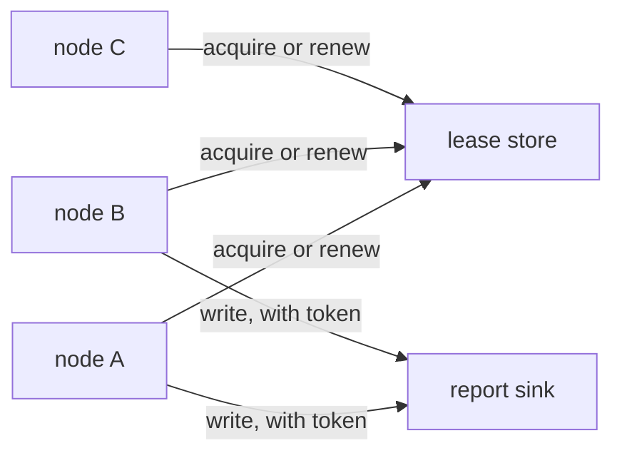

# Leader Election Pattern — Architecture Diagram

Every copy asks the same record. Only the holder acts, and the sink checks.

Mermaid source

```mermaid
flowchart LR
    A["node A"] -->|acquire or renew| L["lease store"]
    B["node B"] -->|acquire or renew| L
    C["node C"] -->|acquire or renew| L
    A -->|write, with token| S["report sink"]
    B -->|write, with token| S
```

