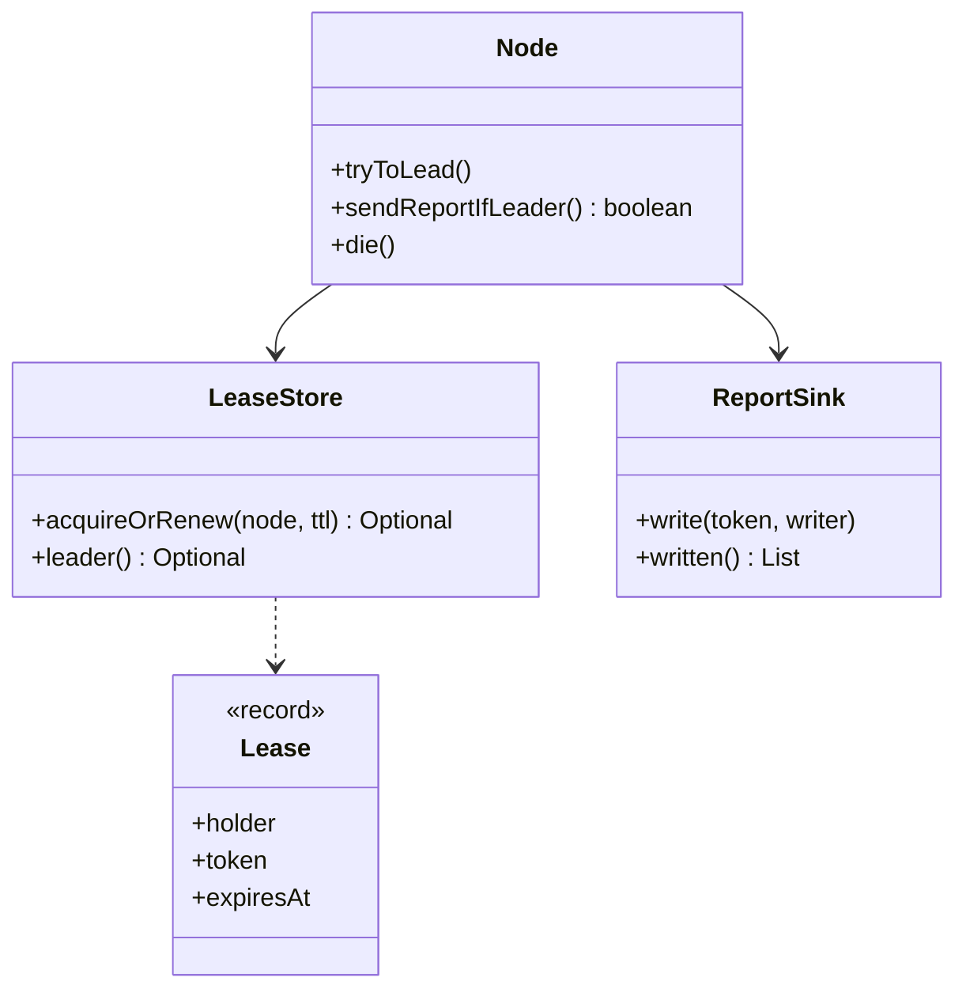

# Leader Election Pattern — Class Diagram

Nodes ask a lease store. The sink checks the token.

Mermaid source

```mermaid
classDiagram
    class LeaseStore {
        +acquireOrRenew(node, ttl) Optional
        +leader() Optional
    }
    class Lease {
        <<record>>
        +holder
        +token
        +expiresAt
    }
    class Node {
        +tryToLead()
        +sendReportIfLeader() boolean
        +die()
    }
    class ReportSink {
        +write(token, writer)
        +written() List
    }
    Node --> LeaseStore
    Node --> ReportSink
    LeaseStore ..> Lease
```

