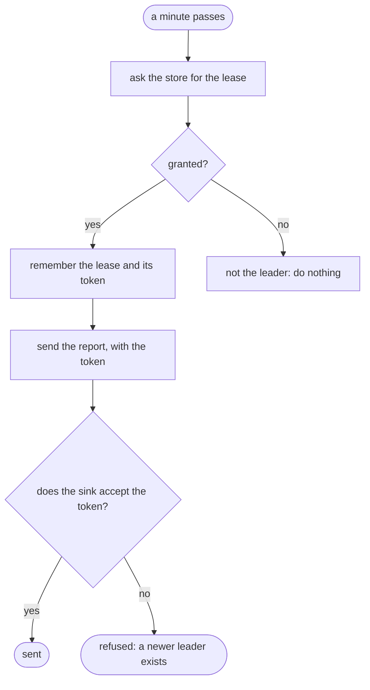

# Leader Election Pattern — Data Flow Diagram

What a copy does each minute.

Mermaid source

```mermaid
flowchart TD
    Tick(["a minute passes"])
    Ask["ask the store for the lease"]
    Got{"granted?"}
    Lead["remember the lease and its token"]
    Wait["not the leader: do nothing"]
    Job["send the report, with the token"]
    Ok{"does the sink accept the token?"}
    Done(["sent"])
    Stale(["refused: a newer leader exists"])
    Tick --> Ask --> Got
    Got -- yes --> Lead --> Job --> Ok
    Got -- no --> Wait
    Ok -- yes --> Done
    Ok -- no --> Stale
```

