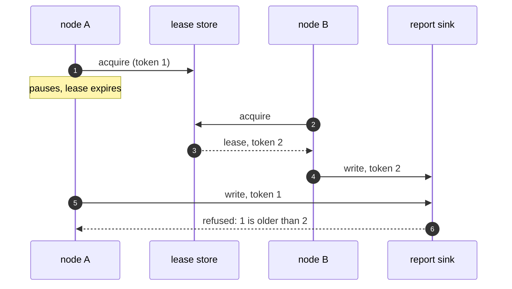

# Leader Election Pattern — Sequence Diagram

Written for a listener with the screen off.

Say it in words. A holds the lease with token one. A pauses. Its lease expires. B asks the store and is granted the lease with token two. B sends the report with token two, and the sink records it. A wakes, still believing it leads, and sends with token one. The sink has seen token two, so it refuses A's write. Only B's report was sent.

Mermaid source

The load-bearing sentence: **the thing being written to is the last line of defence against a stale leader.**
