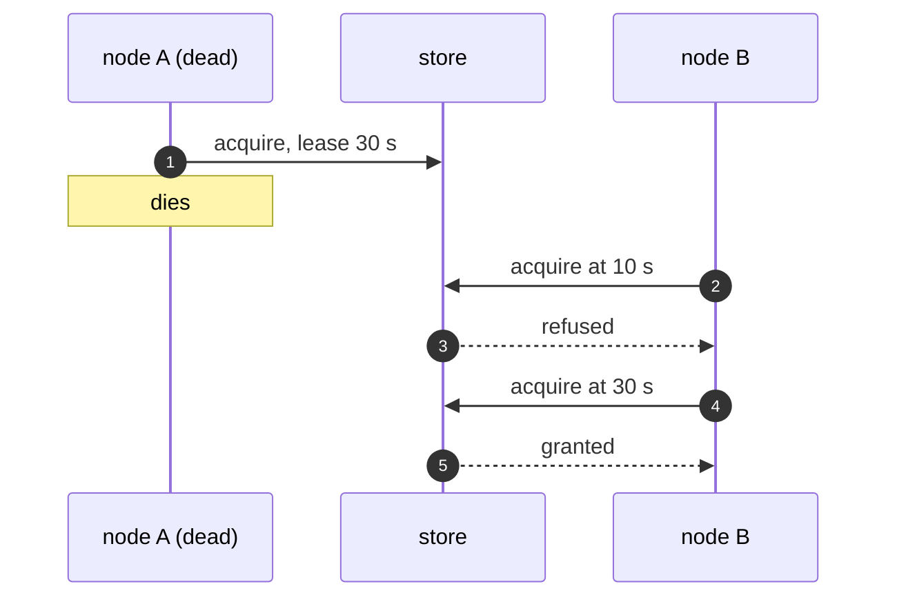

# Leader Election Pattern — UML Sequence Diagrams

Four sequences.

## 1. A Takeover

Mermaid source

```mermaid
sequenceDiagram
    autonumber
    participant A as node A (dead)
    participant S as store
    participant B as node B
    A->>S: acquire, lease 30 s
    Note over A: dies
    B->>S: acquire at 10 s
    S-->>B: refused
    B->>S: acquire at 30 s
    S-->>B: granted
```

