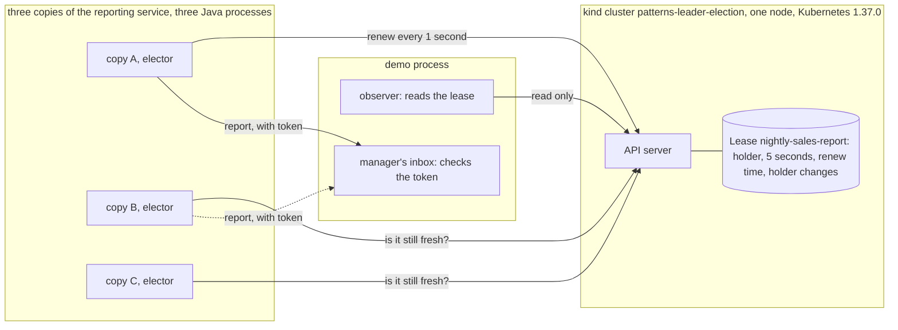

# Leader Election with Kubernetes Pattern — Architecture Diagram

Three copies, each its own process, and one record they all read and write. The record lives in the API server, inside a one-node cluster in the container runtime. The fencing check lives in the inbox, outside Kubernetes altogether.

Mermaid source

