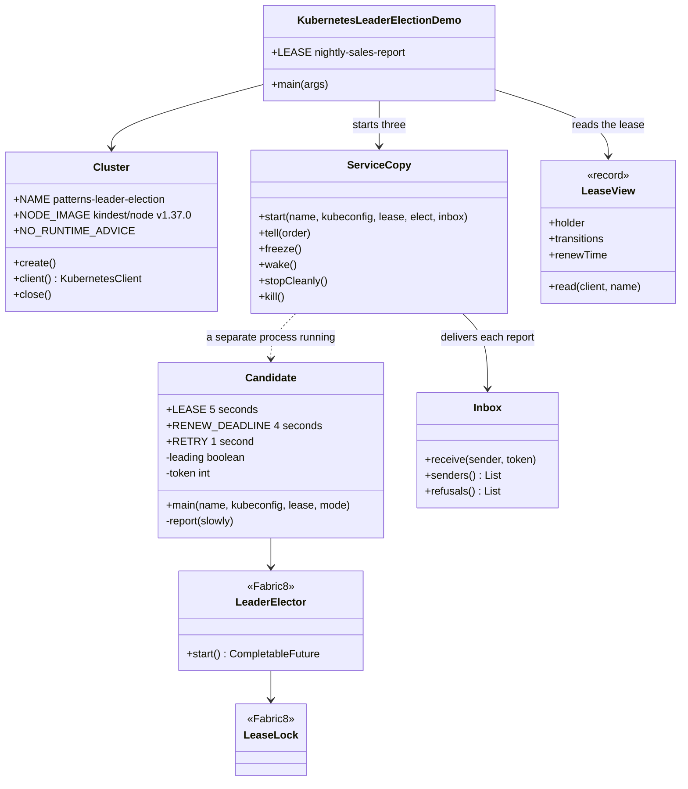

# Leader Election with Kubernetes Pattern — Class Diagram

The pattern lives in `Candidate`, which hands the election to Fabric8's `LeaderElector` on a `LeaseLock`. `Inbox` holds the fencing check. Everything else runs the cluster and the copies.

Mermaid source

