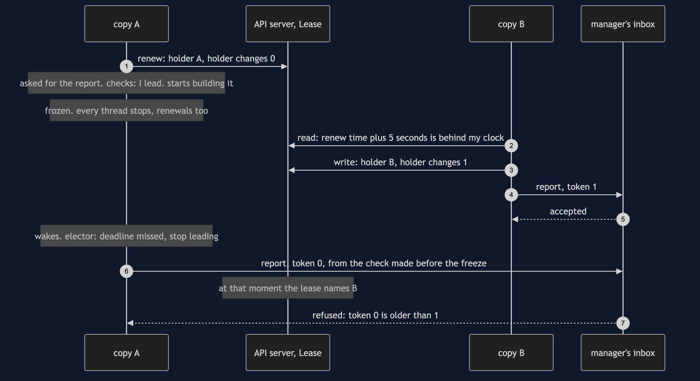
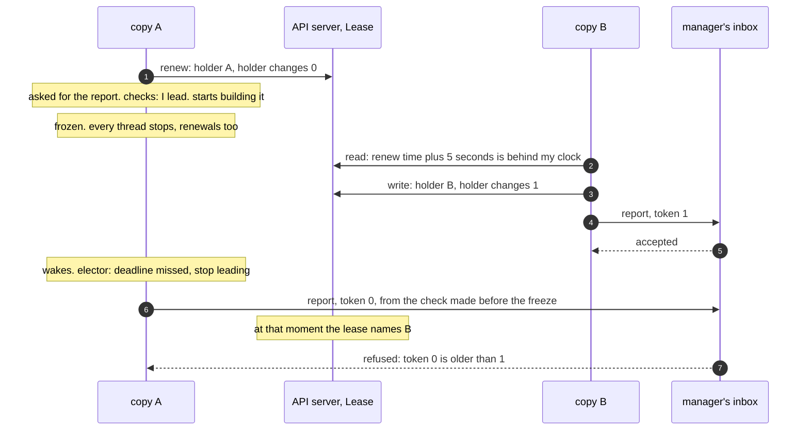

# Leader Election with Kubernetes Pattern — Sequence Diagram

Written for a listener with the screen off.

Say it in words. Copy A holds the lease and renews it every second. The store asks A for the nightly sales report. A checks that it leads, and it does. It starts building the report. Then A's whole process freezes, every thread at once, the way a long garbage-collection pause freezes a program. A stops renewing. Copy B, which has been reading the lease every second, sees that the last renewal plus five seconds is now behind its own clock. B writes its own name into the lease, and the count of holder changes goes from zero to one. B sends the report with token one, and the inbox accepts it. Now A wakes up. Its elector sees it missed its deadline and says it no longer leads, but A has already checked, and it finishes the report and sends it with token zero. The lease, read at that moment, names B. The inbox has already seen token one, so it refuses token zero. One report reaches the manager.

Mermaid source

The load-bearing sentence: **the lease can tell everyone else that A is no longer the leader, but only the thing A writes to can stop A acting on the old answer.**

For the clean shutdown, the killed leader, the version check and the loser that never rejoins, see [`uml-diagram.md`](uml-diagram.md).
