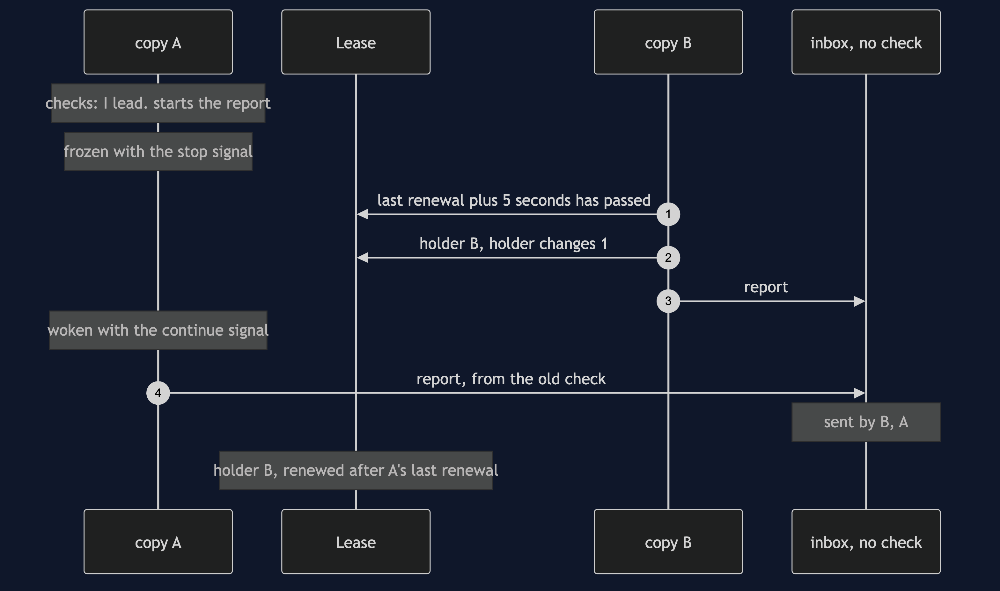
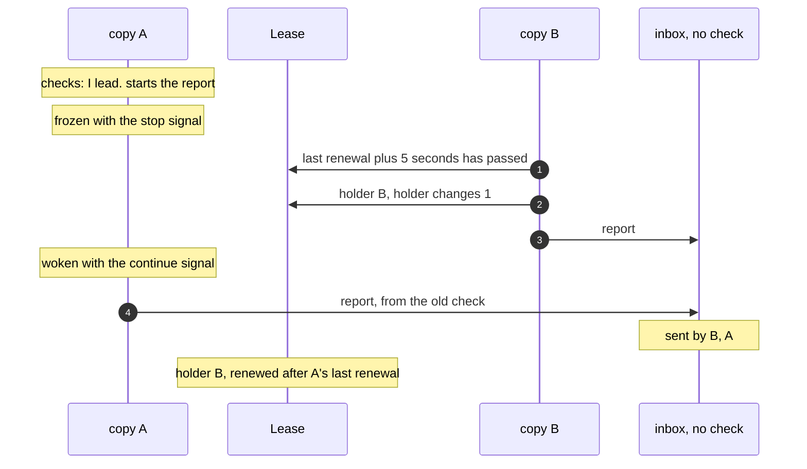
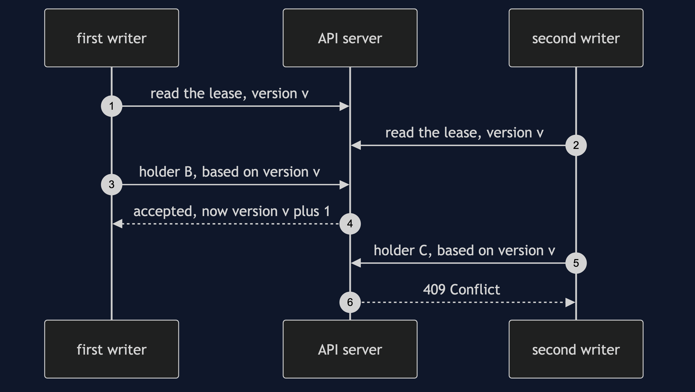
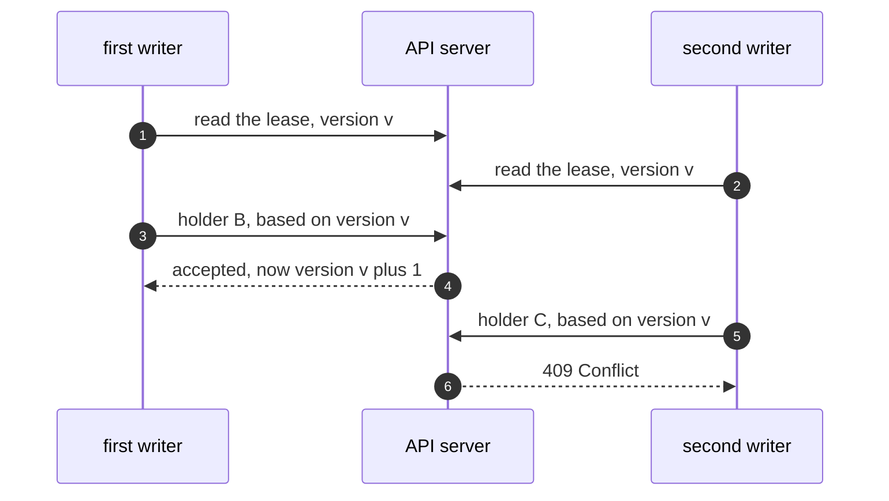
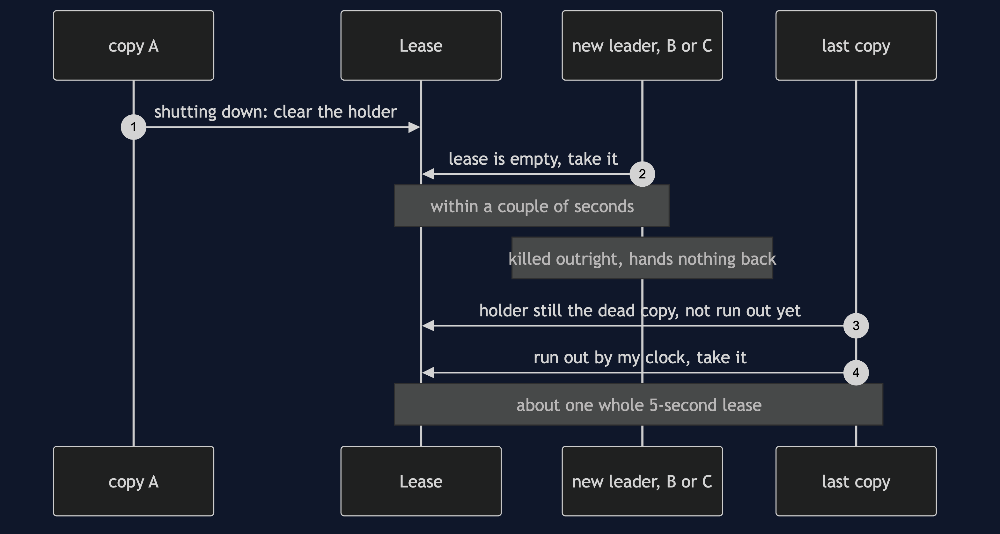
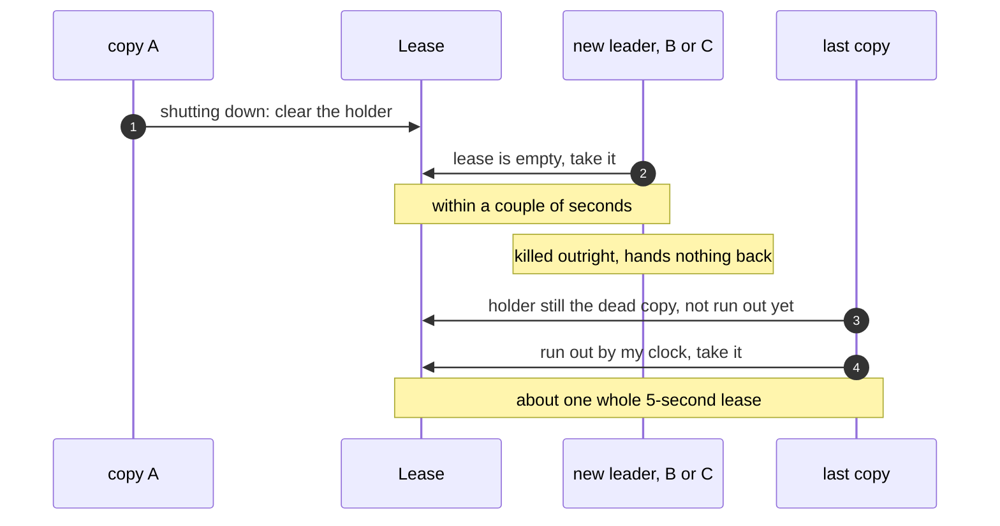
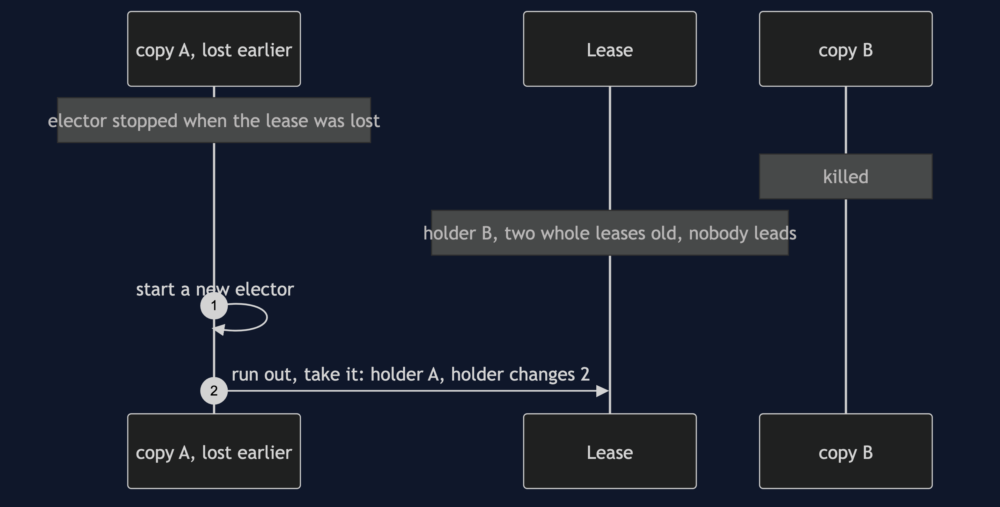
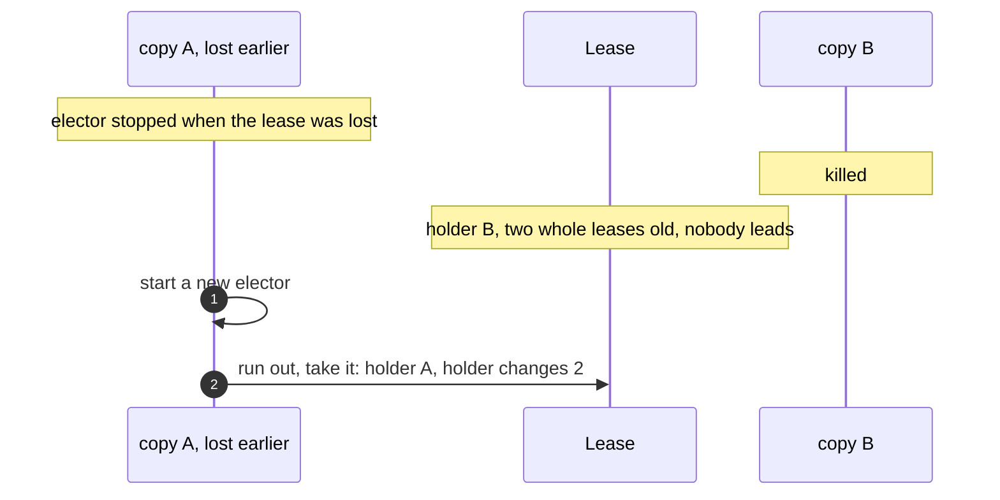

# Leader Election with Kubernetes Pattern — UML Sequence Diagrams

Four sequences. The frozen leader comes first, because it is the one thing a lease inside one program could never really show.

## 1. Two Who Think They Lead

A checks that it leads, then freezes. B takes the lease. A wakes and sends anyway. With no token check, both reports arrive.

Mermaid source

## 2. Two Writes From One Version

Two writers read the lease at the same version and both try to put their own name in it. The API server takes the first and refuses the second.

Mermaid source

## 3. Stopped Cleanly, Then Killed

A is shut down cleanly and hands the lease back; a copy takes it at its next check. That copy is then killed outright; the last copy waits out the whole lease.

Mermaid source

## 4. The Loser Never Rejoins

After losing the lease, A's elector has stopped for good. B is killed. The lease stays expired, naming B, for two whole leases. Only a new elector brings A back.

Mermaid source

