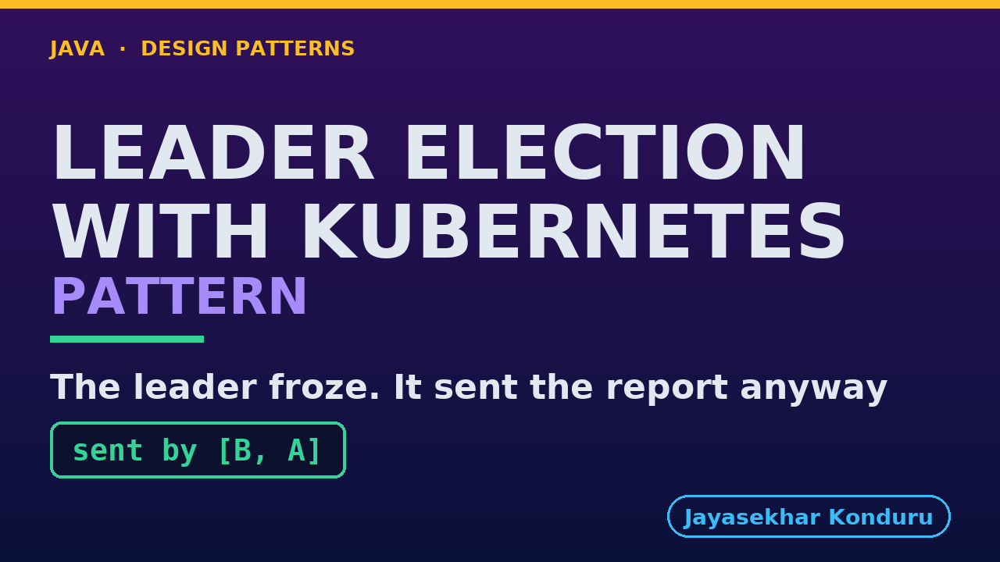

# YouTube — Leader Election With Kubernetes Pattern

Everything needed to publish `video/leader-election-with-kubernetes-pattern-explained.mp4`. Copy the fields straight out of this file.

Chapter timings are generated from the video's `.srt`. Re-run `python3 docs/make_youtube_docs.py leader-election-with-kubernetes` after any change to the narration, or they will be wrong.

## Title

```
Leader Election with Kubernetes
```

31 characters — under the 60 YouTube shows before truncating in search results.

## Description

The first two lines are what a viewer sees above the fold, so they carry the hook rather than the boilerplate.

```
Leader Election pattern in Java, explained with a real Kubernetes cluster. Several copies of a program agree that exactly one does a particular job by holding a lease, a claim that runs out unless it is renewed, while the others wait to take over. In our online store three copies of the reporting service run, and every night exactly one must send the sales report: not three, and not none. We watch Kubernetes refuse a write, a leader that dies leave nobody in charge for a whole lease, and a leader that freezes wake up and send the report after losing the lease, which is why fencing matters.

CHAPTERS
00:00 Introduction
01:02 The Scenario
01:36 Three Copies, Nobody In Charge
01:55 Kubernetes' Words
02:58 One Holds The Lease
03:42 The Elector's Settings
04:18 The Leader Stops
05:06 Who Reads The Clock
05:44 Two Who Think They Lead
06:30 The Lease's Own Record
07:00 Fencing
07:35 The Bill
08:28 What The Simulation Left Out
09:08 The Verdict
09:42 What Is Real, And When Not
10:34 Thanks for Watching

SOURCE CODE, WRITTEN NOTES AND AN INTERACTIVE ANIMATION
https://github.com/jk-boot-up/java-design-patterns/tree/main/gradle-java/micro-services-design-patterns/leader-election-with-kubernetes-pattern

WHAT YOU NEED FIRST
Java 21 and a working knowledge of classes and interfaces. No prior design-pattern knowledge is assumed. The full prerequisites are in docs/prerequisites.md in the repository.
```

## Chapters

YouTube renders these as chapters only if there are at least three and the first is at `00:00`.

```
00:00 Introduction
01:02 The Scenario
01:36 Three Copies, Nobody In Charge
01:55 Kubernetes' Words
02:58 One Holds The Lease
03:42 The Elector's Settings
04:18 The Leader Stops
05:06 Who Reads The Clock
05:44 Two Who Think They Lead
06:30 The Lease's Own Record
07:00 Fencing
07:35 The Bill
08:28 What The Simulation Left Out
09:08 The Verdict
09:42 What Is Real, And When Not
10:34 Thanks for Watching
```

## Tags

```
leader election, kubernetes lease, fencing token, kind, design patterns, java design patterns, gang of four, java 21, software design, clean code, object oriented design, java tutorial, ecommerce, programming tutorial
```

217 characters, under YouTube's 500 limit.

## Thumbnail



**Upload `docs/thumbnail.png`** — 1280×720, the size YouTube recommends, generated by `docs/make_thumbnails.py`. It is deliberately not the same image as the video's opening frame: a thumbnail is judged at about 360 pixels wide in a search result, so this one carries only the pattern name, one line of promise and one short piece of code, each set large enough to survive the shrink.

`video/poster.png` is the 1920×1080 opening frame, produced by the video build. It stays in the repository as the title card; it is not what gets uploaded.

YouTube will not pick the thumbnail up on its own — upload it under **Details → Thumbnail → Upload file**. A custom thumbnail requires a verified channel.

## Upload checklist

- [ ] Upload `video/leader-election-with-kubernetes-pattern-explained.mp4` (1080p, H.264, 30 fps, AAC 48 kHz — already YouTube's recommended settings, no re-encode needed)
- [ ] Set the video language to **English** first, or the subtitle option may not appear
- [ ] Add subtitles: *Video elements → Add subtitles → Upload file → With timing* → `video/leader-election-with-kubernetes-pattern-explained.srt`
- [ ] Upload `docs/thumbnail.png` as the thumbnail — do not let YouTube auto-pick a frame
- [ ] Paste the title, description and tags from above
- [ ] Add to the **Java Design Patterns** playlist, in learning order
- [ ] Wait for 1080p processing before sharing the link — code slides are unreadable at 360p

## Cards and end screen

End screen links to whichever pattern video goes up next — set it at upload time rather than assuming an order.

Add a card partway through pointing at the playlist, so a viewer who arrives at this pattern from search can find the rest of the series.

## Runtime

Approximately 11:10, narrated at 145 words per minute.
