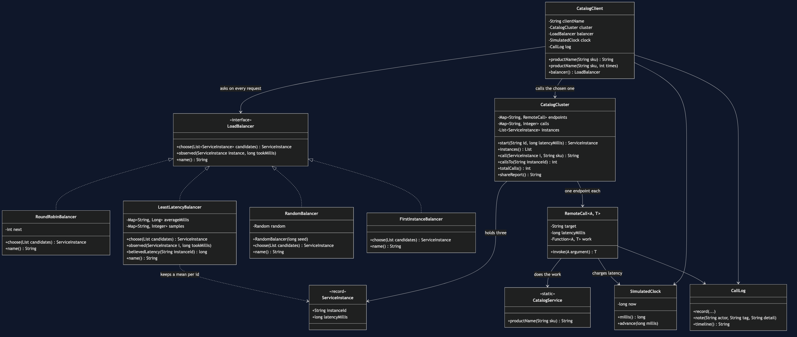

# Client-Side Load Balancing

**In plain words:** when several identical copies of a service are running, the
caller picks which copy to talk to — and it picks again for every single request.

**Everyday analogy:** you walk into a supermarket with six tills open. Nobody
directs you. You look along the row, see which queue is shortest, and join it. You
are doing the balancing yourself, from where you are standing, with your own eyes —
and you do it afresh every time you shop. That is this pattern. The alternative is
a single member of staff at the head of all six queues sending each shopper to a
till; that works too, and it is the *server-side* answer we come back to at the
end.

In the shop, the copies are three instances of the Catalog service. The service
discovery pattern told the caller that all three exist. This pattern is the very
next question: **now that I know about three, which one do I ask?**

## The deliberately uneven cluster

Two of the three Catalog instances answer in 10 milliseconds. The third takes 60,
because it is on older hardware. Real clusters look like this much more often than
the diagrams admit — and it is what makes the choice interesting, because a
strategy that is *fair* is not automatically a strategy that is *fast*.

## What the demo prints

Four acts, each sending the same twelve requests to the same three instances,
differing only in who gets asked.

### 1. Always the first on the list

```
    catalog-1   12 requests (100%)   10ms each
    catalog-2    0 requests ( 0%)   10ms each
    catalog-3    0 requests ( 0%)   60ms each
  12 requests took 120ms in total
```

This is what you get by writing `instances.get(0)` and moving on. Read the timing
line again: 120ms, faster than every other act. It is **not slow**. That is exactly
why nobody catches it. The cost is not on the clock — it is that the shop bought
three instances and is running on one, and when `catalog-1` falls over it takes
every request with it.

### 2. Round-robin: take turns

```
    catalog-1    4 requests (33%)   10ms each
    catalog-2    4 requests (33%)   10ms each
    catalog-3    4 requests (33%)   60ms each
  12 requests took 320ms in total
```

A perfectly even split, and nearly three times the total time. Round-robin
faithfully sends a third of the shop's traffic to the slowest machine it owns,
because round-robin does not know what "slow" means. It is still the right default:
it needs no measurements, no configuration and no state beyond a counter.

### 3. Least latency: try each once, then prefer the fast ones

```
    catalog-1   10 requests (83%)   10ms each
    catalog-2    1 requests ( 8%)   10ms each
    catalog-3    1 requests ( 8%)   60ms each
  12 requests took 170ms in total
  the client now believes: catalog-1 10ms, catalog-2 10ms, catalog-3 60ms
```

170ms instead of 320. And notice the last line: nothing configured those numbers.
The client measured them from its own requests. That is the whole argument for
putting the balancer in the caller — "how slow has this instance been **for me**"
is a question only the caller can answer, because the answer depends on which rack
the caller sits in and what path its packets take.

### The part that is easy to skip

Look at act 3 again. `catalog-2` is exactly as fast as `catalog-1` and got one
request out of twelve. Ties broke towards whoever was measured first, so the client
found a favourite and stayed with it. Now imagine a thousand clients all measuring
the same cluster and all reaching the same conclusion: they stampede onto one
instance, make it slow, then stampede off it together. A learning balancer needs a
tie-break — a random pick among the near-equals — or it will herd. This is the
honest cost of the cleverer strategy, and the reason round-robin remains the
default.

### 4. Two clients, each taking perfect turns

```
    catalog-1    2 requests (50%)   10ms each
    catalog-2    2 requests (50%)   10ms each
    catalog-3    0 requests ( 0%)   60ms each
```

Two clients, each running round-robin, each behaving impeccably. Between them they
left an instance with nothing to do. Neither client did anything wrong; a
client-side balancer can only balance the traffic it can see, and it can only see
its own. **If the callers are not yours to change, put one balancer in front of the
cluster and let it see every request.** That is server-side balancing, it is
simpler, and it is the right answer more often than this pattern's fans admit.

## This pattern *is* Strategy

Not "like" Strategy — the same structure. `LoadBalancer` has one method, four
interchangeable implementations, and `CatalogClient` holds one without ever asking
which it holds. If you have done `behavioural/strategy-pattern`, you have written
this interface before under another name.

What is new is the context. The decision is about machines rather than business
rules, it is remade on every request rather than once per order, and the chooser
has local knowledge that nothing in the middle of the network can see.

## Run it

```bash
./gradlew run     # the four acts above
./gradlew test    # 21 tests
```

## The tests are the proof

The interesting thing about these tests is what they *do not* assert. Every
instance returns the same product name, so "the answer was right" proves nothing.
What is pinned down instead is the shape of the traffic — who got how much, in what
order, and what it cost:

- `LoadBalancerTest` — round-robin splits twelve requests 4/4/4 and costs 320ms;
  least-latency costs 170ms and sends the slow box exactly one request; the client
  learns the latencies with nothing telling it; a seeded random balancer is
  reproducible; and two independent clients leave `catalog-3` idle.
- `FirstInstanceBalancerTest` — **every test in it passes.** That is the lesson: a
  concentration bug does not announce itself with a failure. It gives the right
  answer, quickly, with one instance carrying everything and two sitting idle. One
  test shows it is indistinguishable from round-robin when only one instance is
  running, which is what the test environment usually looks like.
- `DemoRunsTest` — the demo is teaching material, so a test keeps it working.

No test sleeps. The clock is simulated, so a 320ms timeline costs no real time and
the whole suite finishes in about a second.

## One JVM, no infrastructure

There is no Docker here, no Spring, no service mesh and no network. The three
"instances" are three `RemoteCall` objects over the same function, differing only
in the latency they charge, and `SimulatedClock` only moves when something moves
it. Everything you need is a JDK, and it runs on a plane.

## Where this sits

Service discovery hands you a list; this pattern is the choice you make from it.
The next one along, retry, is what you do when the instance you chose does not
answer — and the two combine naturally, because the obvious retry is a retry
against a *different* instance.

## Learning Material

| Document | What it covers |
| --- | --- |
| [`docs/problem-statement.md`](docs/problem-statement.md) | Why `candidates.get(0)` is fast, correct, and still runs the shop on one machine out of three |
| [`docs/load-balancing-pattern-explained.md`](docs/load-balancing-pattern-explained.md) | The pattern from a row of supermarket tills, the four strategies, herding, and why this is Strategy |
| [`docs/class-diagram.md`](docs/class-diagram.md) | The types, and the arrow that is missing — no client can see another client |
| [`docs/uml-diagram.md`](docs/uml-diagram.md) | One request step by step, then all four acts as sequences |
| [`docs/animation.html`](docs/animation.html) | The same twelve requests being shared out, one step at a time, in a browser |
| [`docs/prerequisites.md`](docs/prerequisites.md) | What you need to know, what you explicitly do not, and how to get a JDK |
| [`docs/session.md`](docs/session.md) | A one-hour taught session with exercises |
| [`docs/spec.md`](docs/spec.md) | The generated specification, with measured test counts and timings |
| [`docs/youtube.md`](docs/youtube.md) | Title, description and chapters for the video |
| [`video/README.md`](video/README.md) | The video pipeline, the scene list, and how to rebuild it |

### The pattern in one picture



### Video

The narrated walkthrough is built from [`video/scenes.py`](video/scenes.py) by
[`video/build_video.sh`](video/build_video.sh). It runs about eighteen and a half
minutes across sixteen scenes, and the rendered file is not committed — see the
repository README for why — so producing it takes about ten minutes on macOS.
