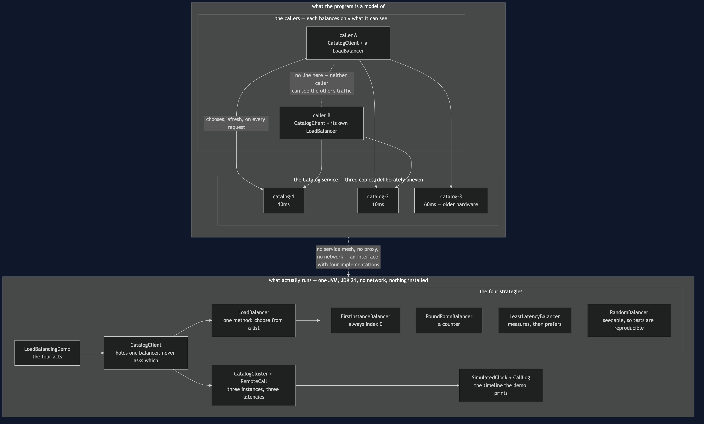
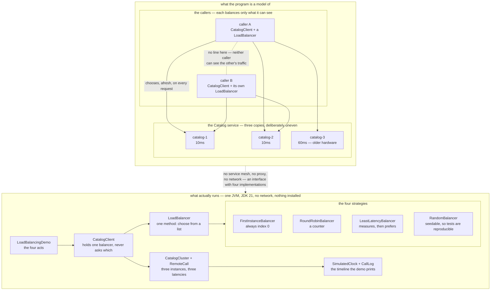

# Client-Side Load Balancing — Architecture Diagram

Where each piece of this project sits, and — because this project starts nothing — what
each piece *stands for*. The class diagram shows the types and the sequence diagrams show
the order of events; this one answers the question those two cannot, which is **where the
decision is taken, and what the decider can see from there**.

Read the picture as two halves stacked. The upper half is what the program is a model of:
two callers, each with a balancer of its own, and three copies of Catalog that are not
equally fast. The lower half is the literal truth — one Java program, four small classes
implementing one interface, and a clock that only moves when something moves it.

The most important feature of the upper half is a line that is not there. **No arrow
connects one caller to the other.** Each is choosing well, from its own measurements,
knowing nothing about the other's traffic. That absence is the pattern's defining
limitation, and act four of the demo is nothing but that absence being paid for: two
impeccably behaved round-robin clients between them leave `catalog-3` with no work at all.

The second feature is the label on the third instance. Two answer in 10 milliseconds, one
in 60. Real clusters look like this far more often than the diagrams admit, and it is the
whole reason the choice is interesting — because a strategy that is *fair* is not
automatically a strategy that is *fast*.

Mermaid source

## What the diagram is telling you to count

**Three arrows leave caller A and two leave caller B, and that is the bug in act four.**
Neither caller is misbehaving. Each is taking perfect turns. Between them the third
instance gets nothing, because turn-taking is only fair across the requests one client
happens to make.

**The balancer sits inside the caller, not in front of the cluster.** That placement is
the entire pattern, and it buys one thing that no middle box can offer: the caller can ask
"how slow has this instance been *for me*", and the answer depends on which rack the caller
sits in and what path its packets take. Act three shows the client learning `catalog-1
10ms, catalog-2 10ms, catalog-3 60ms` with nothing configured.

**`LoadBalancer` is one box with four boxes under it.** This is Strategy, not something
like it. One method, four interchangeable implementations, and `CatalogClient` holds one
without ever asking which it holds. If you have done
[Strategy](../../behavioural/strategy-pattern) you have written this interface before under
another name; what is new here is that the decision is about machines and is remade on
every request.

**The instance latencies are on the boxes because they are in the code.** 10, 10 and 60
are constants in `CatalogCluster`, which is why the demo's totals — 120ms concentrated,
320ms round-robin, 170ms least-latency — are arithmetic rather than claims.

## What it deliberately leaves out

**There is no server-side balancer in this picture**, and for a great many systems that is
the right answer: one box in front of the cluster that sees every request, balances
properly, and needs no cooperation from callers you may not control. The demo's fourth act
exists to make that case honestly rather than to sell against it.

There is also no health checking and no failure. Every instance here answers; it is just
that one answers slowly. What to do when the chosen instance does not answer at all is the
next pattern along, [Retry](../retry-pattern) — and the natural retry is a retry against a
*different* instance, which is why these two combine so readily.

And there is no tie-break. Act three's client found a favourite among two equally fast
instances and stayed with it. Scale that to a thousand clients measuring the same cluster
and they herd — onto one instance, making it slow, then off it together. A real
least-latency balancer randomises among the near-equals; this one does not, so the herding
is visible rather than hidden.
