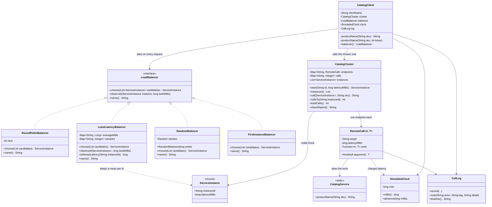

# Client-Side Load Balancing — Class Diagram

Shows the static structure: the one-method `LoadBalancer` interface that is the
pattern, its four implementations, the client that holds one of them without
knowing which, and the cluster of interchangeable instances they all choose from.

Mermaid source

## What the arrows are saying

**`LoadBalancer` is the pattern, and it has one method that matters.** Given every
instance currently believed to be running, return the one to call. Four classes
implement it, and every one of them is under thirty lines. There is no framework
here and no configuration: the pattern is an interface and a choice.

**`CatalogClient` points at the interface, never at an implementation.** That single
arrow is the reason swapping *take turns* for *prefer the fast ones* changes nothing
in the client. Read the client and you will find no policy at all — it asks the
cluster who is available, hands the list over, calls the winner, and reports back
how long that took. This is Strategy, the same structure you met in
`behavioural/strategy-pattern`, applied to machines instead of business rules.

**`observed` is a default method, and that is deliberate.** Only
`LeastLatencyBalancer` implements it. Round-robin does not care how fast an instance
was and should not have to pretend to, so the interface lets it stay silent rather
than forcing an empty override into every class.

**Only `LeastLatencyBalancer` has state about instances**, and the dashed arrow says
so: a running mean and a sample count, keyed by instance id. Those numbers were not
configured by anybody. The client measured them from its own requests, which is the
one thing a balancer inside the caller can do that a balancer in the middle of the
network cannot.

**`FirstInstanceBalancer` is drawn the same as the others on purpose.** It
implements the same interface, satisfies the same contract, and passes every test
written against it. The problem with it is not visible in this diagram, and it is
not visible in a test run either — it only shows up as an idle machine and a bill.

**`CatalogCluster` owns the tally, not the client.** `callsTo` and `shareReport` are
what the tests assert on, because the question this pattern answers is not "did I
get the right product name" — every instance gives that — but "how was the work
shared out".

**`ServiceInstance` carries a latency.** Two of the three instances in the demo
answer in 10 milliseconds and one takes 60, which is what makes the choice worth
making: a strategy that is *fair* is not automatically a strategy that is *fast*.

**Nothing points from one balancer to another.** Each client holds its own, with its
own counter or its own table, and no balancer can see another's state. That absence
is the pattern's ceiling: two clients each taking perfect turns can between them
leave an instance completely idle, and no arrow you could add to this diagram would
fix it. The fix is a different diagram — one balancer in front of the cluster,
seeing every request.
