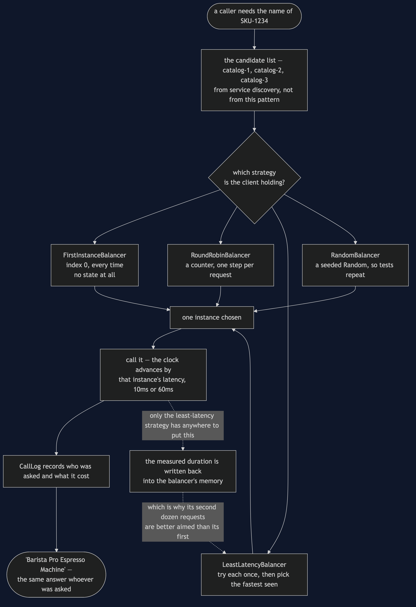
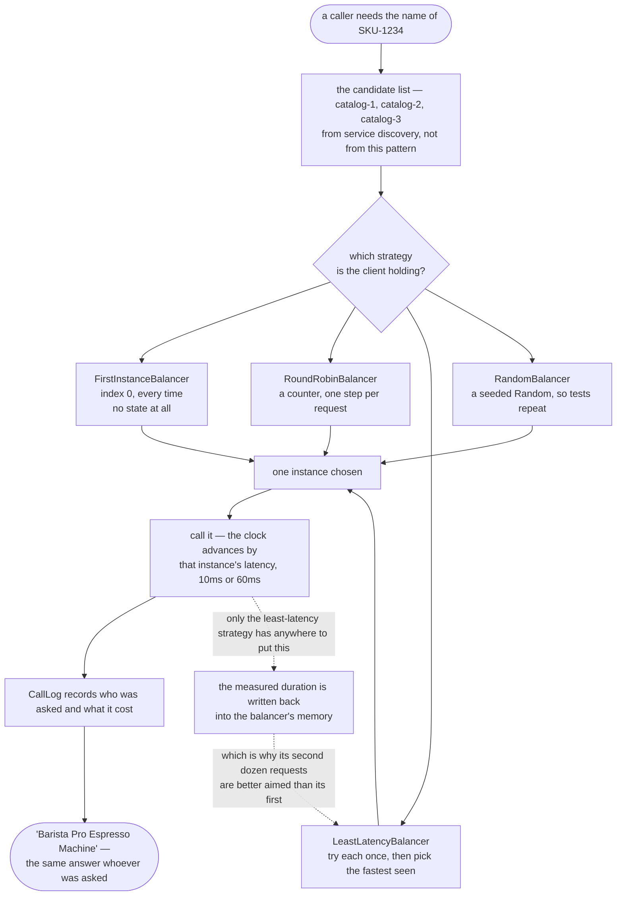

# Client-Side Load Balancing — Data Flow Diagram

One request, followed from the moment the caller wants a product name to the moment it has
one. The architecture diagram says where the decision is taken; this one says **what is
decided, with what information, and what comes back changed**.

The thing to hold onto is that two different kinds of data move here and only one of them
is the work.

The work is a product code going out and a product name coming back, and it is identical
whichever strategy is in play. Every instance returns the same name. That is why no test
in this project asserts that the answer is correct — it would pass on the worst strategy
as readily as the best.

The other kind is **the choice itself**, and it is made from a list of candidates plus
whatever the balancer happens to remember. Round-robin remembers a counter. Least-latency
remembers a measured time per instance, and — this is the part worth pausing on — it writes
to that memory on the way *back*, from the duration of the call it just made. Nothing told
it those numbers. It found them out by working.

Mermaid source

## What the picture is telling you

**Everything above the choice is shared and everything below it is shared.** The candidate
list arrives the same way, the call is made the same way, and the answer is the same
object. The only thing that varies is one box in the middle, which is exactly what makes
this Strategy and exactly why swapping strategies is a one-line change at the point where
the client is built.

**Three of the four strategies have no return path.** `First`, `RoundRobin` and `Random`
choose from the list alone; nothing they learn from a call could change what they do next.
That is a genuine virtue and not a shortcoming — round-robin needs no measurements, no
configuration and no state beyond a counter, which is why it remains the sensible default.

**Only one strategy has a feedback loop, and the loop is the whole argument for putting
the balancer in the caller.** "How slow has this instance been for me" is a question only
the caller can answer. The dotted line back into `LeastLatencyBalancer` is that answer
being accumulated, one request at a time, from ordinary traffic rather than from a probe.

**The choice is remade on every single request.** There is no box in this diagram that
caches an instance. A client that picks once and keeps the result has quietly become the
first strategy, whatever the field is called.

## The same request with no balancing at all

Delete the choice and the diagram is a straight line: caller, one instance, answer. It is
shorter, and it is faster — act one of the demo takes 120ms where round-robin takes 320,
because concentrating all twelve requests on a 10ms instance genuinely is the quickest
thing to do with them.

That is the trap worth naming. **The cost of the missing box is not on the clock.** The
shop bought three instances and is running on one; two sit idle and paid for; and the day
`catalog-1` falls over it takes every request with it. `FirstInstanceBalancerTest` passes
in full, which is the lesson in miniature — a concentration bug does not announce itself
with a failing test. It gives the right answer, quickly, forever, until it doesn't.
