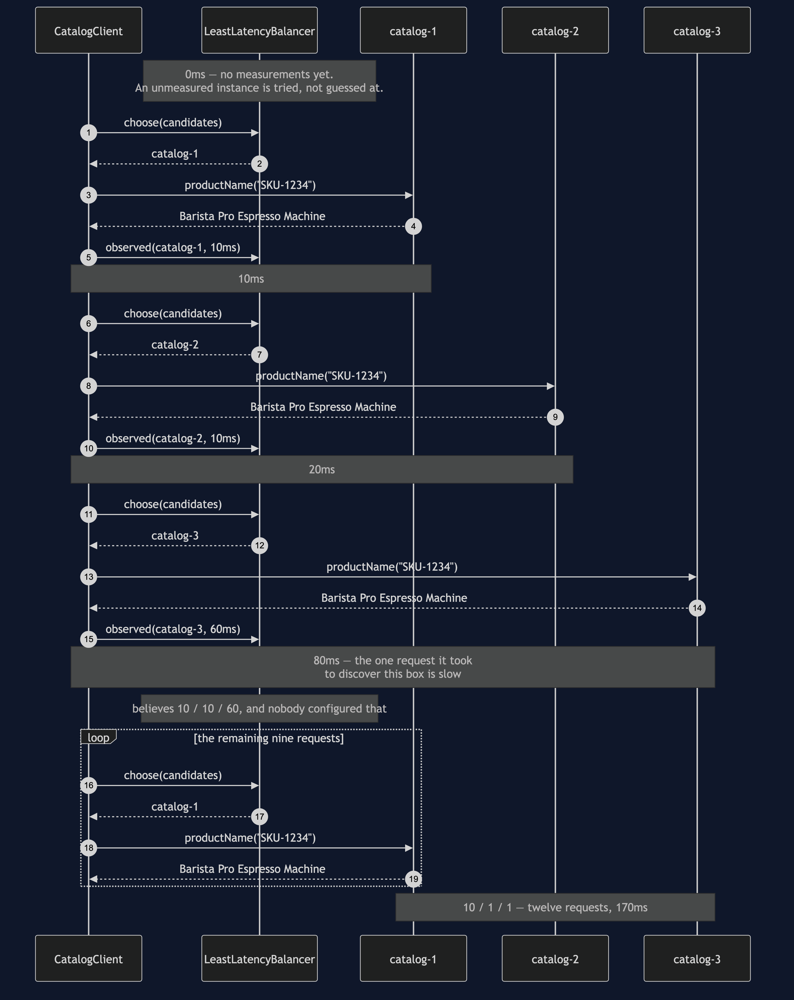
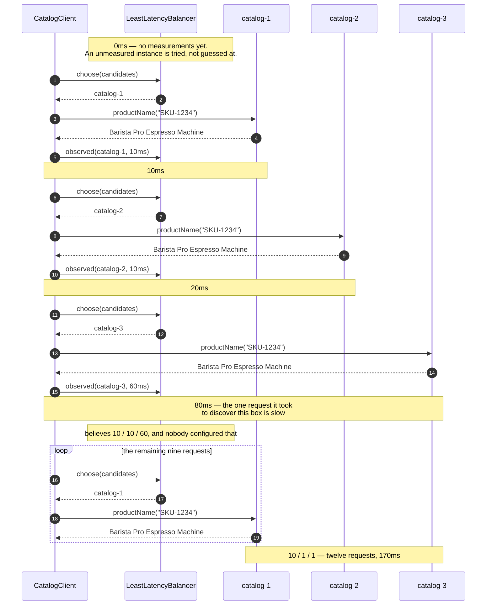

# Client-Side Load Balancing — Sequence Diagram

The one sequence worth having in your head before the others make sense: a client that
knows nothing about three instances, finds out which of them is slow purely by using them,
and ends up aiming ten of its twelve requests at a machine nobody told it to prefer.

[`uml-diagram.md`](uml-diagram.md) holds the full set of five — one request in isolation,
then each of the four acts. This document takes the learning one, because it contains the
only thing client-side balancing can do that a box in front of the cluster structurally
cannot.

The clock runs in the notes and the figures are the ones the demo prints: 10ms for
`catalog-1` and `catalog-2`, 60ms for `catalog-3`, and 170ms for all twelve requests
against round-robin's 320. The first three requests are the tuition fee. Everything after
them is the client spending what it learned.

Mermaid source

## Reading the timings

**The first three requests cost 80ms of the 170.** Nearly half the total went on finding
out what the cluster looks like, and there is no way around that: an instance you have
never called is an instance you know nothing about. The strategy tries each one once
because the alternative — assuming — is how you end up permanently avoiding a machine that
was slow the day you happened to measure it.

**`observed` is sent after every call, including the slow one.** That message is the
feedback loop, and it is the reason the diagram has arrows going back to the balancer at
all. Round-robin receives the same message and ignores it. The client does not know the
difference and should not have to.

**Sixty milliseconds bought a permanent decision, and that is the risk as well as the
win.** One sample is enough here because `catalog-3` is uniformly slow. A machine that was
slow for one second during a garbage collection would be judged the same way and avoided
for the rest of the run. Real least-latency balancers keep a decaying average rather than a
last-seen figure, and they re-probe what they have written off.

**Look at what `catalog-2` got.** One request out of twelve, while being exactly as fast as
`catalog-1`. The tie broke towards whoever was measured first, so the client found a
favourite and stayed with it. With one client that is harmless. With a thousand clients all
measuring the same cluster it is a stampede: they crowd onto the same favourite, make it
slow, and then leave it together. A learning balancer needs a random tie-break among the
near-equals, and this one deliberately does not have it so that you can see the herding
rather than read about it.

## What changes with a different strategy

Swap the balancer for `RoundRobinBalancer` and every `observed` arrow still happens and
nothing comes of it. The picture becomes a strict rotation, the twelve requests split
4/4/4, and the total goes to 320ms — a third of the shop's traffic sent to the slowest
machine it owns, because round-robin does not know what "slow" means and was never told.

Swap it for `FirstInstanceBalancer` and the diagram loses two of its three instances
entirely. Twelve requests to `catalog-1`, 120ms, and it is the **fastest** act in the demo.
That is the one to be suspicious of: nothing fails, nothing is slow, every answer is right,
and the shop is running on one machine out of three.
