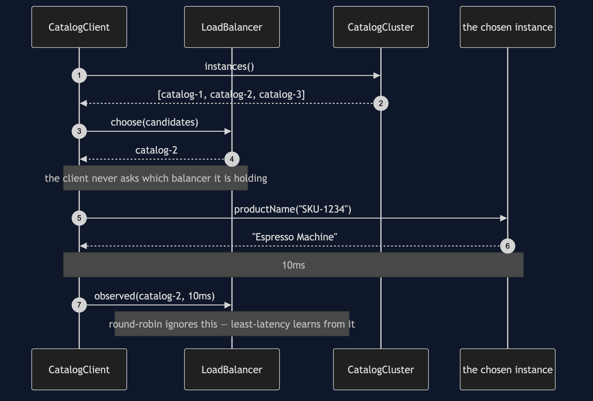
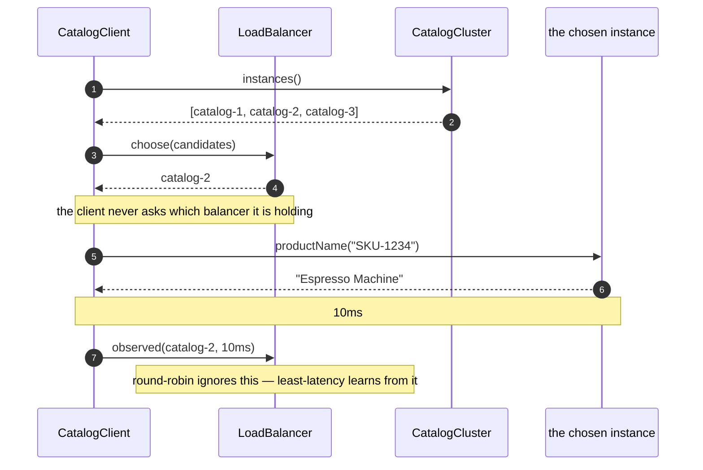
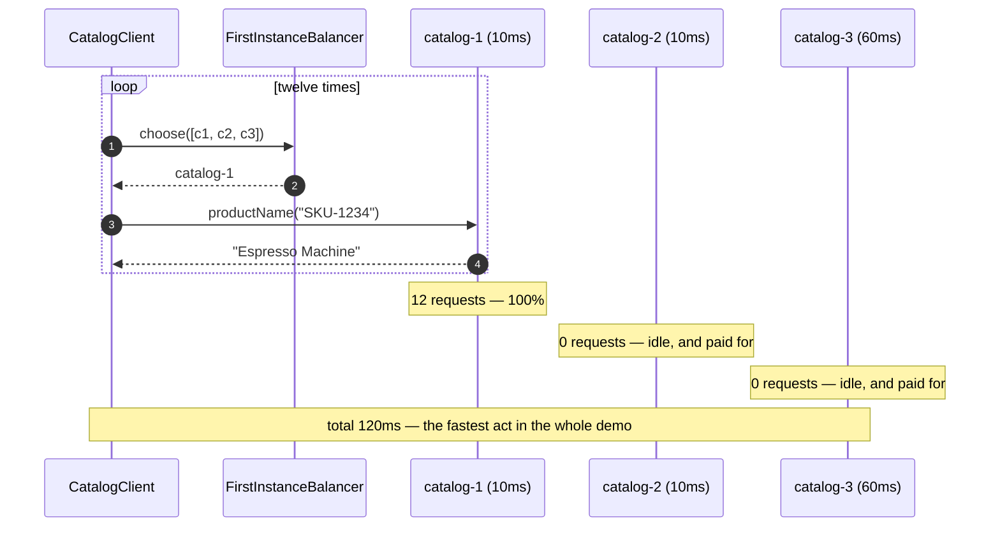
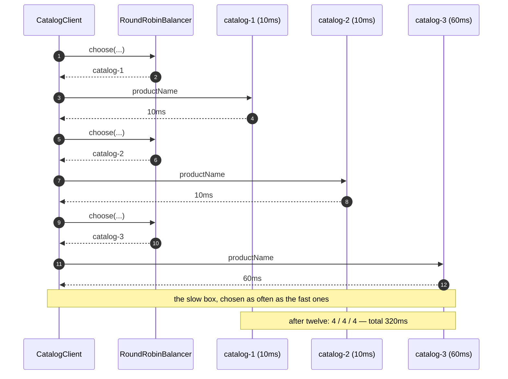
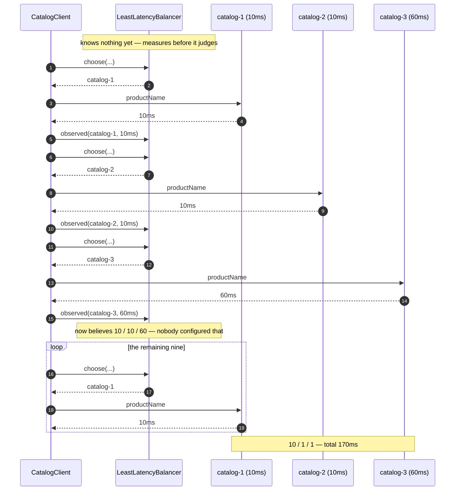
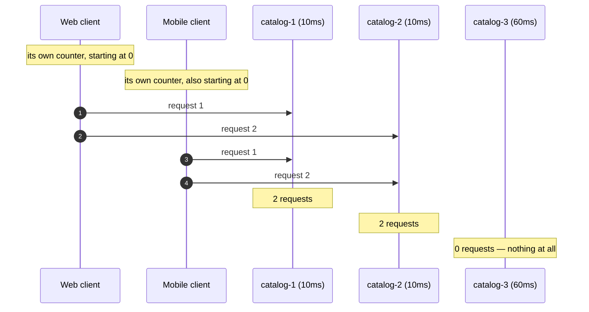

# Client-Side Load Balancing — UML Sequence Diagrams

Five sequences over the same three instances. What changes between them is only who
gets asked — and that is the whole pattern.

Throughout: `catalog-1` and `catalog-2` answer in 10 milliseconds, `catalog-3` takes
60, because it is on older hardware.

## One Request, Step By Step

Every request goes through the same three beats: ask who is available, choose one,
and report back how long it took.

Mermaid source

## Act One: Always The First On The List

Twelve requests, and the same instance every time.

The thing to notice is the last note. This is not the slow one. Nothing here fails,
nothing times out, and every request gets the right answer promptly. The cost is
two machines being billed for doing nothing, and one machine whose death takes the
entire shop with it.

## Act Two: Round-Robin Takes Turns

A perfectly even split, and nearly three times act one's total. Round-robin sent a
third of the shop's traffic to the slowest machine the shop owns, because
round-robin does not know what "slow" means and was never told. **Fair is not the
same as fast.**

## Act Three: Least Latency Measures, Then Prefers

One hundred and seventy milliseconds instead of three hundred and twenty, and the
slow box was asked exactly once: the once it took to find out it was slow.

Two things in this diagram are worth more than the timing. The first is the note in
the middle — the client discovered those latencies from its own requests, and a
client in a different rack would have measured different ones. That is the only
thing client-side balancing can do that server-side balancing structurally cannot.

The second is that `catalog-2` is *exactly as fast* as `catalog-1` and received one
request out of twelve. The tie broke towards whoever was measured first, so the
client found a favourite and kept it. Harmless with one client; with a thousand
clients they all pick the same favourite, crowd it until it is slow, and then all
leave it together. A learning balancer needs a random tie-break or it will herd.

## Act Four: Two Well-Behaved Clients, One Idle Machine

There is no mistake in this diagram, and that is what makes it the important one.
Each client took perfect turns. Each counter did exactly what a counter should.
Between them they left a machine completely idle, because the counter lives inside
one client and counts one client's requests.

**A client-side balancer can only balance the traffic it can see, and it can only
see its own.** When that is not good enough, the answer is not a cleverer client —
it is one balancer in front of the cluster, seeing every request. That is
server-side balancing, and it is the right answer more often than this pattern's
fans admit.

## Notes

- The first four diagrams are the *same* client code. `CatalogClient` is not
  modified between acts; only the object passed to its constructor changes. That is
  Strategy doing its job.
- `observed` appears in act three and is absent from acts one and two, because it is
  a default method that those balancers do not implement. Round-robin should not have
  to pretend to learn.
- Every millisecond in these diagrams comes out of `SimulatedClock`, which moves only
  when something moves it. The 320ms timeline costs no real time, so the numbers are
  exact rather than approximately reproducible.
