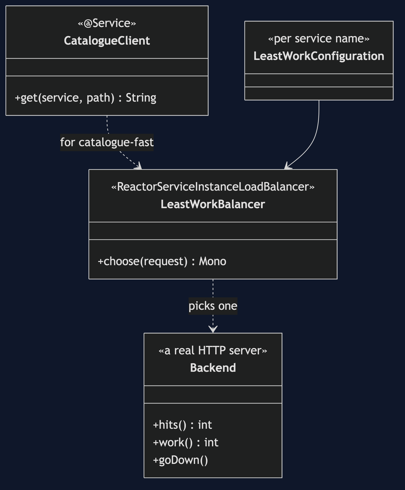
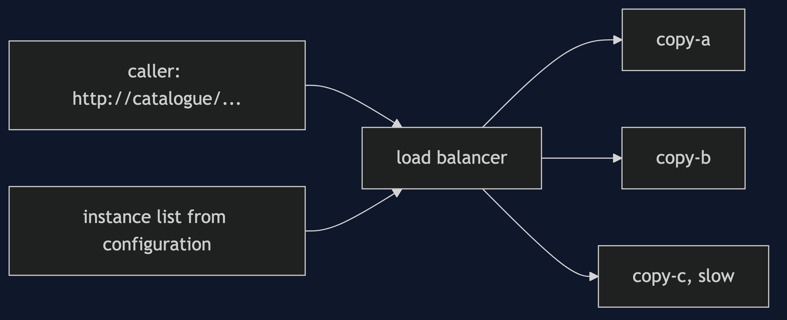
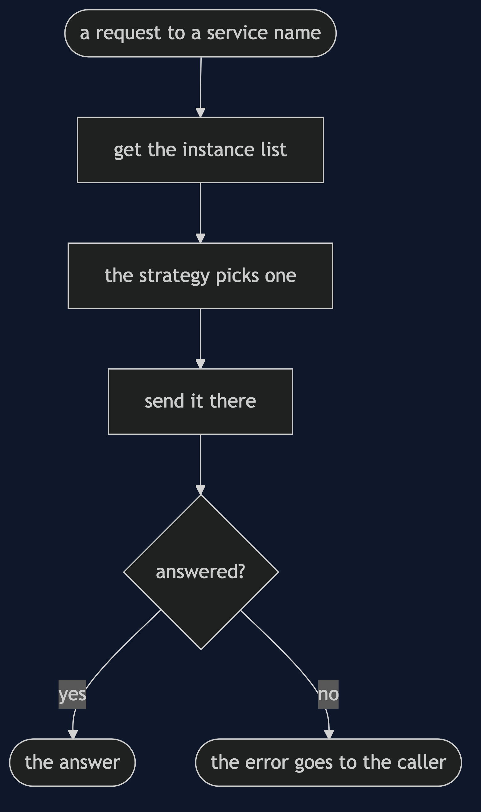
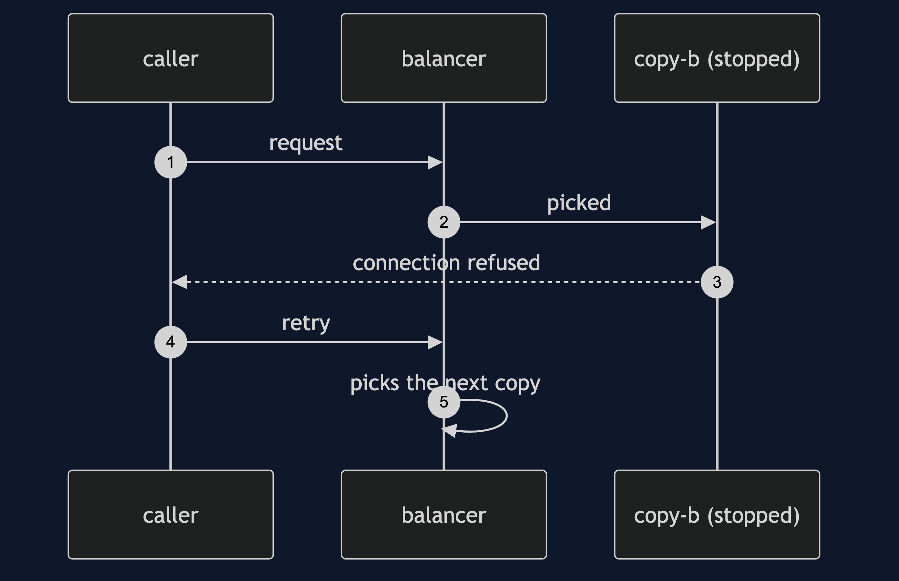

# Load Balancing with Spring Cloud LoadBalancer Pattern

```
src/main/java/com/jk/explore/loadbalancersc/
├── CatalogueApplication.java     the entry point, the six acts, and the cluster
├── CatalogueClient.java          calls a service by name
├── LeastWorkBalancer.java        a strategy of our own
├── LeastWorkConfiguration.java   registers it for one service name
└── Backend.java                  one copy, a real HTTP server
```

**Spring Cloud LoadBalancer picks a copy for every request from a service name. The default is round robin, and it is replaceable per name.**

This project is the framework version of [Client-Side Load Balancing](../load-balancing-pattern). That project built the mechanism by hand. This one shows the same idea inside Spring Cloud LoadBalancer. It does not re-teach the pattern. It shows what Spring Cloud LoadBalancer adds, the failures that are its own, and what it costs.

## Run

```bash
./gradlew run
```

Six acts. The partner project, Client-Side Load Balancing, built the mechanism by hand. Here the same idea runs through Spring Cloud LoadBalancer, and every count comes from real output.

```
ONE. Twelve requests, one logical name.
  requests answered by copy-a, copy-b, copy-c: [4, 4, 4].
  the caller wrote http://catalogue/... and never saw an address. the default is round robin.
TWO. Fair is not fast.
  work done, counting the old machine as six times a fast one: [4, 4, 24].
  the slow copy did the most work, because round robin gives every copy the same number of requests.
THREE. A strategy of our own.
  least work so far, twelve requests: [6, 5, 1]. work done: [6, 5, 6].
  registered for one service name, catalogue-fast. the name catalogue still uses round robin.
FOUR. A copy goes down.
  copy-b is stopped. 12 requests: 4 failed, 8 answered.
  the list still holds copy-b, so a third of the requests are sent to it.
FIVE. A retry lands somewhere else.
  the same 12 requests, each allowed one retry: 12 answered. some needed a second attempt: true.
  the retry is the caller's, and a balancer without health checks only spreads the failures.
SIX. Only for names.
  a name the balancer has no instances for: IllegalStateException.
  a real address on a load-balanced client: IllegalStateException.
  a load-balanced client treats every host as a service name.
```

## Test

```bash
./gradlew test
```

2 test classes, 6 test methods, offline, with each Spring context started inside the test, and no server.

## Technologies and versions

| What | Version | Why it is here |
| --- | --- | --- |
| Java | 21 | The repository standard, via the Gradle toolchain block |
| Gradle | 9.2.1 | The wrapper in this directory; no separate install needed |
| Spring Boot | 4.1.1 | The container and the REST client |
| Spring Cloud | 2025.1.3 | The BOM that manages the balancer |
| spring-cloud-starter-loadbalancer | 5.0.3 | The balancer |
| JUnit 5 | 5.10.2 | Test runner |

See [`docs/dependencies.md`](docs/dependencies.md).

## Learning Material

| Document | What it covers |
| --- | --- |
| [`docs/problem-statement.md`](docs/problem-statement.md) | The partner's copies, and what is new |
| [`docs/load-balancing-with-spring-cloud-loadbalancer-pattern-explained.md`](docs/load-balancing-with-spring-cloud-loadbalancer-pattern-explained.md) | A balancer inside the client |
| [`docs/class-diagram.md`](docs/class-diagram.md) | The types |
| [`docs/architecture-diagram.md`](docs/architecture-diagram.md) | Caller, balancer and three copies |
| [`docs/data-flow-diagram.md`](docs/data-flow-diagram.md) | What happens to a request |
| [`docs/sequence-diagram.md`](docs/sequence-diagram.md) | Written for a listener with the screen off |
| [`docs/uml-diagram.md`](docs/uml-diagram.md) | Four sequences |
| [`docs/animation.html`](docs/animation.html) | The six acts in a browser |
| [`docs/prerequisites.md`](docs/prerequisites.md) | What you need to know |
| [`docs/session.md`](docs/session.md) | A one-hour taught session |
| [`docs/spec.md`](docs/spec.md) | The generated specification |
| [`docs/youtube.md`](docs/youtube.md) | Title, description and chapters |
| [`docs/dependencies.md`](docs/dependencies.md) | What Spring Cloud LoadBalancer is, what it costs, and that skipping this project loses none of the pattern |

### The pattern in one picture



### Where each piece sits



### How one request moves



### Who calls whom, in order


### All four sequences




### Video

Built from [`video/scenes.py`](video/scenes.py) by
[`video/build_video.sh`](video/build_video.sh). The rendered file is not
committed; see the repository README for why.

## Where you have already met this

Any Spring service that calls another by name.

## When this is too much

With one copy of a service, there is nothing to balance.

## Where this sits

This project pairs with [Client-Side Load Balancing](../load-balancing-pattern), and is a framework version in [`micro-services-design-patterns`](..).
