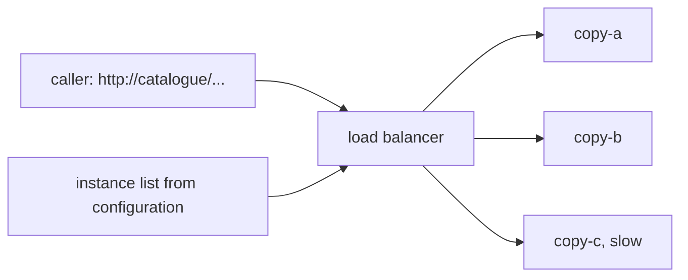

# Load Balancing with Spring Cloud LoadBalancer Pattern — Architecture Diagram

The caller names a service. The balancer picks a copy each time.

Mermaid source

```mermaid
flowchart LR
    C["caller: http://catalogue/..."] --> B["load balancer"]
    L["instance list from configuration"] --> B
    B --> A["copy-a"]
    B --> Bb["copy-b"]
    B --> Cc["copy-c, slow"]
```

