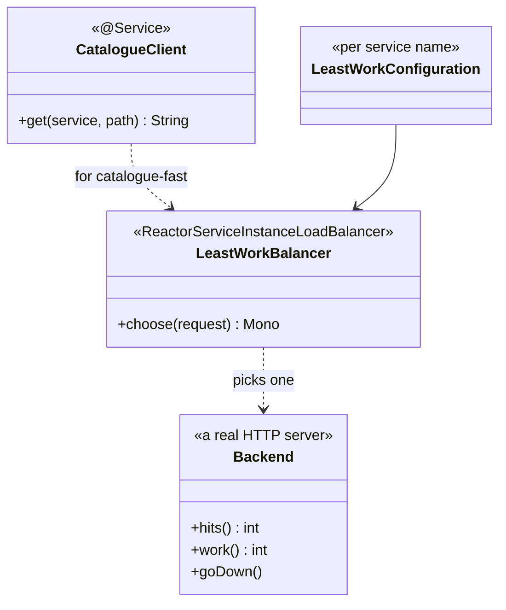

# Load Balancing with Spring Cloud LoadBalancer Pattern — Class Diagram

A client, a strategy of our own, and the copies.

Mermaid source

```mermaid
classDiagram
    class CatalogueClient {
        <<@Service>>
        +get(service, path) String
    }
    class LeastWorkBalancer {
        <<ReactorServiceInstanceLoadBalancer>>
        +choose(request) Mono
    }
    class LeastWorkConfiguration {
        <<per service name>>
    }
    class Backend {
        <<a real HTTP server>>
        +hits() int
        +work() int
        +goDown()
    }
    CatalogueClient ..> LeastWorkBalancer : for catalogue-fast
    LeastWorkConfiguration --> LeastWorkBalancer
    LeastWorkBalancer ..> Backend : picks one
```

