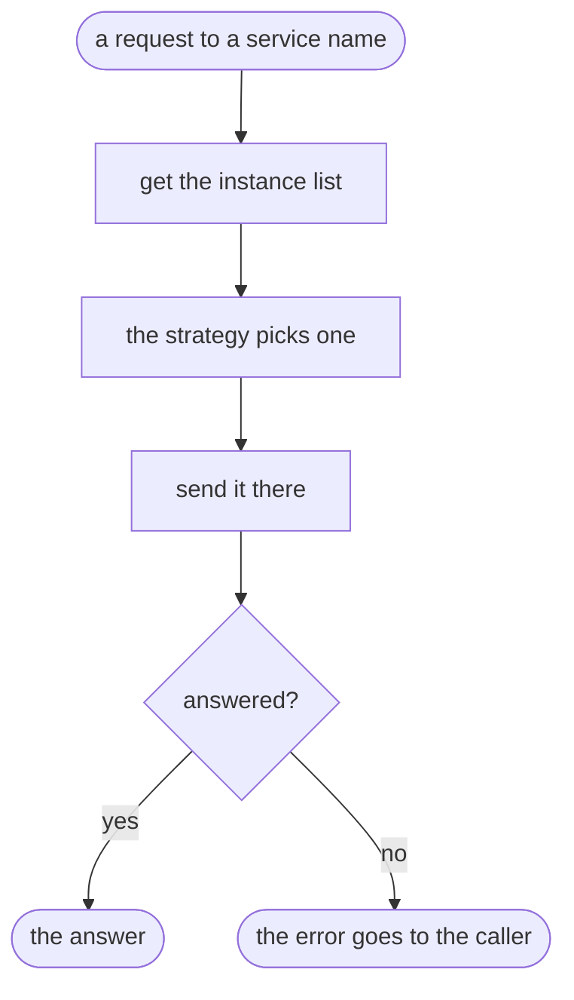

# Load Balancing with Spring Cloud LoadBalancer Pattern — Data Flow Diagram

What happens to one request.

Mermaid source

```mermaid
flowchart TD
    Req(["a request to a service name"])
    List["get the instance list"]
    Pick["the strategy picks one"]
    Send["send it there"]
    Ans{"answered?"}
    Ok(["the answer"])
    Err(["the error goes to the caller"])
    Req --> List --> Pick --> Send --> Ans
    Ans -- yes --> Ok
    Ans -- no --> Err
```

