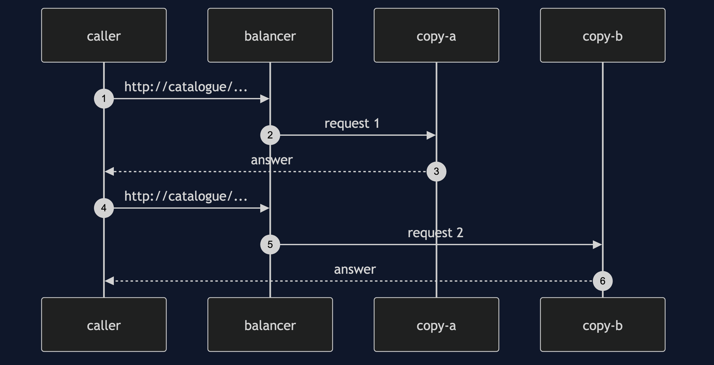
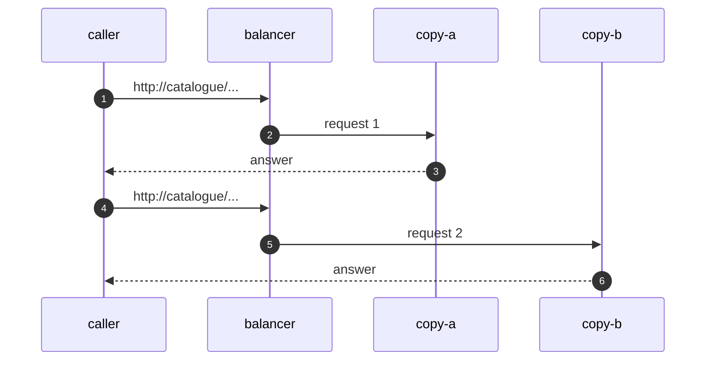

# Load Balancing with Spring Cloud LoadBalancer Pattern — Sequence Diagram

Written for a listener with the screen off.

Say it in words. The caller asks for a URL whose host is the name catalogue. The balancer asks for the list of instances, and the strategy picks one, say copy a. The request goes to copy a, and the answer comes back. The next request goes through the same steps, and the strategy picks a different copy.

Mermaid source

The load-bearing sentence: **the choice is made again for every request.**
