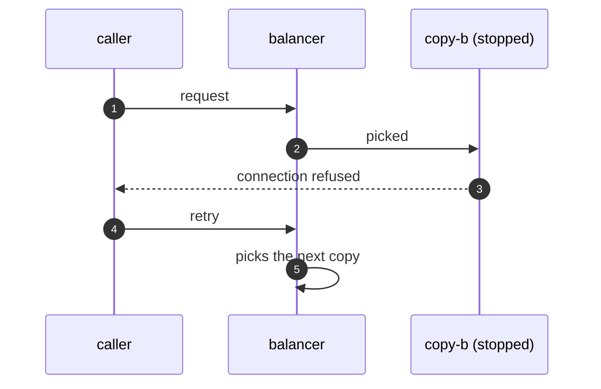

# Load Balancing with Spring Cloud LoadBalancer Pattern — UML Sequence Diagrams

Four sequences.

## 1. A Stopped Copy

Mermaid source

```mermaid
sequenceDiagram
    autonumber
    participant C as caller
    participant B as balancer
    participant S as copy-b (stopped)
    C->>B: request
    B->>S: picked
    S-->>C: connection refused
    C->>B: retry
    B->>B: picks the next copy
```

