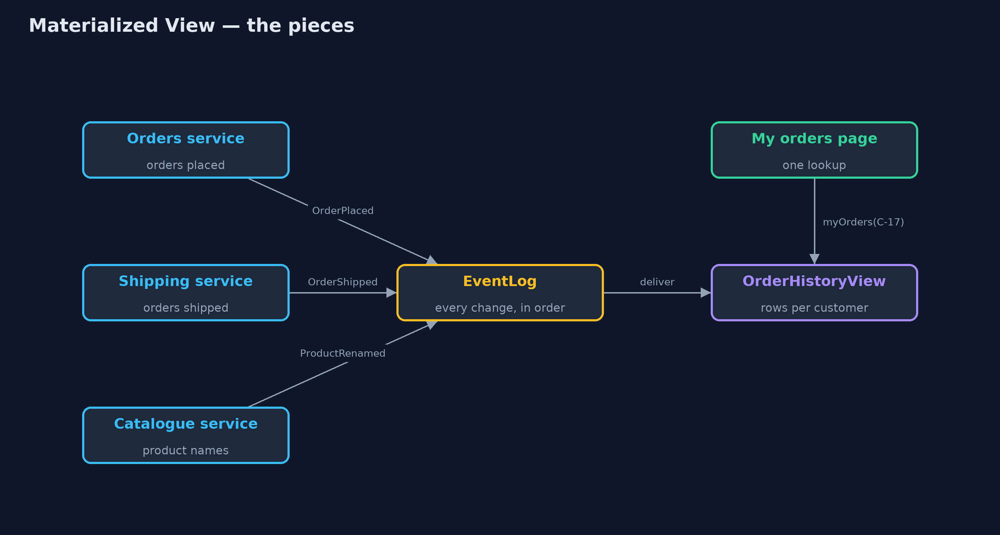
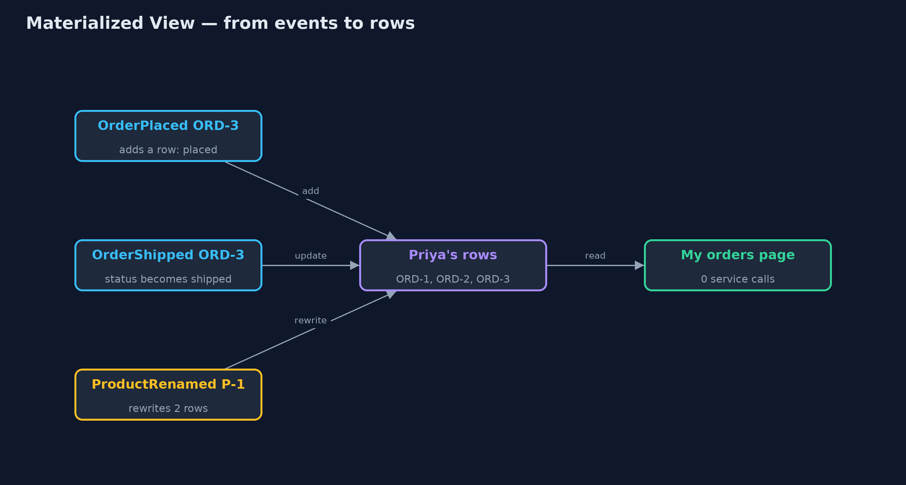
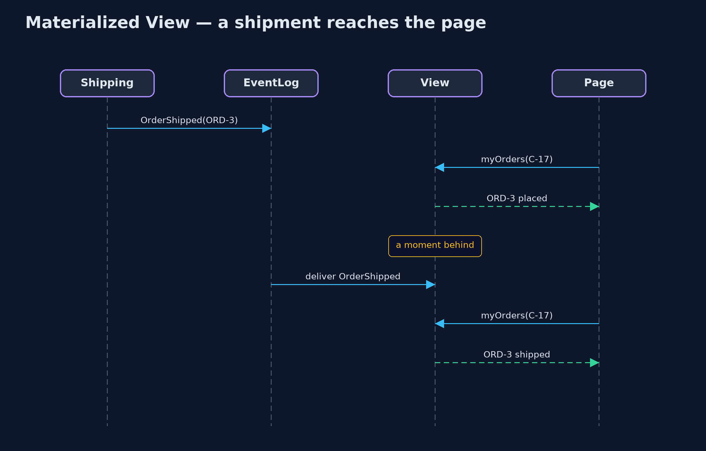

# Materialized View Pattern

```
src/main/java/com/jk/explore/materializedview/
├── Event.java                 Something that happened in one of the services, published so others can react
├── EventLog.java              The events, in order: kept forever for replay, and delivered to the view only when deliver() is called
├── HistoryRow.java            One line of the "my orders" page: which order, what was bought, how many, and whether it has shipped
├── MaterializedViewDemo.java  The five acts: the page built by asking three services, the ready-made view, the lag, the rebuild, and the bill
├── OrderHistoryView.java      The pattern: a ready-made table of every customer's order history, kept up to date from events
├── QueryOnRead.java           The page without the pattern: asks all three services every time someone opens it
└── Services.java              The three services that own the data: orders, shipping and the catalogue, each counting its calls
```

**When a page needs data from several services, keep a ready-made copy shaped exactly for that page, and update it from events, instead of asking every service on every visit.**

Materialized View is a microservices pattern for reading data that lives in
several services. Instead of asking each service every time a page is opened,
you keep a separate, ready-made table shaped exactly for that page. The
services publish events when their data changes, and the view listens and
updates itself.

Reading the page is then a single lookup. It is fast, and it keeps working when
one of the services is down. The price is that the view is a copy: it can be a
moment behind, and it has to be kept in step.

## The idea in everyday terms

Think of the departures board at a railway station. Nobody phones each train
company when a passenger wants to know which platform to go to. The board is
prepared in advance, and each company sends an update when a train is delayed
or changes platform. Passengers just read the board.

For a few seconds after a change, the board can be behind. That is the deal:
instant answers for everyone, in return for a short delay in updates.

## The scenario

The online store's "my orders" page shows each order, the product's name, the
quantity and whether it has shipped. That data lives in three services: orders,
shipping and the catalogue. The page asked all three on every visit: seven
calls for a customer with three orders, and a broken page whenever the
catalogue was down.

## Run

```bash
./gradlew run
```

The demo tells the story in 5 acts, each printing exact numbers that the tests check:

| Act | What it shows |
| --- | --- |
| 1. Asking three services | One page with 3 orders makes 7 service calls, about 280 ms of waiting; with the catalogue down, the page fails. |
| 2. A ready-made view | The view hears 7 events and writes 3 rows; the page is served with 0 service calls, catalogue still down. |
| 3. A moment behind | ORD-3 ships; until the event is delivered the page says placed, a moment later shipped. |
| 4. Rebuild from the events | Replaying all 8 events into an empty view gives exactly the same page. |
| 5. The bill | Renaming the kettle changes 1 name in the catalogue but rewrites 2 rows in the view; 3 rows are stored twice. |

## Test

```bash
./gradlew test
```

12 tests in `DemoRunsTest`, `OrderHistoryViewTest`. Every number the demo prints is asserted, and nothing depends on the clock, so every run gives the same result.

## Technologies and versions

| Technology | Version | Used for |
| --- | --- | --- |
| Java | 21 | the code (toolchain set in `build.gradle`) |
| Gradle | 9.2.1 (wrapper) | build and run, nothing to install |
| JUnit | 5.10.2 | the tests |
| videokit | repository tool | the narrated video and animation: Piper `en_US-amy-medium`, speed 0.8, longer pauses (the approved `amy-slow` voice) |

## Learning Material

| Document | What it is for |
| --- | --- |
| [Problem statement](docs/problem-statement.md) | the situation and what the project must show |
| [Prerequisites](docs/prerequisites.md) | what you need to know first |
| [Materialized View, explained](docs/materialized-view-pattern-explained.md) | the acts in prose |
| [Session guide](docs/session.md) | a one-hour lesson with exercises |
| [Animated walkthrough](docs/animation.html) | the acts step by step, narrated |
| [Spec](docs/spec.md) | what this project must be true of |

### The pattern in one picture

The services publish events; the view listens; the page reads only the view.



### Where each piece sits

One sealed event type, one log, and one view with a single method that reacts to each kind of event.


### How the data moves

Each event changes a row; the page reads the rows as they are.



### Who calls whom, in order

The change is published once; every later read is served from the view.



### Video

`video/materialized-view-pattern-explained.mp4` (with `.m4a` audio and `.srt` subtitles) is built by `video/build_video.sh`. Rendered media is not committed.

## What it costs

- **The view can be behind.** Between an event happening and the view hearing about it, the page shows the old state.
- **A copy to keep in step.** Rows are stored twice, and a single change, such as renaming a product, can rewrite many rows.
- **Events are required.** The services must publish every change, and the view must never miss one.
- **More moving parts.** Something has to run the view, store it, and rebuild it when its shape changes.

## When this is too much

When one service already holds everything the page needs, just ask it. And
when the page must be exactly current, such as a bank balance before a
payment, read from the owning service instead of a copy that may be behind.

## Where you have already met this

- Database materialized views, such as `CREATE MATERIALIZED VIEW` in PostgreSQL.
- The read side of CQRS, where commands and queries use different models.
- Search indexes such as Elasticsearch, filled from events or change data capture.
- Dashboards and reports built from a nightly or streaming copy of the data.

## Where this sits

This project is in [micro-services-design-patterns](..), next to
[API Composition](../api-composition-pattern), which answers the same question
by asking every service at the moment of reading. Materialized View answers it
in advance.
