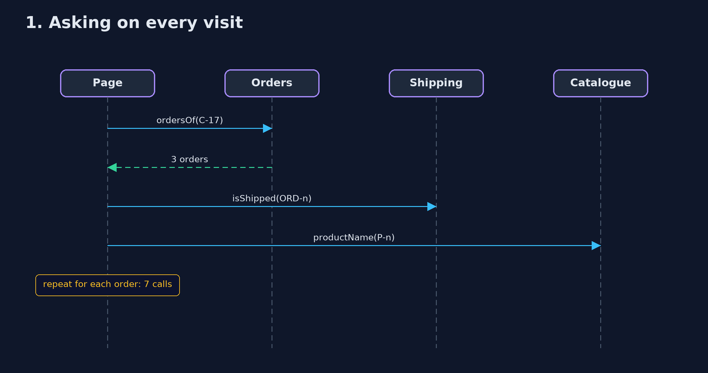
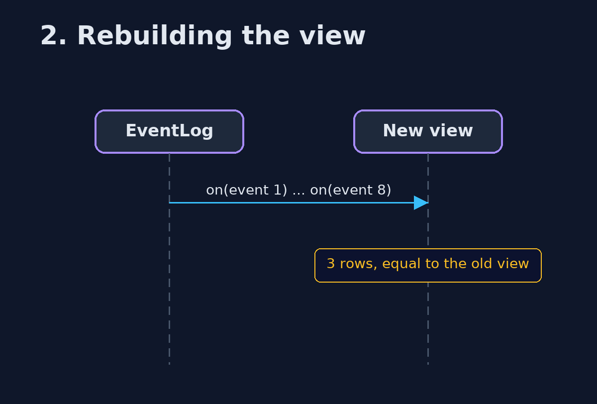

# Materialized View Pattern — UML Sequence Diagrams

## 1. 1. Asking on every visit

One call for the orders, then two per order.

## 2. 2. Rebuilding the view

An empty view plus every event, in order, gives the same rows.

