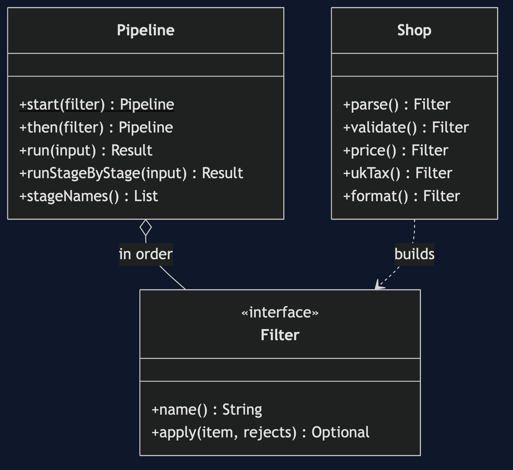
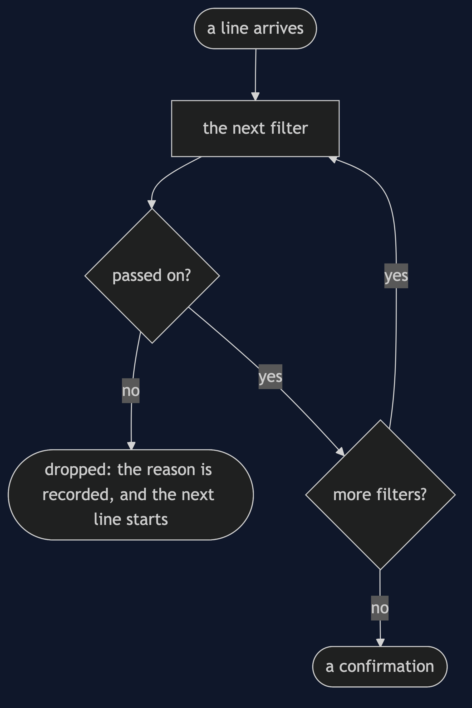
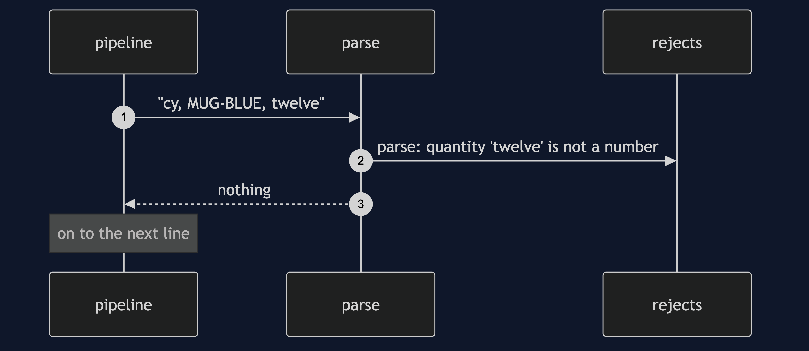

# Pipes and Filters Pattern

```
src/main/java/com/jk/explore/pipesfilters/
├── PipesAndFiltersDemo.java         the six acts
├── Filter.java                      one step: an item in, an item out, or a rejection
├── Pipeline.java                    steps joined end to end; streaming and stage-by-stage
├── Shop.java                        parse, validate, price, tax, format, and their types
│
└── naive/
    └── BigImport.java                all five jobs in one loop
```

**Pipes and filters: small steps joined end to end, each doing one thing.**

This project is in [micro-services-design-patterns](..). It is the pattern behind Unix pipelines, Java streams and ETL jobs, and the shape of [Chain of Responsibility](../../behavioural/chain-of-responsibility-pattern) when every step is applied, not just the first that answers.

## Run

```bash
./gradlew run
```

Six acts. Every number quoted below comes from this program's own output.

```
ONE. One method does it all.
  6 lines in, 3 out: [ada: 2 x MUG-BLUE = £19.20, ben: 1 x ESP-001 = £360.00, fay: 3 x TEA-050 = £28.80].
  5 separate jobs in one loop. the six lines came in, and the three that were dropped left no trace of why.
TWO. Small steps, joined end to end.
  the pipeline: parse | validate | price | uk-tax | format.
  the price step on its own, for one parsed line: Priced[customer=ada, sku=MUG-BLUE, quantity=2, netPence=1600].
  each step can be run, and tested, without the others.
THREE. Swap a step, add a step.
  uk: [ada: 2 x MUG-BLUE = £19.20].
  eu: [ada: 2 x MUG-BLUE = £19.36].
  a new step added in the middle: parse | validate | not-ben | price | uk-tax | format. no other step changed.
FOUR. Bad lines are rejected, and the rest go on.
  3 orders out:
    ada: 2 x MUG-BLUE = £19.20
    ben: 1 x ESP-001 = £360.00
    fay: 3 x TEA-050 = £28.80
  3 rejected, each with the step and the reason:
    parse: quantity 'twelve' is not a number
    validate: di asked for 50 of MUG-BLUE
    parse: 'ed, TEA-050' does not have three fields
FIVE. Streaming, or one stage at a time.
  10000 lines. items held at once: streaming 1, one stage at a time 20000.
  the results are the same: true. only the memory differs.
SIX. The bill: the steps must agree on the shape.
  steps passing loose maps: one step calls the field qty and the next asks for quantity. it fails at run time, in the later step: NumberFormatException.
  with typed items, that mistake does not compile. but every step now depends on the type before it, and changing one means changing its neighbours.
  and when a line is wrong, the error appears in the step that noticed, which may be far from the step that caused it.
```

## Test

```bash
./gradlew test
```

2 test classes, 8 test methods, offline, with nothing installed and no framework.

## Technologies and versions

| What | Version | Why it is here |
| --- | --- | --- |
| Java | 21 | The repository standard, via the Gradle toolchain block |
| Gradle | 9.2.1 | The wrapper in this directory; no separate install needed |
| JUnit 5 | 5.10.2 | Test runner |

No framework. A hand-built project stays plain Java so the mechanism is the whole lesson.

## Learning Material

| Document | What it covers |
| --- | --- |
| [`docs/problem-statement.md`](docs/problem-statement.md) | An order file and five jobs |
| [`docs/pipes-and-filters-pattern-explained.md`](docs/pipes-and-filters-pattern-explained.md) | The pattern, and six acts |
| [`docs/class-diagram.md`](docs/class-diagram.md) | The types |
| [`docs/architecture-diagram.md`](docs/architecture-diagram.md) | Lines through filters to confirmations |
| [`docs/data-flow-diagram.md`](docs/data-flow-diagram.md) | What happens to one line |
| [`docs/sequence-diagram.md`](docs/sequence-diagram.md) | Written for a listener with the screen off |
| [`docs/uml-diagram.md`](docs/uml-diagram.md) | Four sequences |
| [`docs/animation.html`](docs/animation.html) | The six acts in a browser |
| [`docs/prerequisites.md`](docs/prerequisites.md) | What you need to know |
| [`docs/session.md`](docs/session.md) | A one-hour taught session |
| [`docs/spec.md`](docs/spec.md) | The generated specification |
| [`docs/youtube.md`](docs/youtube.md) | Title, description and chapters |

### The pattern in one picture



### Where each piece sits


### How one request moves



### Who calls whom, in order


### All four sequences




### Video

Built from [`video/scenes.py`](video/scenes.py) by
[`video/build_video.sh`](video/build_video.sh). The rendered file is not
committed; see the repository README for why.

## Where you have already met this

`java.util.stream`, shell pipelines, servlet filters, ETL tools, and image and audio processing chains.

## When this is too much

For a job with two simple steps, a pipeline is more structure than the job. Where every step needs the whole batch, a pipeline gains nothing.

## Where this sits

This project is in [`micro-services-design-patterns`](..), and is meant to be read with its neighbours there.
