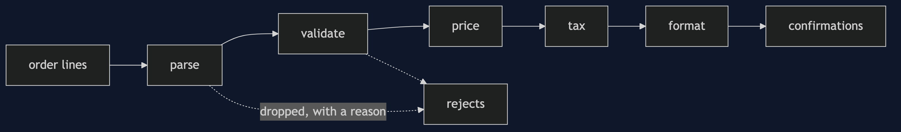
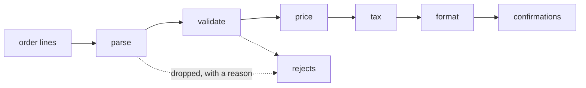

# Pipes and Filters Pattern — Architecture Diagram

Each line goes through every filter, in order.

Mermaid source

```mermaid
flowchart LR
    L["order lines"] --> P["parse"]
    P --> V["validate"]
    V --> R["price"]
    R --> T["tax"]
    T --> F["format"]
    F --> O["confirmations"]
    P -.->|dropped, with a reason| X["rejects"]
    V -.-> X
```

