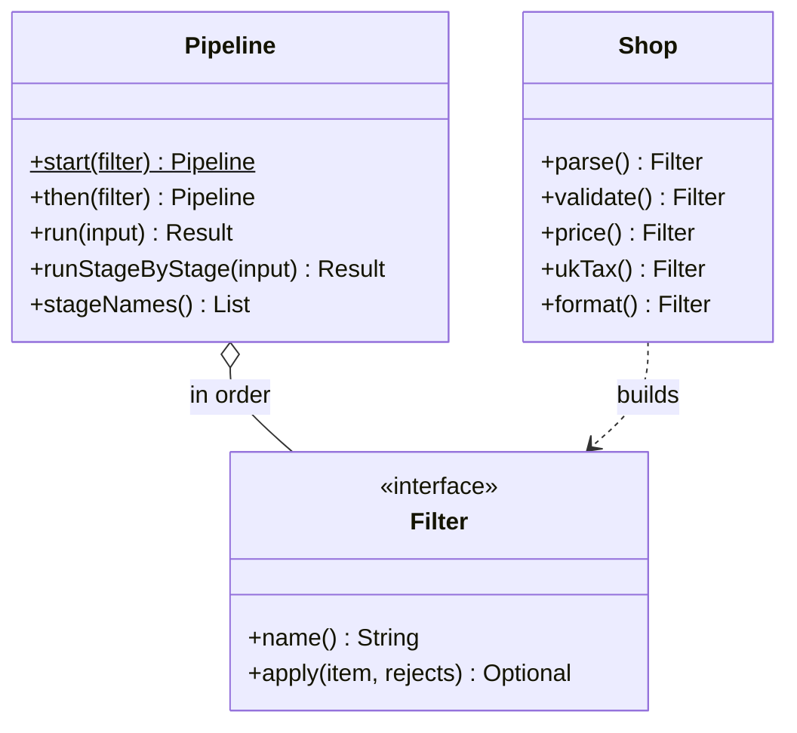

# Pipes and Filters Pattern — Class Diagram

A pipeline is a list of filters. Each filter has one job.

Mermaid source

```mermaid
classDiagram
    class Filter {
        <<interface>>
        +name() String
        +apply(item, rejects) Optional
    }
    class Pipeline {
        +start(filter)$ Pipeline
        +then(filter) Pipeline
        +run(input) Result
        +runStageByStage(input) Result
        +stageNames() List
    }
    class Shop {
        +parse() Filter
        +validate() Filter
        +price() Filter
        +ukTax() Filter
        +format() Filter
    }
    Pipeline o-- Filter : in order
    Shop ..> Filter : builds
```

