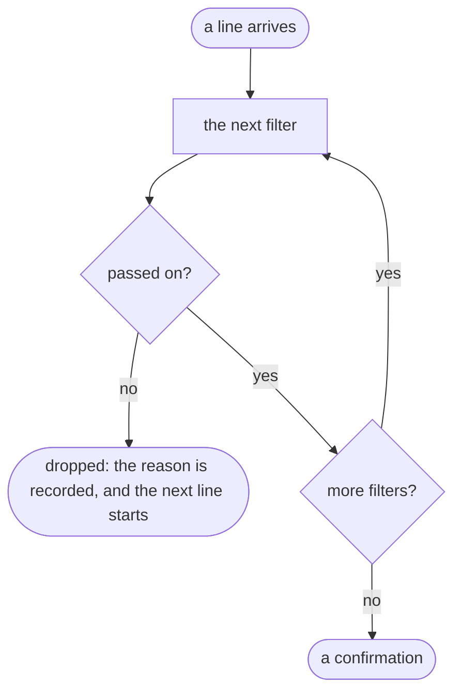

# Pipes and Filters Pattern — Data Flow Diagram

What happens to one line.

Mermaid source

```mermaid
flowchart TD
    Line(["a line arrives"])
    S["the next filter"]
    Ok{"passed on?"}
    Drop(["dropped: the reason is recorded, and the next line starts"])
    More{"more filters?"}
    Out(["a confirmation"])
    Line --> S --> Ok
    Ok -- no --> Drop
    Ok -- yes --> More
    More -- yes --> S
    More -- no --> Out
```

