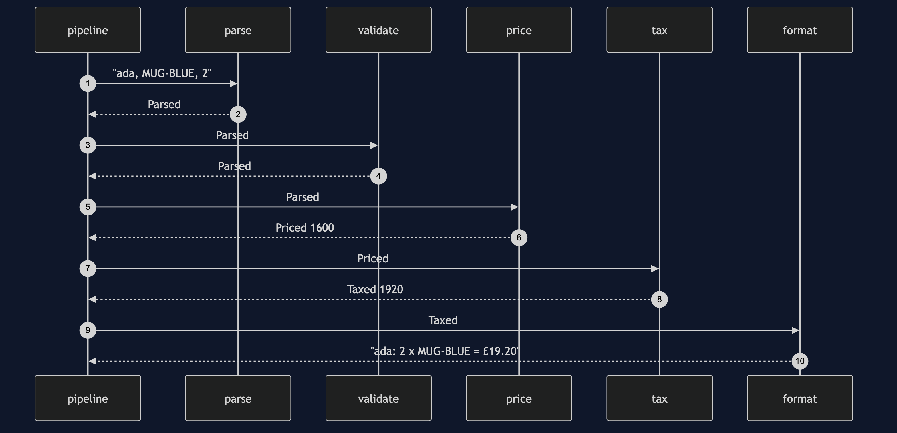
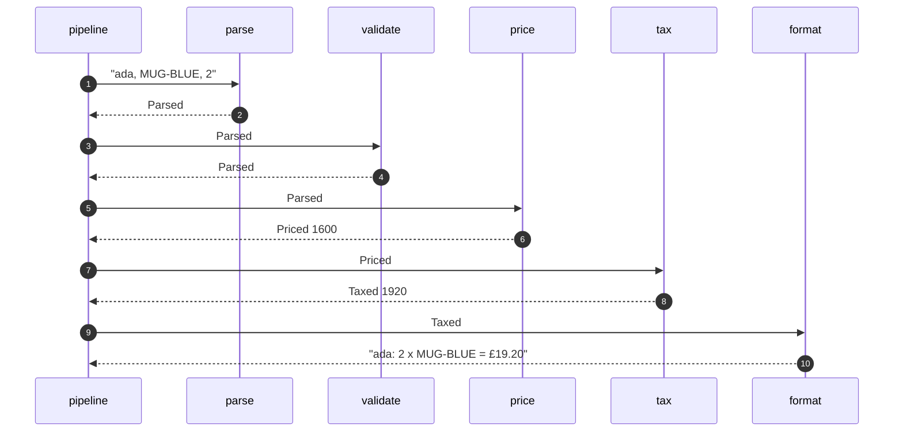

# Pipes and Filters Pattern — Sequence Diagram

Written for a listener with the screen off.

Say it in words. The pipeline takes the line ada, mug blue, two. Parse turns it into a parsed record. Validate checks the quantity, and passes it on. Price works out sixteen hundred pence. Tax adds a fifth. Format writes the confirmation. Then the next line starts. If any step drops a line, it writes the reason, and the pipeline moves on to the next line.

Mermaid source

The load-bearing sentence: **each filter sees one item, and knows nothing about the others.**
