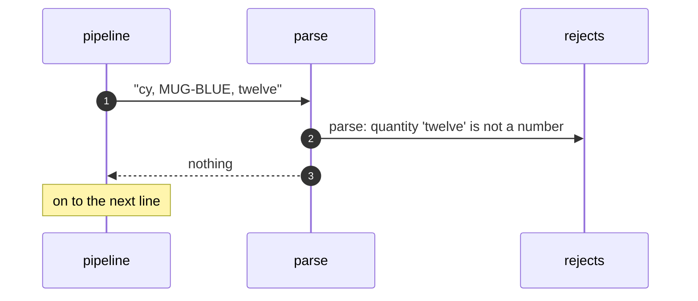

# Pipes and Filters Pattern — UML Sequence Diagrams

Four sequences.

## 1. A Rejected Line

Mermaid source

```mermaid
sequenceDiagram
    autonumber
    participant P as pipeline
    participant A as parse
    participant R as rejects
    P->>A: "cy, MUG-BLUE, twelve"
    A->>R: parse: quantity 'twelve' is not a number
    A-->>P: nothing
    Note over P: on to the next line
```

