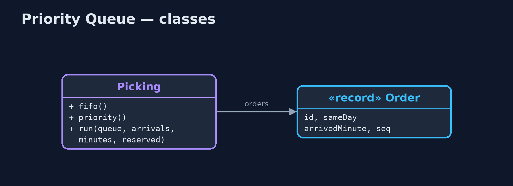

# Priority Queue Pattern

```
src/main/java/com/jk/explore/priorityqueue/
├── Order.java              An order waiting to be picked: same-day orders must reach the courier's van by the cut-off
├── Picking.java            The warehouse pickers: they pick 10 orders a minute from a queue
└── PriorityQueueDemo.java  The five acts: one first-come queue, a priority queue, a flood of standard orders, starvation and a reserved share, and the bill
```

**Let urgent messages overtake routine ones in the queue, and keep a share of capacity for routine work so it is never starved.**

Priority Queue is a cloud design pattern for work queues. Messages carry a
priority, and consumers take the highest-priority message first, however
long lower-priority ones have been waiting. It can be one queue that orders by
priority, or separate queues per priority, each with its own consumers.

Urgent work is never stuck behind a backlog of routine work. The danger is the
opposite: if urgent work never stops coming, routine work never gets done,
so a share of capacity is kept for it.

## The idea in everyday terms

Think of the fast-track lane at airport security. Passengers with a tight
connection skip the long queue. But the airport keeps at least one officer on
the ordinary lane, or those passengers would miss their flights too. And if
every ticket came with fast track, the fast lane would just be another queue.

## The scenario

The online store's warehouse pickers work through a queue of orders, ten a
minute. Same-day orders must be picked before the courier's van leaves at 9:05.
On a busy morning, a hundred standard orders arrived at 9:00 and five same-day
orders at 9:01. First come, first served, the same-day orders were picked at
9:10, and the van left without them.

## Run

```bash
./gradlew run
```

The demo tells the story in 5 acts, each printing exact numbers that the tests check:

| Act | What it shows |
| --- | --- |
| 1. First come, first served | 100 standard orders at 9:00, 5 same-day at 9:01, 10 picked a minute: the last same-day order is picked at 9:10, after the van left. |
| 2. A priority queue | Same-day first: all 5 picked by 9:01, in time for the van. |
| 3. A flood of standard orders | Even with 1,000 standard orders queued ahead, same-day orders are picked by 9:01. |
| 4. Starvation, and a reserved share | 12 same-day orders a minute against 10 picks: 0 of 20 standard orders picked; reserving 2 picks a minute gets all 20 done. |
| 5. The bill | Sellers learn that same-day jumps the queue and mark every order same-day; priorities need rules about who may set them. |

## Test

```bash
./gradlew test
```

4 tests in `DemoRunsTest`, `PickingTest`. Every number the demo prints is asserted, and nothing depends on the clock, so every run gives the same result.

## Technologies and versions

| Technology | Version | Used for |
| --- | --- | --- |
| Java | 21 | the code (toolchain set in `build.gradle`) |
| Gradle | 9.2.1 (wrapper) | build and run, nothing to install |
| JUnit | 5.10.2 | the tests |
| videokit | repository tool | the narrated video and animation: Piper `en_US-amy-medium`, speed 0.8, longer pauses (the approved `amy-slow` voice) |

## Learning Material

| Document | What it is for |
| --- | --- |
| [Problem statement](docs/problem-statement.md) | the situation and what the project must show |
| [Prerequisites](docs/prerequisites.md) | what you need to know first |
| [Priority Queue, explained](docs/priority-queue-pattern-explained.md) | the acts in prose |
| [Session guide](docs/session.md) | a one-hour lesson with exercises |
| [Animated walkthrough](docs/animation.html) | the acts step by step, narrated |
| [Spec](docs/spec.md) | what this project must be true of |

### The pattern in one picture

Same-day orders overtake; a share is kept for standard.


### Where each piece sits

One comparator makes the difference.



### How the data moves

The same arrivals, two outcomes.


### Who calls whom, in order

The pickers take same-day orders first.


### Video

`video/priority-queue-pattern-explained.mp4` (with `.m4a` audio and `.srt` subtitles) is built by `video/build_video.sh`. Rendered media is not committed.

## What it costs

- **Starvation.** With twelve same-day orders a minute and capacity for ten, standard orders were never picked, until a share was reserved.
- **Priorities get abused.** Once people learn that urgent jumps the queue, everything becomes urgent.
- **More to run.** Several queues or a priority rule, reserved shares, and settings to watch.

## When this is too much

When all work has the same deadline, one first-in-first-out queue is simpler
and fairer. Priorities pay off when some work has a real, earlier deadline
than the rest.

## Where you have already met this

- `java.util.PriorityQueue` and `PriorityBlockingQueue`.
- RabbitMQ priority queues and separate SQS queues per priority.
- Hospital triage and airport fast-track lanes.

## Where this sits

This project is in [micro-services-design-patterns](..), and near
[Scheduler](../../concurrency-design-patterns/scheduler-pattern), which applies
the same idea to threads waiting for a shared resource.
