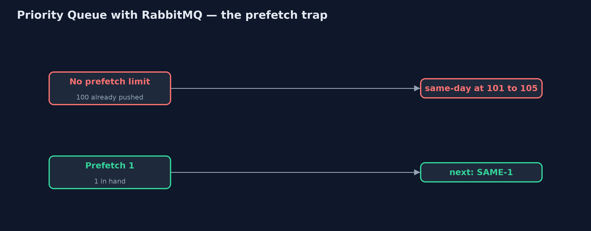

# Priority Queue with RabbitMQ Pattern

```
src/main/java/com/jk/explore/priorityrabbit/
├── Broker.java                   A real RabbitMQ broker, running in a container that this demo starts and stops itself
├── Poll.java                     Waits for a real condition, checking often, and gives up after a limit
├── RabbitPriorityQueueDemo.java  The five acts, against a real RabbitMQ broker started and stopped by this program
└── Warehouse.java                Order queues on the real broker, and pickers who take ten orders a minute
```

**Let same-day orders overtake standard ones on a real RabbitMQ priority queue, and see its two limits: priority only reorders messages still waiting on the queue, and it keeps no share for routine work.**

This is the real-infrastructure version of the Priority Queue pattern. The
plain Java version, a separate project in this category, sorts orders with a
comparator. Here a real RabbitMQ broker, started in a container by the demo
itself, does the ordering: a queue declared with `x-max-priority` hands out
higher-priority messages first, and each order is sent with a priority.

Two limits of the real thing are shown. RabbitMQ can only reorder messages
that are still waiting on the queue; ones it has already pushed to a consumer
stay in the order they were sent. And it has no built-in share for routine
work, so a steady stream of urgent orders starves the rest unless the shop
builds the share itself.

## The idea in everyday terms

Think of the fast-track lane at airport security. Passengers with a tight
connection skip the long queue. But anyone who has already been waved into
the scanner area cannot be overtaken any more. And unless the airport keeps
an officer on the ordinary lane, those passengers miss their flights too.

## The scenario

The online store's warehouse pickers take orders ten a minute from a queue.
Same-day orders must be picked before the courier's van leaves at 9:05. On a
busy morning, a hundred standard orders came in first, then five same-day
orders, and with a first-in-first-out queue the van left without them.

## Run

This project needs a running container runtime, such as Docker Desktop: the
demo starts a real RabbitMQ 4.3.6 broker in a container and removes it again.
Without one, it prints a sentence saying what to start, rather than failing.

```bash
./gradlew run
```

The demo tells the story in 5 acts, each printing exact numbers that the tests check:

| Act | What it shows |
| --- | --- |
| 1. First in, first out | 100 standard then 5 same-day orders on an ordinary queue: at 10 a minute from 9:00, the last same-day order is picked at 9:11, after the van left. |
| 2. A priority queue | The queue is declared with x-max-priority 10 and same-day orders sent with priority 9: all 5 are picked by 9:01. |
| 3. A flood | With 1,000 standard orders queued ahead, same-day orders are still picked by 9:01. |
| 4. Only what is still waiting | A handheld with no prefetch limit already holds 100 standard orders; same-day ones land at positions 101 to 105. With prefetch 1, SAME-1 is next. |
| 5. The bill: starvation | 12 same-day orders a minute against 10 picks: 0 of 20 standard orders picked; with two queues and 2 picks a minute kept for standard, 20 of 20. |

## Test

```bash
./gradlew test
```

2 tests in `DemoRunsTest`. Every number the demo prints is asserted against a real broker. Minutes are counted, not waited for, and waits are bounded polls on real conditions. Without a container runtime, the broker test is skipped rather than failed.

## What the simulation got right, and what it left out

The plain Java version got the idea right: urgent work overtakes routine work
however long the backlog, and strict priority starves routine work unless a
share is kept for it. What it left out is what happens with a real broker.
Priority is declared on the queue and set on each message. It only applies to
messages still waiting: a picker's handheld with no prefetch limit already
had all a hundred standard orders pushed to it, and the same-day orders
joined the back. A prefetch of one fixes that. And RabbitMQ has no reserved
share, so the shop keeps one with two queues.

## Technologies and versions

| Technology | Version | Used for |
| --- | --- | --- |
| Java | 21 | the code (toolchain set in `build.gradle`) |
| Gradle | 9.2.1 (wrapper) | build and run, nothing to install |
| JUnit | 5.10.2 | the tests |
| RabbitMQ | 4.3.6 (container image) | priority queues and prefetch |
| RabbitMQ Java client | 5.36.0 | publishing with priority, basicGet, basicConsume |
| Testcontainers | 2.0.5 | starts and stops the broker container from the demo |
| Docker | 24 or later | runs the container |
| SLF4J simple | 2.0.17 | library logging, switched off |
| videokit | repository tool | the narrated video and animation: Piper `en_US-amy-medium`, speed 0.8, longer pauses (the approved `amy-slow` voice) |

## Learning Material

| Document | What it is for |
| --- | --- |
| [Dependencies](docs/dependencies.md) | what the framework and infrastructure are, and why they are here |
| [Problem statement](docs/problem-statement.md) | the situation and what the project must show |
| [Prerequisites](docs/prerequisites.md) | what you need to know first |
| [Priority Queue with RabbitMQ, explained](docs/priority-queue-with-rabbitmq-pattern-explained.md) | the acts in prose |
| [Session guide](docs/session.md) | a one-hour lesson with exercises |
| [Animated walkthrough](docs/animation.html) | the acts step by step, narrated |
| [Spec](docs/spec.md) | what this project must be true of |

### The pattern in one picture

Priority on the queue, set on each message.


### Where each piece sits

One argument and one property.


### How the data moves

Pushed messages cannot be overtaken.



### Who calls whom, in order

Same-day handed out first.


### Video

`video/priority-queue-with-rabbitmq-pattern-explained.mp4` (with `.m4a` audio and `.srt` subtitles) is built by `video/build_video.sh`. Rendered media is not committed.

## What it costs

- **Only while waiting.** Messages already pushed to a consumer are not reordered; keep prefetch small.
- **Starvation.** Twelve same-day orders a minute against ten picks meant 0 of 20 standard orders picked; RabbitMQ keeps no share for them.
- **Declared up front.** A queue's `x-max-priority` is fixed when it is created; changing it means a new queue.

## When this is too much

When all work has the same deadline, a plain queue is simpler and fairer.
Priority queues pay off when some work has a real, earlier deadline.

## Where you have already met this

- RabbitMQ `x-max-priority` queues and message priority.
- Separate high and low priority queues in Amazon SQS.
- Hospital triage and airport fast-track lanes.

## Where this sits

This project is in [micro-services-design-patterns](..). It is the
real-infrastructure version of the plain Java Priority Queue project in the
same category, which is left unchanged.
